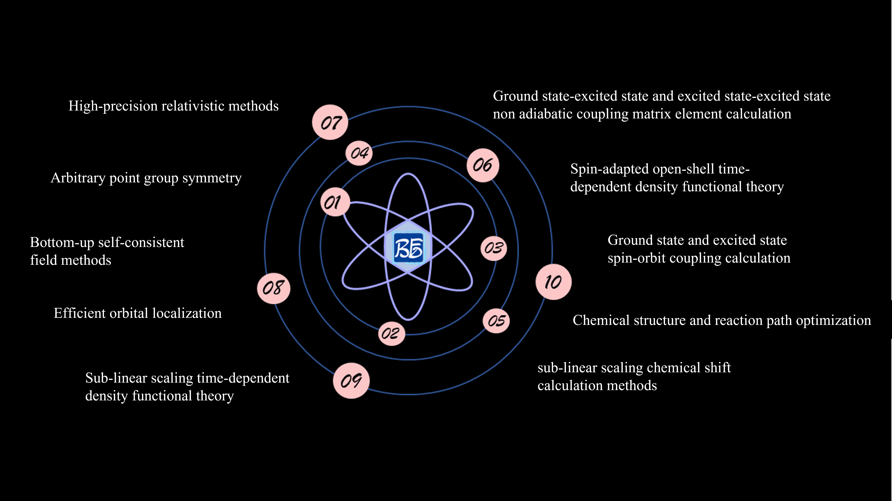
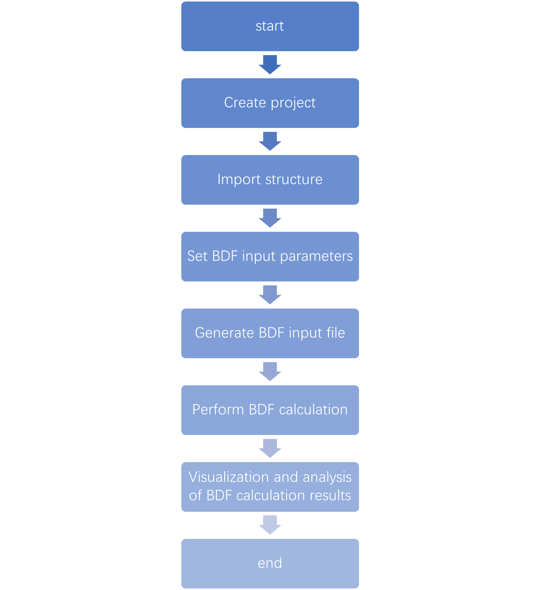
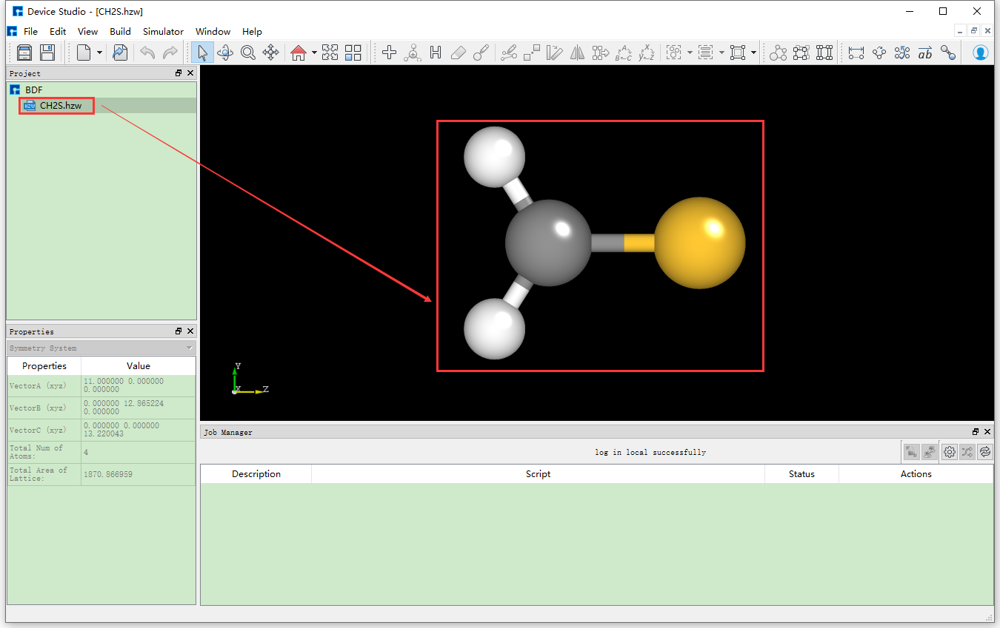
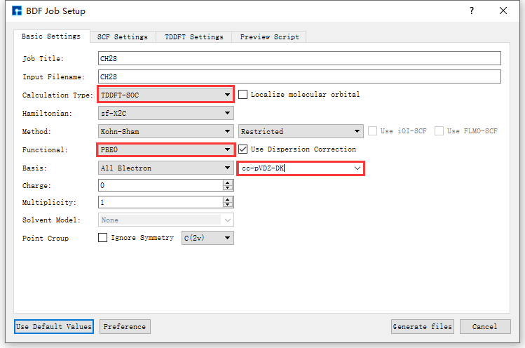
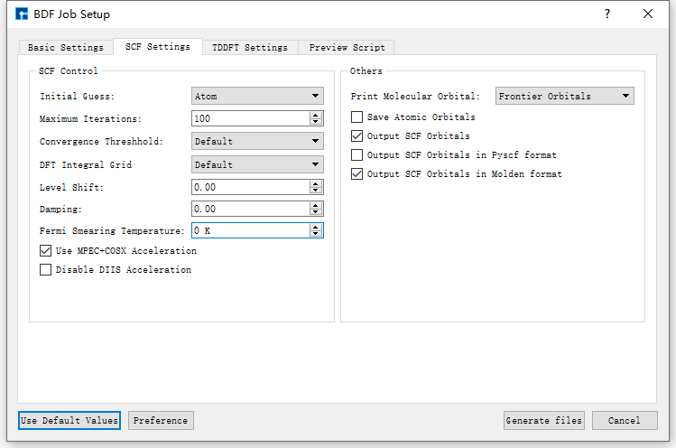
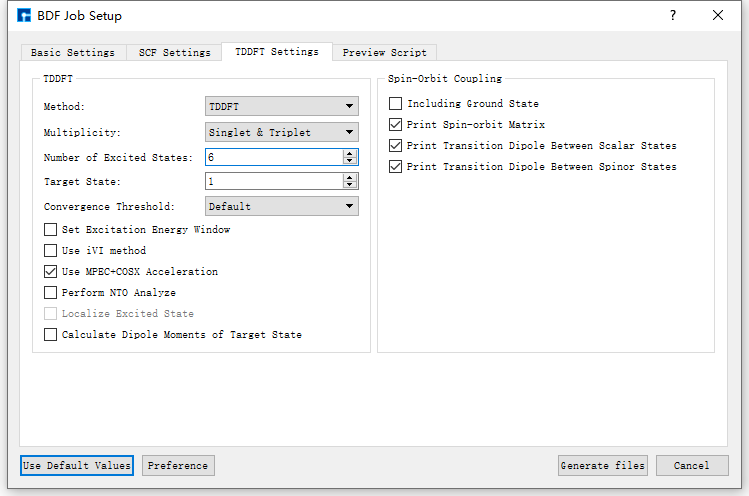
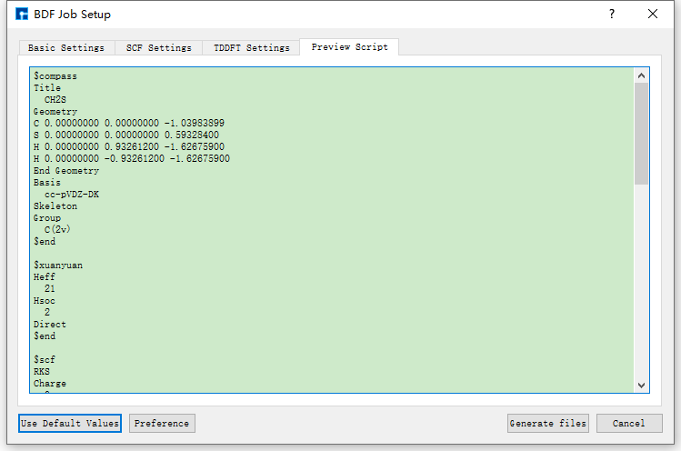
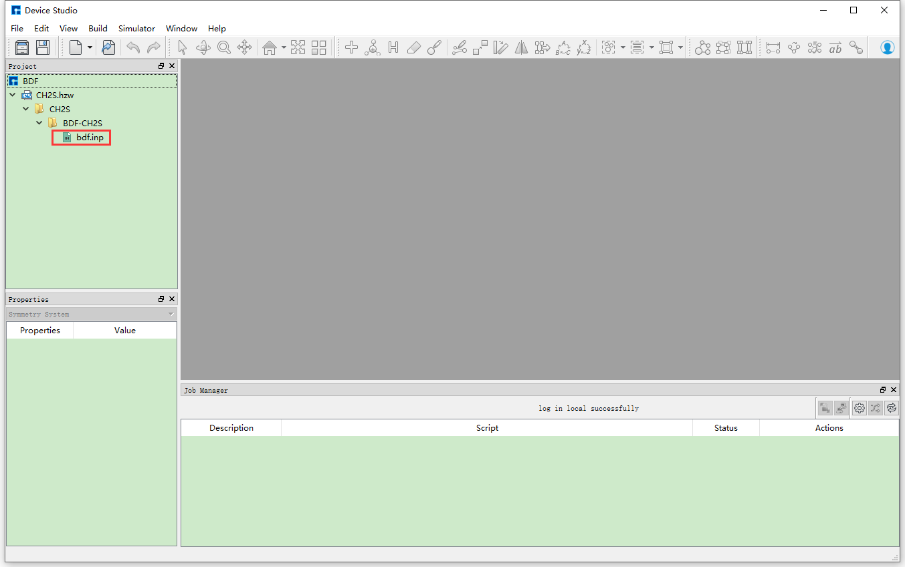

.. _bdf-example:

================================
BDF Example
================================

BDF_ (Beijing Density Functional) is an independent and complete **quantum chemistry calculation software package** with complete independent intellectual property rights. It is also the first **program based on modern density functional theory that can accurately calculate the total ground state energy of molecular systems with complete relativistic density functional** (early similar programs could not accurately calculate total energy due to poor numerical integration accuracy).

BDF_ **Official User Manual Website**: https://bdf-manual.readthedocs.io/zh_CN/latest/index.html

**BDF Development Team Information**:

- **International Quantum Molecular Science Academy Academician Wenjian Liu's Research Team**.
- **Hongzhiwei Development Team, Service Team**.

   BDF Software Features Diagram

**BDF Software Features**:

1. High-precision relativistic methods.
2. Arbitrary point group symmetry.
3. Bottom-up self-consistent field methods.
4. Efficient orbital localization.
5. Sub-linear scaling time-dependent density functional methods.
6. Sub-linear scaling chemical shift calculation methods.
7. Spin-matched open-shell time-dependent density functional methods.
8. Ground state and excited state spin-orbit coupling calculations.
9. Ground state-excited state and excited state-excited state non-adiabatic coupling matrix elements.
10. Chemical structure and reaction path optimization.

Taking **ground state molecule CH2S sf-X2C/TDDFT-SOC spin-orbit coupling calculation** as an example to describe BDF_ application in Device Studio in detail.

.. _bdf-development-history:

BDF Development History
=======================

BDF_ development began in 1993 and was officially named in 1997. The initial idea was to **perform high-precision calculations on small molecular systems such as rare earths, actinides, transition metals, and superheavy elements**, examining relativistic effects in these systems, therefore initially adopting complete relativistic density functional theory (4C-DFT) based on Dirac operators and nearly complete basis functions "numerical basis + STO" (Slater-type orbital). Because of this, BDF's calculation results for rare earths, actinides, and superheavy elements have been used as benchmarks for testing other approximate relativistic methods. BDF's calculation results for electronic and molecular structures of heavy element systems have been verified by more than 20 subsequent experiments.

In 2009, **analytical integration based on Gaussian basis** was introduced, and BDF_ entered a new development stage.

Needless to say, BDF_ was initially positioned as a platform for developing new theories, new methods, and new algorithms, therefore it is a "research software". Theories and methods developed based on BDF_ include: relativistic time-dependent density functional theory (4C/ZORA/X2C-TDDFT), exact two-component (X2C) relativistic theory, quasi-four-component (Q4C) relativistic theory, spin-separated X2C relativistic theory (sf-X2C+so-DKHn), many-body effective quantum electrodynamics (eQED), relativistic nuclear magnetic theory (4C/X2C-NMR), relativistic nuclear spin-rotation theory (4C-NSR), relativistic band theory (X2C-PBC), X2C analytical gradients and Hessian; excited state HF/KS methods (mom); orbital localization scheme (FLMO) based on the idea of "synthesizing molecules from molecular fragments" (F2M), sub-linear scaling time-dependent density functional theory (FLMO-TDDFT), sub-linear scaling NMR methods (FLMO-NMR), iterative orbital interaction "bottom-up" self-consistent field methods (iOI); spin-matched open-shell time-dependent density functional theory (SA-TDDFT), spin-flip time-dependent density functional theory (SF-TDDFT), ground state/excited state-excited state non-adiabatic coupling time-dependent density functional theory (NAC-TDDFT), time-dependent density functional theory analytical energy gradients, arbitrary single-value/double-value point group symmetrization, etc.

Besides the above relativistic/non-relativistic density functional and time-dependent density functional theory, BDF_ also has wave function electron correlation methods based on the idea of "static then dynamic then static" (SDS), including SDSPT2SDSCI, iCI, iCIPT2, iCAS, iCISCF, SOC-iCI, iCI-SOC, and the iVI method for directly solving large matrix internal eigenstates, etc.

Given BDF_'s current status, the first commercial version will focus on fluorescence/phosphorescence material luminescence mechanism and material design as the main application targets, therefore it does not include 4C/X2C relativity, wave function electron correlation, solid band/nuclear magnetic methods, etc. That is, the first commercialized BDF will mainly focus on DFT and TDDFT, including ground state and excited state KS, QM/MM, FLMO-TDDFT, SF-TDDFT, NAC-TDDFT, sf-X2C-SA-TDDFT/SOC, SA-TDDFT analytical energy gradients and numerical Hessian, stable structure and transition state optimization, reaction path optimization, implicit solvation models, FLMO-NMR, based on localized orbitals (FLMO) property calculations and analysis, and other special features.

.. _bdf-calculation-process:

BDF Calculation Process
=======================

The BDF calculation process in Device Studio is shown in :numref:`ApplicationExamples_127`.

   
   BDF Calculation Process

.. _creating-a-bdf-project:

Creating a BDF Project
======================

Double-click the Device Studio icon shortcut, log in and launch Device Studio. In the create or open project interface (:ref:`startUp-figure`), according to the interface prompts, select to create a new project ( :guilabel:`Create a new Project` ) or open an existing project ( :guilabel:`Open an existing Project` ) button, then click the :guilabel:`OK` button in the interface. If you choose to create a new project, users can name the project as needed, such as naming this project ``BDF``, or use the software's default project name.

.. _importing-bdf-structure:

Importing BDF Structure
=======================

In the Device Studio graphical interface, click :guilabel:`File` → :guilabel:`Import` → :guilabel:`Import Local`,
which will pop up the interface for importing BDF structure files. According to the interface prompts, find the location of the ``CH2S.hzw`` structure file, select the ``CH2S.hzw`` structure
file, click the :guilabel:`Open` button, and the Device Studio interface after importing the ``CH2S.hzw`` structure is shown in :numref:`ApplicationExamples_128`. Other methods for importing structures in Device Studio are not explained in detail here, users can refer to the :ref:`Import Structure` section content.

   Device Studio graphical interface after importing the ``CH2S.hzw`` structure

.. _generating-bdf-input-files:

Generating BDF Input Files
==========================

In the interface shown in :numref:`ApplicationExamples_128`, select :guilabel:`Simulator` → :guilabel:`BDF` → 
:guilabel:`BDF`, which will pop up the BDF parameter settings interface BDF Job Setup as shown in :numref:`ApplicationExamples_129`.

Taking the generation of input files for **ground state molecule CH2S sf-X2C/TDDFT-SOC spin-orbit coupling calculation** as an example, in the BDF Job Setup interface shown in :numref:`ApplicationExamples_128`, according to calculation needs, select :guilabel:`Basic Settings`, :guilabel:`SCF Settings`, :guilabel:`TDDFT Settings` and :guilabel:`Preview Script` respectively, set parameters
as shown in :numref:`ApplicationExamples_129`, :numref:`ApplicationExamples_130`, :numref:`ApplicationExamples_131` and :numref:`ApplicationExamples_132` respectively, then click the :guilabel:`Generate files` button in the interface to generate the input file ``bdf.inp``. 

   Basic Settings parameter settings interface

   SCF Settings parameter settings interface

   TDDFT Settings parameter settings interface

   Preview Script parameter settings interface

The Device Studio interface for generating the input file ``bdf.inp`` for **ground state molecule CH2S sf-X2C/TDDFT-SOC spin-orbit coupling calculation** is shown in :numref:`ApplicationExamples_133`.

   Device Studio interface for generating input files for **ground state molecule CH2S sf-X2C/TDDFT-SOC spin-orbit coupling calculation**

.. _BDF计算:

BDF Calculation
===============

Before performing the **ground state molecule CH2S sf-X2C/TDDFT-SOC spin-orbit coupling calculation**, you need to connect to a server with BDF installed. The specific connection process is not explained in detail here, users can refer to the :ref:`Nanodcal Connect to Server` section content. After connecting to the server with BDF installed, before performing the calculation, users can open the input file and check if the parameter settings in the file are reasonable according to their needs. If not reasonable, they can choose to edit directly in the file or regenerate, and finally perform the BDF calculation (here BDF calculation refers to **ground state molecule CH2S sf-X2C/TDDFT-SOC spin-orbit coupling calculation**). For example, to open the ``bdf.inp`` file, in the Device Studio's Project Explorer area, select ``bdf.inp`` → right-click → :guilabel:`Open with` to view the ``bdf.inp`` file as shown below. 

.. code::  

   $compass
   Title
     CH2S
   Geometry
   C 0.00000000 0.00000000 -1.03983899
   S 0.00000000 0.00000000 0.59328400
   H 0.00000000 0.93261200 -1.62675900
   H 0.00000000 -0.93261200 -1.62675900
   End Geometry
   Basis
     cc-pVDZ-DK
   Skeleton
   Group
     C(2v)
   $end
   
   $xuanyuan
   Heff
     21
   Hsoc
     2
   Direct
   $end
   
   $scf
   RKS
   Charge
     0
   SpinMulti
     1
   DFT
     PBE0
   D3
   MPEC+COSX
   Molden
   $end
   
   $tddft
   Imethod
     1
   Isf
     0
   Idiag
     1
   Iroot
     6
   MPEC+COSX
   Istore
     1
   $end
   
   $tddft
   Imethod
     1
   Isf
     1
   Idiag
     1
   Iroot
     6
   MPEC+COSX
   Istore
     2
   $end

   $tddft
   Isoc
     2
   Nfiles
     2
   Imatsoc
     -1
   Imatrsf
     -1
   Imatrso
     -1
   $end

.. admonition:: note

   During actual calculations, users can refer to the BDF_ **User Manual** to understand the detailed meaning of each parameter and set them appropriately according to calculation needs. To learn more about BDF_, click on the corresponding purple or blue software name, or send an email to support@hzwtech.com for consultation.

In the interface shown in :numref:`ApplicationExamples_128`, in the Device Studio's Project Explorer area, select ``bdf.inp`` → right-click → :guilabel:`Run`, which will pop up the Run interface. In the Run
interface, click the :guilabel:`Run` button to perform the BDF calculation. Users can observe the BDF calculation status in the Job Manager area. When the BDF calculation task is in the queue,
in progress, or completed, :guilabel:`Status` is Queued, Running, Finished respectively. After the calculation is completed, click the Actions button in the Job Manager area, which will pop up the Qsftp Explorer interface. In this interface, find the calculation result file, click the :guilabel:`Download` button to download the calculation result file from the server to the local, and the downloaded result file can be viewed in the Device Studio's Project Explorer area. 

.. _BDF计算结果的可视化分析:

BDF results visualization
=========================

Currently, there is no visualization analysis function for BDF_ calculation results in Device Studio. Users can analyze them themselves. The specific analysis process can refer to the BDF_ user manual. The visualization analysis function of BDF_ will be integrated into the Device Studio in subsequent version updates.

.. _bdf: https://cloud.hzwtech.com/web/product-service?id=13

.. _device: https://cloud.hzwtech.com/web/product-service?id=6

.. _ds: https://cloud.hzwtech.com/web/product-service?id=10

.. _dspaw: http://hzwtech.com/Device%20Studio/DS-PAW/index.html

.. _studio: https://cloud.hzwtech.com/web/product-service?id=6