.. _ds-paw-example:

================================
DS-PAW Example
================================

DS-PAW_ is a first-principles plane wave calculation software under the Device Studio platform, using plane waves as basis functions, and the pseudopotential is constructed using the Projector Augmented Wave method. DS-PAW_ is powerful and can be applied to different scenarios, such as metals, semiconductors, insulators, surfaces, magnetic, non-magnetic, lithium batteries, etc.; it can accurately predict material electron distribution; it can perform atomic geometric structure optimization; it can be widely applied in materials science. DS-PAW_ has stable performance, having undergone millions of internal test cases on Intel chips and domestic Haiguang chips, including various functions and parallel efficiency.

As shown in :numref:`ApplicationExamples_115`, DS-PAW_ 2021B version has implemented 28 calculation functions including **structure relaxation, electronic structure, mechanical properties, magnetic calculations, transition states, hybrid functionals, van der Waals corrections, optical properties, spin-orbit coupling, phonon calculations, strongly correlated calculations, first-principles molecular dynamics**, and more functions are still being added.

Taking **Si crystal structure hybrid functional band calculation** as an example to describe DS-PAW_ application in Device Studio in detail.

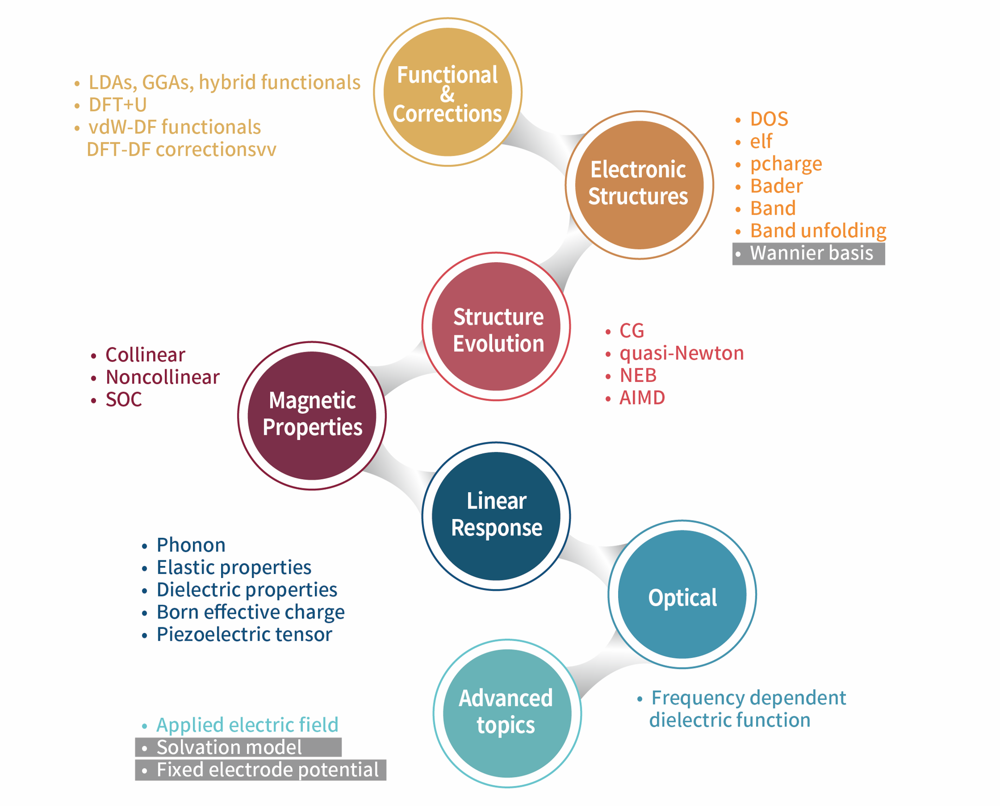

   DS-PAW Software Function Diagram

.. _ds-paw-calculation-process:

DS-PAW Calculation Process
==========================

The DS-PAW calculation process in Device Studio is shown in :numref:`ApplicationExamples_116`.

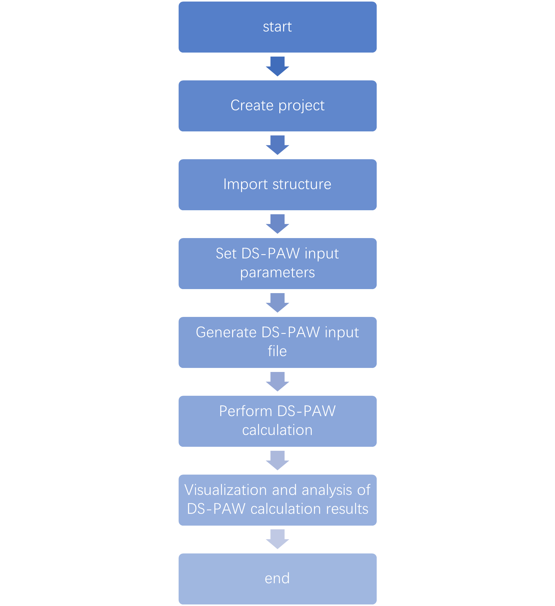

   DS-PAW Calculation Process

.. _ds-paw-project-creation:

DS-PAW Project Creation
=======================

Double-click the Device Studio icon shortcut, log in and start Device Studio. In the create or open project interface (:ref:`startUp-figure`), according to the interface prompts, select the button to create a new project (:guilabel:`Create a new Project`) or open an existing project (:guilabel:`Open an existing Project`), then click the :guilabel:`OK` button in the interface. If choosing to create a new project, users can name the project according to their needs, such as naming this project ``DS-PAW``, or use the software's default project name.

.. _ds-paw-structure-import:

DS-PAW Structure Import
=======================

In the Device Studio graphical interface, click :guilabel:`File` → :guilabel:`Import` → :guilabel:`Import Local`, which will open the interface for importing DS-PAW structure files. According to the interface prompts, find the location of the ``Si.hzw`` structure file, select the ``Si.hzw`` structure file, click the :guilabel:`Open` button, then the Device Studio interface after importing the ``Si.hzw`` structure is shown in :numref:`ApplicationExamples_117`. Other methods for importing structures in Device Studio are not detailed here, users can refer to the :ref:`Import Structure` section.

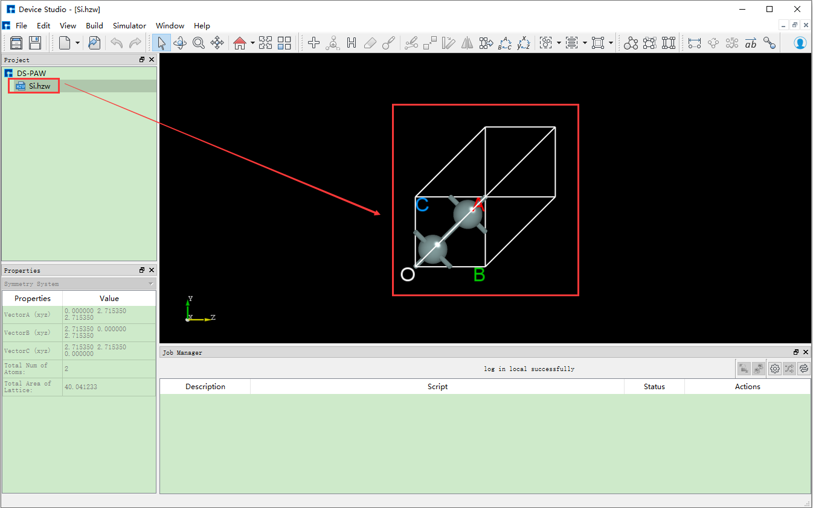

   Device Studio Graphical Interface After Importing ``Si.hzw`` Structure

.. _ds-paw-input-file-generation:

DS-PAW Input File Generation
============================

In the interface shown in :numref:`ApplicationExamples_117`, select :guilabel:`Simulator` → :guilabel:`DS-PAW` → :guilabel:`Electronic Structure`, which will open the DS-PAW parameter settings interface Electronic structure as shown in :numref:`ApplicationExamples_118`. The Electronic structure interface is mainly divided into four modules: :guilabel:`Task`, :guilabel:`Solver setting`, :guilabel:`Physical setting`, and :guilabel:`Advanced`. Users can set parameters by clicking the four modules in sequence according to calculation needs, then click :guilabel:`Generate files` to generate the corresponding calculation input files.

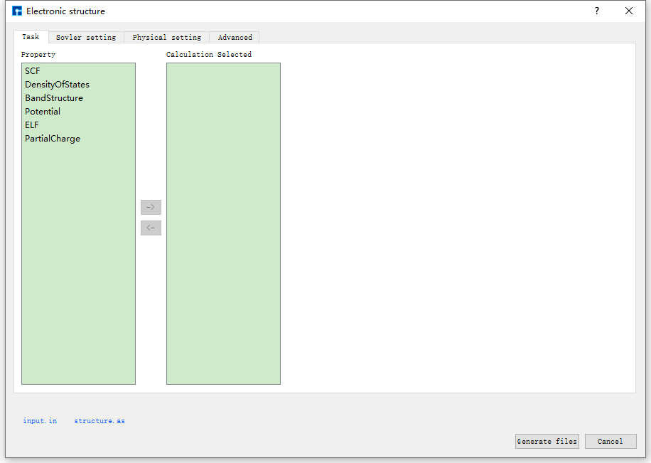

   DS-PAW Parameter Settings Interface Electronic structure

Taking the generation of input files for **Si crystal structure hybrid functional band calculation** as an example, in the Electronic structure interface shown in :numref:`ApplicationExamples_118`, according to calculation needs, select :guilabel:`Task`, :guilabel:`Solver setting`, :guilabel:`Physical setting`, and :guilabel:`Advanced` respectively, set parameters as shown in :numref:`ApplicationExamples_119`, :numref:`ApplicationExamples_120`, :numref:`ApplicationExamples_121`, and :numref:`ApplicationExamples_122` respectively, then click :guilabel:`Generate files` in the interface to generate the input files ``scf.in`` and ``structure``.

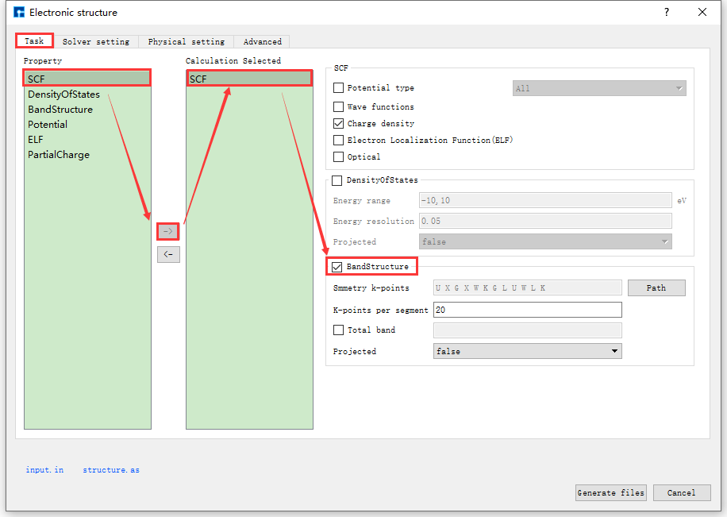

   Task Parameter Settings Interface

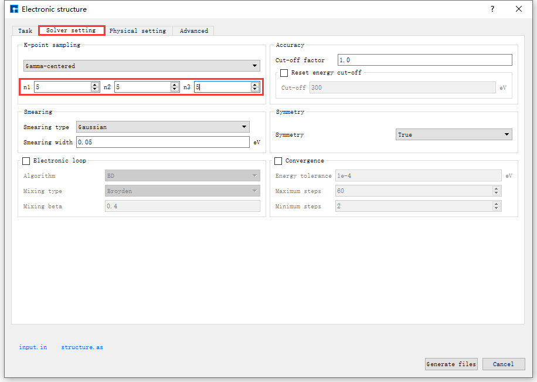

   Solver Setting Parameter Settings Interface

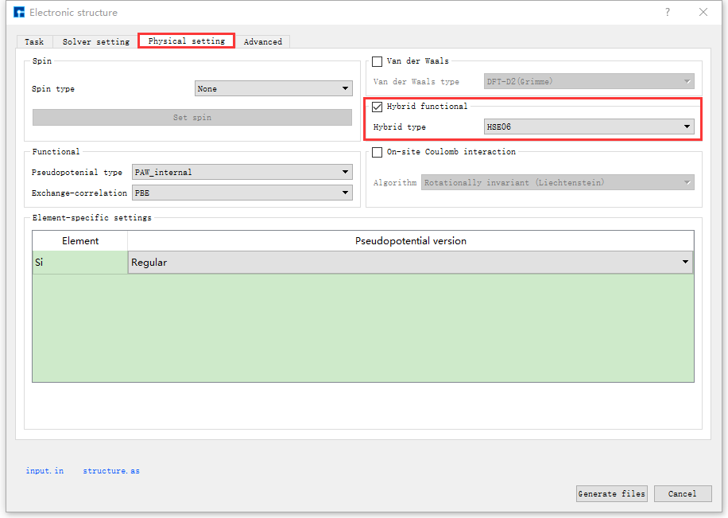

   Physical Setting Parameter Settings Interface

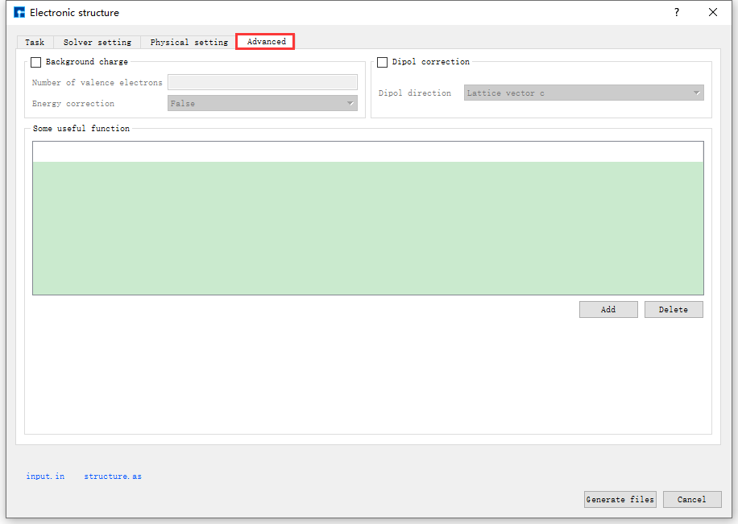

   Advanced Parameter Settings Interface

The Device Studio interface for generating input files ``scf.in`` and ``structure`` for **Si crystal structure hybrid functional band calculation** is shown in :numref:`ApplicationExamples_123`.

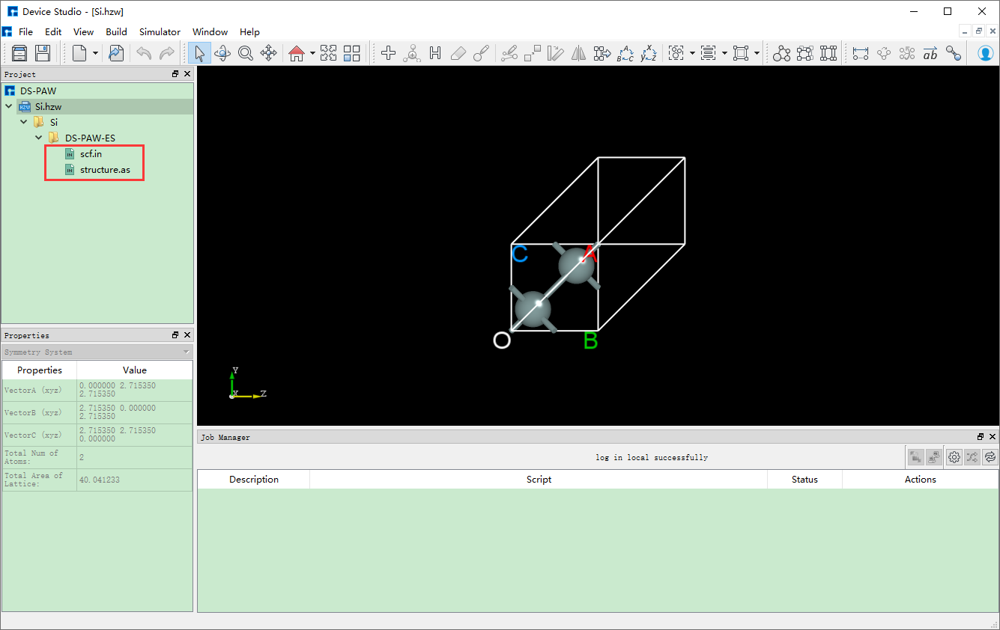

   Device Studio Interface for Generating **Si crystal structure hybrid functional band calculation** Input Files

.. _DS_PAW计算:

DS-PAW Calculation
==================

Before performing the **Si crystal structure hybrid functional band calculation**, you need to connect to a local computer or server with DS-PAW installed. The specific connection process is not explained in detail here, users can refer to the :ref:`Nanodcal Connect to Server` section content. Taking calculation on a local computer as an example, after connecting to the local computer with DS-PAW installed, before performing the calculation, users can open the input files and check if the parameter settings in the files are reasonable according to their needs. If not reasonable, they can choose to edit directly in the files or regenerate, and finally perform the DS-PAW calculation. For example, to open the ``scf.in`` file, in the Device Studio's Project Explorer area, select ``scf.in`` → right-click → :guilabel:`Open with` to view the ``scf.in`` file as shown in :numref:`ApplicationExamples_124`. For other input files, users can choose whether to open and view them according to their needs, which is not explained in detail here.    

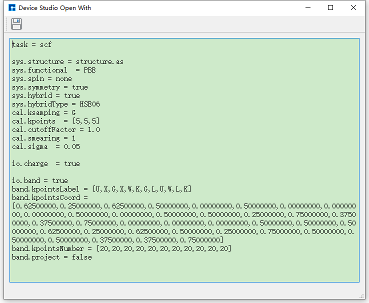

   ``scf.in`` File

In the interface shown in :numref:`ApplicationExamples_123`, in the Device Studio's Project Explorer area, select ``scf.in`` → right-click → :guilabel:`Run`, which will pop up the Run interface. In the Run interface, click the :guilabel:`Run` button to perform the DS-PAW calculation. Users can observe the DS-PAW calculation status in the Job Manager area. When the DS-PAW calculation task is in the queue, in progress, or completed, :guilabel:`Status` is Queued, Running, Finished respectively. After the calculation is completed, the result file ``band.json`` and log file ``DS-PAW.log`` can be seen in the Device Studio's Project Explorer area.

.. _DS_PAW计算结果的可视化分析:

DS-PAW Results Visualization
============================

In the Device Studio's Project Explorer area, select ``band.json`` → right-click → :guilabel:`Show View`, which will pop up the DS-PAW results visualization interface as shown in :numref:`ApplicationExamples_125`.

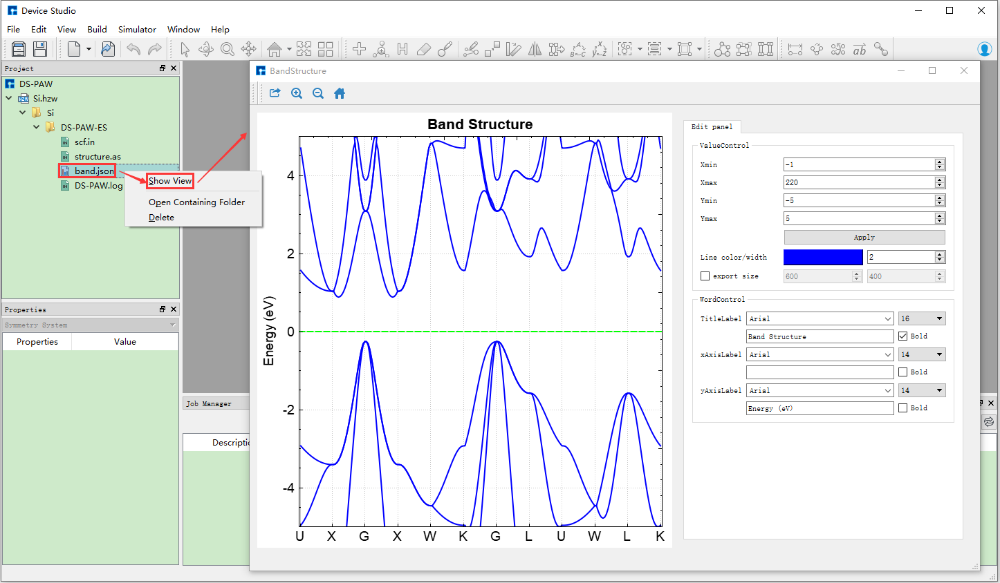

   DS-PAW Results Visualization Interface

.. admonition:: Note

   DS-PAW calculation results are often stored in ``.json`` or ``.h5`` format. Currently, Device Studio supports visualization analysis of DS-PAW result files in ``.json`` format smaller than **68MB**. For ``.json`` files larger than **68MB**, it is recommended that users use the DS-PAW auxiliary toolkit dspawpy_ for data analysis.

.. _bdf: https://cloud.hzwtech.com/web/product-service?id=13

.. _device: https://cloud.hzwtech.com/web/product-service?id=6

.. _ds: https://cloud.hzwtech.com/web/product-service?id=10

.. _ds-paw: http://hzwtech.com/Device%20Studio/DS-PAW/build/html/index.html

.. _dspawpy: http://hzwtech.com/Device%20Studio/DS-PAW/build/html/tools.html

.. _studio: https://cloud.hzwtech.com/web/product-service?id=6
