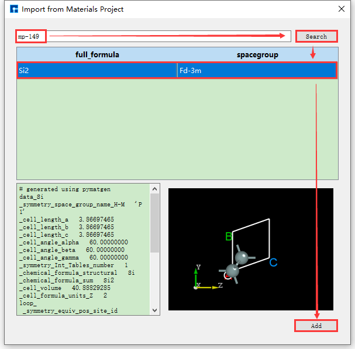
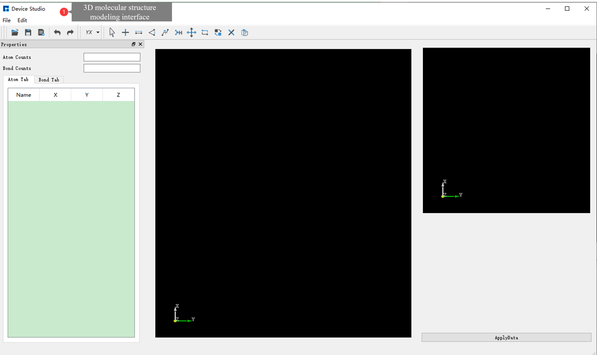

.. _structure-modeling:

**************************
Structure Modeling
**************************

Device Studio supports importing structures from local or online databases, or building new structures based on imported ones. It supports creating various molecules, crystals, and typical device structures such as LCR/LR/FCB/FB/BCT/BT. Device Studio can automatically split crystal planes and build device structures according to user-specified matching accuracy requirements. It can automatically match and build multilayer device or crystal structures. It can generate special structures such as Nanoribbons, Nanotubes, clusters, grain boundaries, and random doping.

.. _supported-file-types:

================================
Supported File Types
====================

Device Studio supports file types including ``.hzw``, ``.xyz``, ``.cif``, ``.dsxml``, ``.pdb``, ``.mol``, ``.xsd``, ``scf.input``, ``.py``, ``POSCAR``, ``CONTCAR``, etc., where ``.hzw`` is Device Studio's proprietary file format. Device Studio can export structure files in ``.hzw`` and ``.xyz`` formats according to user needs, and can export 3D visualization results of structure files in ``.png`` image format. For crystal structures, it can identify their space group structure information and export structure files in ``.cif`` format.

.. _importing-structures:

================================
Importing Structures
====================

Before importing a structure, you need to create a new project or open an existing project, and import the structure based on an existing project. To create a project: double-click the Device Studio icon shortcut to log in and start the software. The graphical interface is shown in :numref:`BuildStructure_1`. According to the interface prompts, select the button to create a new project ( :guilabel:`Create a new Project` ) or open an existing project ( :guilabel:`Open an existing Project` ), then click the :guilabel:`OK` button. If you choose to create a new project, you can name it according to your needs, such as naming this project ``Device Studio``.

.. _startUp-figure:

   Graphical interface for selecting to create or open a project after starting the software

.. _importing-structures-from-local-database:

Importing Structures from Local Database
========================================

Device Studio comes with a local database containing over 500 commonly used or popular materials, which will be continuously updated and expanded. If users need a large-scale database, they can pay attention to Hongzhiwei's FIRST_ software, which includes three major databases: QuickMol, QuickCrystal, and ACED, with over **10 million** material entries. Users can import structures through the local database, such as importing the ZnO-MgO-Si device structure. The import operation is shown in the red part of :numref:`BuildStructure_2`: :guilabel:`File` → :guilabel:`Import` → :guilabel:`Import Local`. Then a graphical interface pops up as shown in :numref:`BuildStructure_3`. According to the interface prompts, find the folder containing ZnO-MgO-Si in the local database, select the ZnO-MgO-Si structure file, and click the open button in :numref:`BuildStructure_3` to import the ZnO-MgO-Si structure. The graphical interface after importing the ZnO-MgO-Si structure is shown in :numref:`BuildStructure_4`, where the ``ZnO-MgO-Si.hzw`` structure file is in the Project Explorer area, and the 3D view of the structure is displayed in the 3D Viewer area.

.. admonition:: Note

   If you don't want to import the structure through the database, and you know the location of the structure file, such as the ZnO-MgO-Si structure, you can simply left-click to select the structure file and drag it to the Project Explorer area of Device Studio to import the structure. The 3D view of the structure will be displayed in the 3D Viewer area.

   Pop-up interface for importing structure from local database

   Interface for selecting ZnO-MgO-Si structure file

   Device Studio interface after importing ZnO-MgO-Si structure

.. _FIRST: https://mp.weixin.qq.com/s/jRkTrYCBE7B3xsJYYaqceA

.. _importing-structures-from-online-database:

Importing Structures from Online Database
=========================================

Device Studio supports connecting to the online Materials Project database. As shown in the red part of :numref:`BuildStructure_5`: click :guilabel:`File` → :guilabel:`Import` → :guilabel:`Import Online` to pop up the interface for importing structures from the Materials Project database. In this interface, users can search for atomic structures by entering elements, chemical formulas, or mp numbers.

   Pop-up interface for importing structure from online database

As shown in :numref:`BuildStructure_6`, search for structures by entering elements. Enter the Si element and click the :guilabel:`Search` button or press the :guilabel:`Enter` key on the keyboard. Many atomic structures containing only Si elements will appear, such as the Si40 structure. The left side shows its detailed chemical formula, and the right side shows its corresponding space group structure. After selection, you can view the structure's chemical formula, space group symmetry information, and atomic coordinates in the red box area at the bottom left of the interface. You can view the 3D display of the structure in the red box area at the bottom right of the interface. For the 3D display of the structure, you can zoom in or out by scrolling the mouse wheel. You can right-click to select the structure and rotate the 3D view by dragging the mouse. After determining the atomic structure to search for, click the :guilabel:`Add` button in the interface to import the atomic structure. The structure file is saved in the software's project management area (Project Explorer), and you can view the 3D view of the atomic structure in the 3D display area. The Device Studio interface after importing the Si40 structure through the online Materials Project database is shown in :numref:`BuildStructure_7`.

   Materials Project element search and structure import operation interface

   Device Studio interface after importing Si40 structure

The operations for searching and importing structures through chemical formulas and mp numbers are the same as those through element search and import. Their operation interfaces are shown in :numref:`BuildStructure_8` and :numref:`BuildStructure_9` respectively.

   Materials Project chemical formula search and structure import operation interface

   Materials Project mp number search and structure import operation interface

.. _2d-molecular-modeling:

================================
2D Molecular Modeling
=====================

**Device Studio 2022A** version adds the **2D Molecular Modeling** function. In the 2D molecular modeling interface, its toolbar contains various bonds and tools for drawing molecular structure formulas, including chemical bonds, ring templates, folded chains, boat structures, chair structures, arrows, borders, and text editing tools. Users can quickly and conveniently draw various 2D planar molecular structure formulas and write equations through this function, and it supports converting 2D molecular structures into 3D molecular structures.

Device Studio has the function of editing 2D molecular structures. Users can perform operations such as rotation, modifying bond width, bond length, bond position color, bond position type, bond position attribute conversion, adding hydrogen, removing hydrogen, adding charge, removing charge, etc. on the molecular structure.

Taking the construction of a 2D molecular structure with three connected benzene rings and its conversion to the corresponding 3D molecular structure as an example, the construction steps are shown in :numref:`BuildStructure_10`, :numref:`BuildStructure_11`, :numref:`BuildStructure_12`, :numref:`BuildStructure_13`, and :numref:`BuildStructure_14`.

   Pop-up 2D molecular modeling interface operation

   2D molecular modeling interface

   Building 2D molecular structure and converting to 3D molecular structure operation

.. figure:: images/2dMolecule_4.png
   :align: center
   :name: BuildStructure_13

   Device Studio interface after converting 2D molecular structure to 3D molecular structure

   Optimizing converted 3D molecular structure operation

.. admonition:: Note

   The :guilabel:`Minimize Structure` labeled as ② in :numref:`BuildStructure_14` is for structural optimization of molecular structures through molecular force field calculations, defaulting to MMFF94. You can select an appropriate force field for structural optimization by clicking the dropdown button.

.. _3d-molecular-modeling:

================================
3D Molecular Modeling
=====================

**Device Studio 2022A** version adds the **3D Molecular Modeling** function. Users can quickly and conveniently build 3D molecular structures through this function. Device Studio supports editing 3D molecular structures and can view detailed information about atomic coordinates and bonds between atoms. It can perform a series of operations on molecular structures such as bond adjustment, atomic angle adjustment, dihedral angle adjustment, adding hydrogen, translation, rotation, renaming, copying fragments, adding, deleting, and modifying. The operation interface for building 3D molecular structures in Device Studio is shown in :numref:`BuildStructure_15`, :numref:`BuildStructure_16`, :numref:`BuildStructure_17`, :numref:`BuildStructure_18`, and :numref:`BuildStructure_19`.

   Pop-up 3D molecular modeling interface operation

   3D molecular modeling interface

   Building 3D molecular structure operation one

.. figure:: images/3dMolecule_4.png
   :align: center
   :name: BuildStructure_18

   Building 3D molecular structure operation two

   Optimizing built 3D molecular structure

.. _crystal-modeling:

================================
Crystal Modeling
================

For crystal modeling, users can first search whether the structure exists in the local database or online database. If it exists, import it directly; if not, they can build it themselves or import a structure and build upon it. Users can choose how to build the crystal structure according to their needs.

Taking the construction of NaCl crystal structure as an example, click :guilabel:`Build` → :guilabel:`Crystal` in the Device Studio graphical interface, and the interface for building crystal structure pops up as shown in :numref:`BuildStructure_20`.

   Crystal structure building interface

If you don't know the space group information of the NaCl crystal, when building the NaCl crystal structure in the interface shown in :numref:`BuildStructure_20`, you can follow the red box selection and arrow direction shown in :numref:`BuildStructure_21`, fill in or select the corresponding information step by step, click the :guilabel:`Preview` button to preview the built structure in the right area of the interface. This step is mainly used to check whether the built structure is correct and whether it is the desired structure. Then click :guilabel:`Build` to build the NaCl crystal structure. The structure file is saved in the software's project management area (Project Explorer), and you can view the 3D view of the structure in the 3D display area. Conversely, if you find that the built structure is incorrect during the preview process, you can rebuild it in the interface shown in :numref:`BuildStructure_20`. During the structure building process, users can choose the :guilabel:`Preview style` in the interface according to their needs, that is, select :guilabel:`Primitive cell` or :guilabel:`Conventional cell`; choose whether to show equivalent position atoms, that is, whether to check :guilabel:`Show equivalent atoms`.

The p1, p2, p3 values of the NaCl crystal structure are shown in the following table:
   +------------+--------------+--------------+---------------+
   | Element    |      p1      |      p2      |      p3       |
   +============+==============+==============+===============+
   | Na         |      0       |      0       |      0        |
   +------------+--------------+--------------+---------------+
   | Na         |      0.5     |      0.5     |      0        |
   +------------+--------------+--------------+---------------+
   | Na         |      0.5     |      0       |      0.5      |
   +------------+--------------+--------------+---------------+
   | Na         |      0       |      0.5     |      0.5      |
   +------------+--------------+--------------+---------------+
   | Cl         |      0.5     |      0       |      0        |
   +------------+--------------+--------------+---------------+
   | Cl         |      0       |      0.5     |      0        |
   +------------+--------------+--------------+---------------+
   | Cl         |      0       |      0       |      0.5      |
   +------------+--------------+--------------+---------------+
   | Cl         |      0.5     |      0.5     |      0.5      |
   +------------+--------------+--------------+---------------+

.. figure:: images/34_buildCrystal_2.png
   :align: center
   :name: BuildStructure_21

   NaCl crystal structure building interface without space group information

   NaCl Crystal Structure Building Interface Based on Space Group Information

If the space group information of the structure is known, it can be built more conveniently and quickly. Device Studio supports the selection of 261 space groups (including 230 space groups and 31 extended subgroups). For example, the space group of NaCl crystal is ``225 FM-3M``. Knowing this information, when building the NaCl crystal in the interface shown in :numref:`BuildStructure_20`, you can fill in the corresponding information as indicated by the red box and arrow in :numref:`BuildStructure_22`. Other operations are consistent with those without knowing the space group information and will not be described in detail here. Comparing :numref:`BuildStructure_21` and :numref:`BuildStructure_22`, it is clear that knowing the space group information can simplify the construction of the crystal structure.
  

Figures :numref:`BuildStructure_21` and :numref:`BuildStructure_22` both show the result of displaying equivalent atoms when building the NaCl crystal structure, i.e., with the :guilabel:`Show equivalent atoms` option checked. If this option is unchecked, the interface will appear as shown in :numref:`BuildStructure_23`. Clicking the :guilabel:`Build` button in the interface will build the NaCl crystal structure. The structure file is saved in the software's project management area, and a 3D view of the structure is displayed in the 3D display area. The interface after building the NaCl crystal structure is shown in :numref:`BuildStructure_24`.

   NaCl Crystal Structure Building Interface Without Equivalent Position Atoms Displayed

   Device Studio Interface for Building NaCl Crystal Structure

.. _sections-slices-of-crystal-structure:

================================
Sections/Slices of Crystal Structure
====================================

Surface/Slab from Crystal Structure, this function is only available when a crystal structure exists.  Taking the NaCl crystal structure built in the :ref:`Crystal Modeling` section as an example, to build a NaCl (1 1 1) crystal structure with a Thickness of 9.73 Å, click :guilabel:`Build` → :guilabel:`Surface/Slab` in the interface shown in :numref:`BuildStructure_24`. The interface for building the surface/slab of the NaCl crystal structure will pop up as shown in :numref:`BuildStructure_25`.

   The interface for creating a slab/slice of the NaCl crystal structure

As shown in the red box and arrow in :numref:`BuildStructure_26`, set the Miller index (1 1 1) in the interface shown in :numref:`BuildStructure_25`. Select the Na (0.5000 0.5000 0.0000) atom as the starting atom for the slab in the dropdown table. Check the :guilabel:`Slab` box and click the :guilabel:`+` button after Thickness 5 times to set the Thickness to 9.73 Å.  The structure can be previewed in the right panel. Click :guilabel:`Build` to build the 9.73 Å thick NaCl (1 1 1) crystal structure. The structure file is mounted in the Device Studio project management area, and the 3D view is displayed in the Device Studio 3D display area. The Device Studio interface after building the 9.73 Å thick NaCl (1 1 1) crystal structure is shown in :numref:`BuildStructure_27`.

   User interface for building a NaCl (1 1 1) crystal structure with a thickness of 9.73 Å.

   Set up the Device Studio interface for a NaCl (1 1 1) crystal structure with a Thickness of 9.73 Å.

.. _redefinition-of-the-unit-cell-in-crystal-structures:

================================
Redefinition of the Unit Cell in Crystal Structures
===================================================

After importing the Cu unit cell structure into Device Studio, the interface is shown as :numref:`BuildStructure_28`. Click :guilabel:`Build` → :guilabel:`Redefine Crystal` in the interface to open the Cu unit cell structure crystal redefinition interface, as shown in :numref:`BuildStructure_29`. Fill in the parameters according to the red boxed area in :numref:`BuildStructure_30`. After filling in the parameters, click the :guilabel:`Preview` button to preview the supercell structure on the right side of the interface. Then, click the :guilabel:`Build` button to expand the Cu unit cell into a single cell.  Simultaneously, the structure file ``Cu_Rede.hzw`` is mounted in the Device Studio project management area, and the 3D view of the structure is displayed in the Device Studio 3D display area, as shown in :numref:`BuildStructure_31`.

   Device Studio interface after importing the Cu unit cell structure (``Cu.hzw``)

   Cu Unit Cell Structure Redefinition Interface

   The interface for expanding the Cu unit cell structure into a supercell.

.. figure:: images/buildRedefineCrystal_4.png
   :align: center
   :name: BuildStructure_31

   3D view of the Cu unit cell (``Cu_Rede.hzw``) in Device Studio

The supercell can be built from the unit cell by using the "Redefine Crystal" function in Device Studio.  The operation is the same as expanding the Cu primitive cell to a unit cell.  For example, to expand the Cu unit cell to a 4x4x4 supercell, click  :numref:`BuildStructure_31`  :guilabel:`Build` → :guilabel:`Redefine Crystal`. The "Redefine Crystal" interface will pop up, as shown in :numref:`BuildStructure_32`. Follow the steps indicated by the red boxes and arrows in :numref:`BuildStructure_32`. After clicking the :guilabel:`Build` button, the Cu unit cell will be expanded to a 4x4x4 supercell. The structure file ``Cu_Rede_Rede.hzw`` will be mounted in the project management area of Device Studio, and the 3D view of the structure will be displayed in the 3D display area of Device Studio, as shown in :numref:`BuildStructure_33`.

   Interface for expanding the Cu unit cell to a 4x4x4 supercell

   3D view of the Cu supercell (``Cu_Rede_Rede.hzw``) structure in Device Studio

.. _device-modeling:

================================
Device Modeling
===============

Taking the construction of a gold-alkanethiol-gold (Au-Alkanethiol-Au) molecular device structure as an example, the following steps will detail the construction process.

.. _importing-the-au-crystal-structure:

Importing the Au Crystal Structure
==================================

***Import the Au crystal structure from the Device Studio local database**, i.e., import the Au primitive cell.  The import process is not described in detail here; users can refer to :ref:`local_database_import_structure`. The interface after importing the Au crystal structure is shown in :numref:`BuildStructure_34`.

   Interface after importing the Au crystal structure

.. _converting-an-au-primitive-cell-to-an-au-conventional-cell:

Converting an Au primitive cell to an Au conventional cell
==========================================================

Click  :guilabel:`Build` → :guilabel:`Redefine Crystal` in :numref:`BuildStructure_34`, which will pop up the Redefine Crystal interface as shown in :numref:`BuildStructure_35`. Click :guilabel:`Face-centered` → :guilabel:`Preview` in :numref:`BuildStructure_35`, and the interface will change as shown in :numref:`BuildStructure_36`.  Users can preview the converted structure in the right area of :numref:`BuildStructure_36`. After clicking :guilabel:`Build`, the Au primitive cell will be converted into an Au crystal cell. The structure file is saved in the software's project management area (Project Explorer), and a 3D view of the structure can be seen in the 3D display area, as shown in :numref:`BuildStructure_37`.  ``Au.hzw`` in :numref:`BuildStructure_37` corresponds to the Au primitive cell, and ``Au_Rede.hzw`` corresponds to the Au crystal cell. Users can select the structure file according to their computational needs, right-click and select :guilabel:`Rename` to rename the structure file.

   Redefine Crystal Interface for Au Unit Cell

   The operation interface for converting an Au unit cell to an Au crystal cell

   Interface after converting the Au primitive cell to the Au conventional cell

.. _converting-an-au-unit-cell-to-an-au-supercell:

Converting an Au unit cell to an Au supercell
=============================================

Convert the Au unit cell to a 2*2*4 supercell (referred to as: Au supercell). Click :guilabel:`Build` → :guilabel:`Redefine Crystal` in :numref:`BuildStructure_37` to open the Redefine Crystal interface. Modify the parameters as shown in the red box in :numref:`BuildStructure_38`. Click :guilabel:`Preview` to preview the converted supercell structure. Clicking :guilabel:`Build` converts the Au unit cell into the Au supercell structure.  The structure file is saved in the software's project management area (Project Explorer), and a 3D view of the structure can be seen in the 3D display area, as shown in :numref:`BuildStructure_39`.  ``Au_Rede_Rede.hzw`` in :numref:`BuildStructure_39` corresponds to the Au supercell; users can rename this structure file according to their computational needs.

   Operation interface for converting an Au unit cell to an Au supercell

   Interface after converting the Au unit cell to a Au supercell

.. _removing-redundant-atoms-and-operations-in-the-au-supercell:

Removing Redundant Atoms and Operations in the Au Supercell
===========================================================

***Remove redundant atoms from the Au supercell and center the structure within the unit cell.**  To avoid accidentally deleting atoms and making them irretrievable, it is recommended to copy the Au supercell. Select the ``Au_Rede_Rede.hzw`` structure file → right-click → Copy. The CopyFile interface will appear, as shown in :numref:`BuildStructure_40`.  Users can rename the file according to their computational needs, such as Au_SuperCell, or directly use the default name. Then, click the :guilabel:`OK` button in the CopyFile interface. The ``Au_SuperCell.hzw`` structure file will be stored in the project management area. Double-click this structure file; its 3D view will be displayed as shown in :numref:`BuildStructure_41` (a).

   CopyFile Interface

(1) In the 3D display area, with the zy-plane view, mouse-select the area indicated by the red box in :numref:`BuildStructure_41` (a), then click the :guilabel:`Delete Atom` icon in the toolbar or press the :guilabel:`Delete` key on the keyboard to delete the selected atoms. The result is shown in :numref:`BuildStructure_42` (b).

(2) Click the dropdown button to the right of the :guilabel:`3D Viewer zy View` icon on the Toolbars and select :guilabel:`xy View` to switch from the zy-plane to the xy-plane, as shown in :numref:`BuildStructure_43` (c).  Select the area within the red box in :numref:`BuildStructure_43` (c) using the mouse, and then click the :guilabel:`Delete Atom` icon on the Toolbars or press the :guilabel:`Delete` key to delete the selected atoms. After deletion, click the :guilabel:`3D Viewer zy View` icon on the Toolbars to switch back to the zy-plane, as shown in :numref:`BuildStructure_44` (d). First, select the area within the red box in :numref:`BuildStructure_44` (d) using the mouse; second, hold down the :guilabel:`Ctrl` key and click the area within the green box in :numref:`BuildStructure_44` (d) with the mouse; finally, click the :guilabel:`Delete Atom` icon on the Toolbars or press the :guilabel:`Delete` key to delete the selected atoms. The result is shown in :numref:`BuildStructure_45` (e).

(3) In the case of :numref:`BuildStructure_45` (e), clicking the :guilabel:`Center` icon on the Toolbars will center all atoms in the structure as a whole within the unit cell, as shown in :numref:`BuildStructure_46` (f). After completing the above series of operations, the structure file ``Au_SuperCell.hzw`` (Au_SuperCell supercell) is obtained, and its 3D view is shown in :numref:`BuildStructure_46` (f).

.. admonition:: note

   Selected atoms are highlighted in yellow, allowing users to easily identify them.

.. list-table:: 

   * - .. figure:: images/44_buildDevice_8.png
          :name: BuildStructure_41

          (a)   			

     - .. figure:: images/45_buildDevice_9.png
          :name: BuildStructure_42

          (b)

   * - .. figure:: images/46_buildDevice_10.png
          :name: BuildStructure_43

          (c)    			

     - .. figure:: images/47_buildDevice_11.png
          :name: BuildStructure_44

          (d)

   * - .. figure:: images/48_buildDevice_12.png
          :name: BuildStructure_45

          (e)    			

     - .. figure:: images/49_buildDevice_13.png
          :name: BuildStructure_46

          (f)

.. _set-x-and-y-axis-directions-to-vacuum:

Set X and Y axis directions to vacuum
=====================================

Set the X and Y axes of the Au_SuperCell supercell to vacuum. Duplicate the Au_SuperCell supercell and rename it Au_SuperCell_1. Double-click its structure file ``Au_SuperCell_1.hzw`` to display it in the 3D display area. Click the :guilabel:`Convert to Crystal` shortcut icon on the Toolbars to open the Convert to Crystal interface. Set the parameters as shown in the red box in :numref:`BuildStructure_47` → preview on the right side of the interface → :guilabel:`Build`. This will set the X and Y axes of the Au_SuperCell_1 supercell to vacuum, as shown in :numref:`BuildStructure_48` (a). Click the :guilabel:`Center` shortcut icon on the Toolbars to center all atoms in the unit cell. After centering, the structure will appear as shown in :numref:`BuildStructure_49` (b). After completing these steps, the structure file ``Au_SuperCell_1.hzw``, representing the Au_SuperCell_1 supercell, will have a 3D view as shown in :numref:`BuildStructure_49` (b).

.. admonition:: note

   Copying and renaming the structural files is for the convenience of this tutorial and to prevent irreversible errors after a series of operations. Users can decide whether to copy and rename them based on their modeling needs. Generally, for accidental deletions or misoperations, you can click the :guilabel:`Undo` shortcut icon on the Toolbars or press the :guilabel:`Ctrl+Z` shortcut to undo.

.. figure:: images/50_buildDevice_14.png
   :align: center
   :name: BuildStructure_47

   Convert to Crystal interface

.. admonition:: note

   After clicking the :guilabel:`Build` button in the :numref:`BuildStructure_47` interface, if the 3D view of the ``Au_SuperCell_1.hzw`` structure does not appear in the appropriate location in the 3D display area, the user can reset the 3D view to the appropriate location by clicking the :guilabel:`3D Viewer zy View` shortcut icon on the Toolbars or by pressing the shortcut key :guilabel:`Ctrl+R`. The reset 3D view of the structure is shown in :numref:`BuildStructure_49` (b).  **Users can use this method to reset the 3D view whenever it is not in the appropriate location in the 3D display area during the modeling process.**

.. list-table:: 

   * - .. figure:: images/51_buildDevice_15.png
          :name: BuildStructure_48

          (a)    			

     - .. figure:: images/52_buildDevice_16.png
          :name: BuildStructure_49

          (b)

.. _mirror-the-structure-and-reset-the-lattice-constants:

Mirror the structure and reset the lattice constants
====================================================

Mirror the selected atoms, reset the lattice constant, and center the structure.  As shown in :numref:`BuildStructure_50`, select all atoms → click the :guilabel:`Mirror Atom` shortcut icon → the Mirror interface pops up → set parameters → check Copy → click :guilabel:`Apply`. The structure will then be as shown in :numref:`BuildStructure_52` (a). Based on :numref:`BuildStructure_52` (a), click the :guilabel:`Convert to Crystal` shortcut icon. The Convert to Crystal interface will pop up, as shown in :numref:`BuildStructure_51`. Set the parameters as shown in the red box in the figure. Preview the structure with the reset lattice constant on the right side of the interface. Click :guilabel:`Build`, then click the :guilabel:`Center` shortcut icon to center all atoms of the structure with the reset lattice constant in the unit cell. The centered structure is shown in :numref:`BuildStructure_53` (b).

   Au_SuperCell_1 Supercell Mirroring Operation Interface

   Au_SuperCell_1 Supercell Lattice Constant Resetting Operation Interface

.. list-table:: 

   * - .. figure:: images/54_buildDevice_18.png
          :name: BuildStructure_52

          (a)    			

     - .. figure:: images/56_buildDevice_20.png
          :name: BuildStructure_53

          (b)

.. _setting-up-a-two-port-device-structure:

Setting up a Two-Port Device Structure
======================================

Import the alkanethiol molecule structure and copy it to the center of the Au_SuperCell_1 supercell structure.  Then, build the two-port device structure.

(1) Import the alkanethiol molecular structure as shown in :numref:`BuildStructure_54`.

   Alkanethiol molecule

(2) Double-click :guilabel:`Au_SuperCell_1.hzw` to open the Au_SuperCell_1 supercell structure.  Box-select the alkanethiol molecule structure and press the shortcut key :guilabel:`Ctrl+C` to copy it. Click the left side of the interface in :numref:`BuildStructure_53` (b) and press the shortcut key :guilabel:`Ctrl+V` to paste the alkanethiol molecule structure into the Au_SuperCell_1 supercell structure, as shown in :numref:`BuildStructure_55` (a). To easily move the pasted alkanethiol molecule structure to the center of the Au_SuperCell_1 supercell structure, click the drop-down button to the right of the :guilabel:`3D Viewer zy View` shortcut icon and select :guilabel:`ZX zx View` to switch from the zy plane to the zx plane, as shown in :numref:`BuildStructure_56` (b). Select the alkanethiol molecule structure and click the :guilabel:`Center` shortcut icon to move the alkanethiol molecule structure to the center of the Au_SuperCell_1 supercell structure, as shown in :numref:`BuildStructure_57` (c). Click the :guilabel:`3D Viewer zy View` shortcut icon to switch back to the zy plane, as shown in :numref:`BuildStructure_58` (d).

.. list-table:: 

   * - .. figure:: images/57_buildDevice_21.png
          :name: BuildStructure_55

          (a)    			

     - .. figure:: images/58_buildDevice_22.png
          :name: BuildStructure_56

          (b)

   * - .. figure:: images/59_buildDevice_23.png
          :name: BuildStructure_57

          (c)    			

     - .. figure:: images/60_buildDevice_24.png
          :name: BuildStructure_58

          (d)

   * - .. figure:: images/62_buildDevice_26.png
          :name: BuildStructure_59

          (e)    			

     - .. figure:: images/64_buildDevice_28.png
          :name: BuildStructure_60

          (f)

(3) Click the :guilabel:`Convert to Device` shortcut icon. The Convert to Device interface will pop up, as shown in :numref:`BuildStructure_61`. Select the parts in the red boxes, then click :guilabel:`Preview` to preview the two-port device structure on the right side of the interface. Clicking :guilabel:`Build` will generate the two-port device structure ``Device_Au_SuperCell_1.hzw``, as shown in :numref:`BuildStructure_59` (e).

   Convert to Device Interface

.. _adding-a-buffer-layer-to-the-device-structure:

Adding a Buffer Layer to the Device Structure
=============================================

Users can choose whether to add a buffer layer to the built two-port device structure based on computational needs; there is no mandatory requirement.  For example, to add a buffer layer to the `Device_Au_SuperCell_1.hzw` device structure near the electrode along the transport direction (Z-axis), using an atom-layer incremental method, double-click to open the device structure → click :guilabel:`Simulator` → :guilabel:`Nanodcal` → :guilabel:`Add Buffer` in the software menu bar.  The Add Buffer interface, as shown in :numref:`BuildStructure_62`, will appear. Click the :guilabel:`+` button twice after Left.  A preview of the buffer layer added to the left side of the device along the transport direction will be shown on the right side of the interface. Clicking :guilabel:`Build` will generate the two-port device structure with the added buffer layer, `Device_Au_SuperCell_1_Buffer.hzw`, as shown in :numref:`BuildStructure_60` (f).

   Add Buffer Interface

.. admonition:: note

   The addition of buffer layers to the device structure described above is merely an example; users can decide whether to add buffer layers near both ends of the electrodes and how many layers to add, based on their computational needs.

.. _export-structure:

================================
Export Structure
================

For a built structure, such as the two-port device structure ``Device_Au_SuperCell_1_Buffer.hzw``, to export this structure file, double-click to open the structure file → click :guilabel:`File` → :guilabel:`Export` in the software to bring up the export interface. Users can select the storage location, name the structure file (or use the default name), and choose the storage format as needed.

