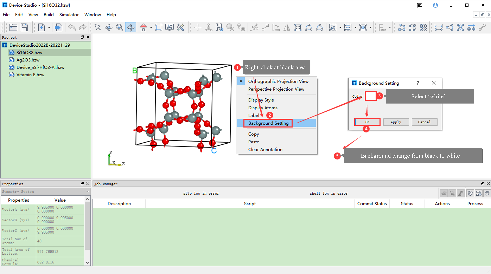
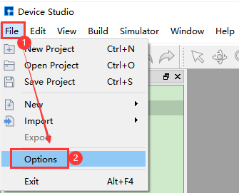
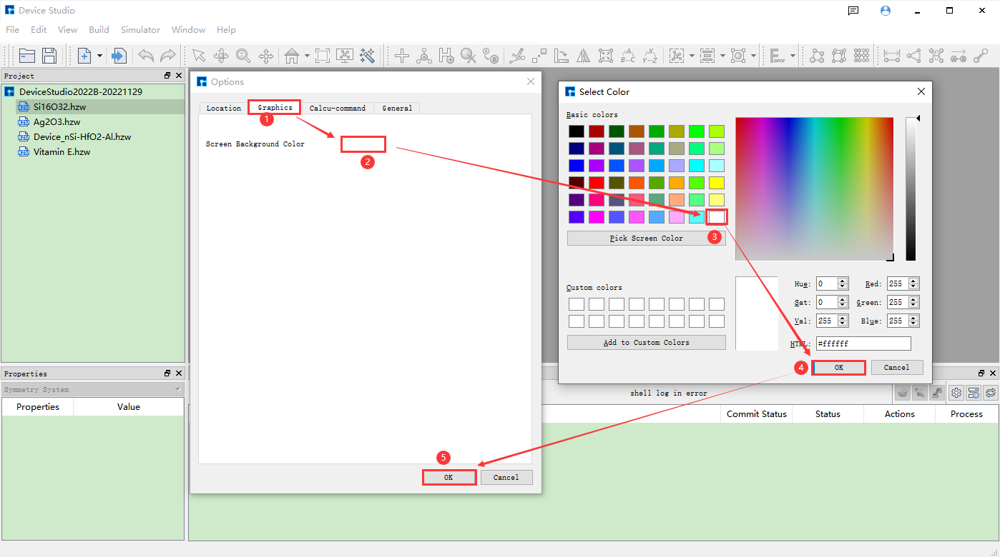
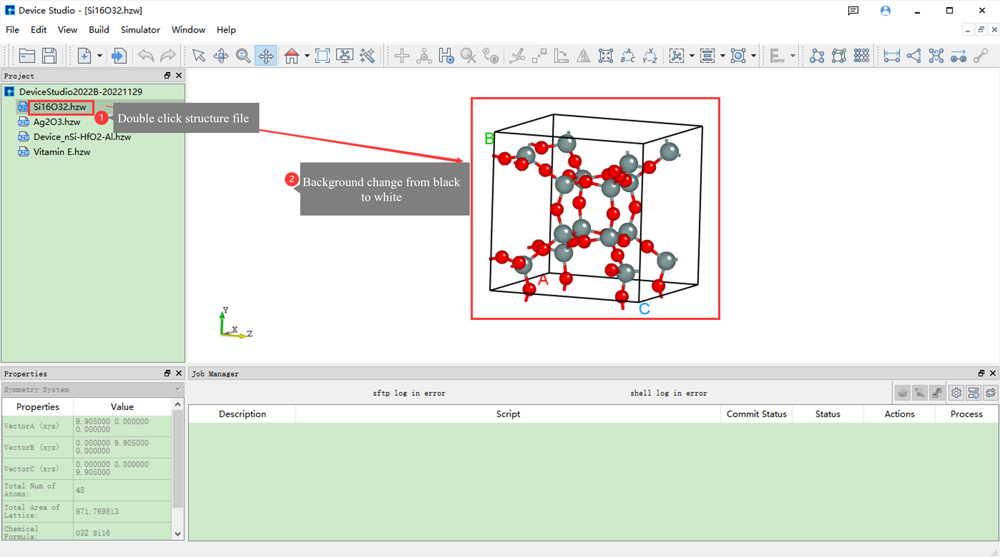

.. _common-functions:

********************************
Common Functions
********************************

.. _modify-device-studio-main-interface-background-color:

================================
Modify Device Studio Main Interface Background Color
====================================================

**Modify the background color of the atomic structure display in the Device Studio main interface**, i.e., modify the :ref:`3D` background color in Device Studio. There are two ways to modify it, using the **Si16O32 crystal structure** as an example for detailed explanation.

1. Method One: When a structure (e.g., Si16O32 crystal structure) is already displayed in the Device Studio main interface, as shown in :numref:`CommonFunction_1`, this is the operation interface for changing the **background color** of the Si16O32 crystal structure display from **pure black** to **pure white**.

   Operation Interface for Changing the **Background Color** of Si16O32 Crystal Structure Display from **Pure Black** to **Pure White**

.. admonition:: Note

   Method One can only be used when a structure is already displayed in the Device Studio main interface.

2. Method Two: When no structure is displayed in the Device Studio main interface, as shown in :numref:`CommonFunction_2`, :numref:`CommonFunction_3`, and :numref:`CommonFunction_4`, these are the operation steps for changing the **background color** of the Si16O32 crystal structure display from **pure black** to **pure white**.

   Step One: Change the **Background Color** of Structure Display in Device Studio Main Interface from **Pure Black** to **Pure White**

   Step Two: Change the **Background Color** of Structure Display in Device Studio Main Interface from **Pure Black** to **Pure White**

   Step Three: Change the **Background Color** of Structure Display in Device Studio Main Interface from **Pure Black** to **Pure White**

.. admonition:: Important Note

   This section mainly describes **how to modify the background color of atomic structure display in the Device Studio main interface**, i.e., modify the :ref:`3D` background color in Device Studio. This does not affect the background color of the :ref:`Atomic Structure Refinement Module`. If you want to modify the background color of the atomic structure refinement module, please refer to the :ref:`Modify Atomic Structure Refinement Module Background Color` section.

.. _device-studio-citation-instructions:

================================
Device Studio Citation Instructions
===================================

When using any module of Device Studio for **Atomic-level Material Modeling (Million-scale)**, **High-performance Scientific Simulation Computing**, **Computation Task Monitoring and Management**, or **Data Visualization**, please cite Device Studio in your article using the following citation template:

| Device Studio[1] program provides a number of functions for performing visualization, modeling and simulation. And XXX simulation using XXX software integrated in Device Studio program.
| Reference：
| [1] Hongzhiwei Technology, Device Studio, Version 2023A, China, 2023. Available online:https://cloud.hzwtech.com/web/product-service?id=6 (accessed on XXX, XXX).

