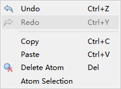
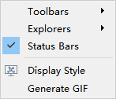

.. _graphical-interface-introduction:

**************************
Graphical Interface Introduction
**************************

The Device Studio graphical interface is shown in :numref:`GraphicalInterface_1`.

   Device Studio Graphical Interface

.. _menu-bar:
 
===================
Menu Bar
===================

The Device Studio menu bar graphical interface is shown in :numref:`GraphicalInterface_2`.

.. figure:: images/8_Menu.png
   :align: center
   :name: GraphicalInterface_2

   Menu Bar

.. _file:

File
==========

Click on :guilabel:`File`, and the interface is shown in :numref:`GraphicalInterface_3`.

   File

- :guilabel:`New Project`: Opens the new project interface where users can create a new project with the file extension ``.hpf``. Users can name the project as needed, such as ``DeviceStudio.hpf``, or use the default name, such as ``Untitled.hpf``. After naming, click the "Save" button to create the project; otherwise, if you don't want to create a new project, click the "Cancel" button.

- :guilabel:`Open Project`: Opens the project interface where users can open an existing project, such as the ``DeviceStudio.hpf`` project. Find and select the project file, then click the "Open" button to open it; otherwise, if you don't want to open the project, click the "Cancel" button.

- :guilabel:`Save Project`: Saves the current project.

- :guilabel:`New`: Users can choose to build device, crystal, or molecular structures as needed.

- :guilabel:`Import`: Opens the structure file import interface where users can choose to import device, crystal, or molecular structures from local or online databases.

- :guilabel:`Export`: Opens the structure file export interface where users can name the structure file as needed or use the default name and choose the storage location.

- :guilabel:`Options`: Opens the options interface where users can choose the pseudopotential basis set file, set the **background color** of Device Studio, and refresh time.

- :guilabel:`Exit`: Closes the Device Studio software.

.. _edit:

Edit
==========

Click on :guilabel:`Edit`, and the interface is shown in :numref:`GraphicalInterface_4`.

   Edit

- :guilabel:`Undo`: Undoes.

- :guilabel:`Redo`: Redoes.

- :guilabel:`Copy`: Copies.

- :guilabel:`Paste`: Pastes.

- :guilabel:`Delete Atom`: Deletes the selected atom.

- :guilabel:`Atom Selection`: Selects specific atoms of a specific element in the selected atoms. Users can select specific atoms as needed. For example: First, select a part of the atoms, then select all C atoms in the selected part of the atoms.

.. _view:

View
==========

Click on :guilabel:`View`, and the interface is shown in :numref:`GraphicalInterface_5`.

   View

- :guilabel:`Toolbars`: Users can choose whether to display the Project, Standard, 3D View modules in the toolbar. If displayed, select the corresponding modules; otherwise, do not select.

- :guilabel:`Explorers`: Users can choose whether to display the Project Explorer, Properties Explorer, and Job Manager modules on the software. If displayed, select the corresponding modules; otherwise, do not select.

- :guilabel:`Status Bars`: Select to display the module on the software; otherwise, do not display.

- :guilabel:`Display Style`: Opens the DisplayStyle setting interface. For atoms, users can choose not to display, display in line form, or display in ball stick form. For lattice basis vectors, users can choose not to display, display in solid line, or display in dashed line. If displayed in solid line, users can set the line thickness as needed.

- :guilabel:`generate GIF`: Opens the generategif interface where users can import a series of existing pictures and generate a dynamic graph with the file extension ``.gif``, then export the dynamic graph.

.. _Build:

Build
==========

Click on :guilabel:`Build`, and the interface is shown in :numref:`GraphicalInterface_6`.

   Build

- :guilabel:`Molecule`: Builds a 3D molecular structure.

- :guilabel:`Molecule2D`: Builds a 2D molecular structure.

- :guilabel:`Decomposition`: Decomposes a molecular structure.

- :guilabel:`Device`: Builds a device structure. Device types include L-R structure, L-C-R structure, B-T structure, etc. Users can choose to build according to their needs.

- :guilabel:`Convert to Device`: Builds a device structure on the basis of molecular or crystal structure.

- :guilabel:`Bending of Device`: Performs bending operation on two-port device structure.

- :guilabel:`Interface Builder`: Builds heterojunction structure.

- :guilabel:`Fill Junction With Atoms`: Builds multilayer membrane structure.

- :guilabel:`CAD to Atomic`: Builds multilayer membrane structure through 2D CAD.

- :guilabel:`Crystal`: Builds a crystal structure.

- :guilabel:`Redefine Crystal`: Crystal cell redefinition and expansion.

- :guilabel:`Surface/Slab`: Crystal structure cut surface/slice.

- :guilabel:`Symmetry`: Performs space group recognition on crystal structure.

- :guilabel:`StandardizeCell`: Super cell recognition primitive cell.

- :guilabel:`Gr_Nanoribbon`: Builds nanoribbon structure.

- :guilabel:`Gr_Nanotube`: Builds nanotube structure.

- :guilabel:`Grain Boundary`: Builds crystal boundary structure on basis of unit cell.

- :guilabel:`Nanotube`: Builds nanotube on basis of crystal structure.

- :guilabel:`Nanowire`: Builds nanowire on basis of crystal structure.

- :guilabel:`Disordered Graphene-like`: Builds disordered graphene-like structure.

- :guilabel:`Disordered Zinc-blende-like`: Builds disordered zinc-blende-like structure.

- :guilabel:`Icosahedron`: Builds regular icosahedron structure.

- :guilabel:`Cubooctahedron`: Builds regular cubooctahedron structure.

- :guilabel:`WulffCluster`: Builds WulffCluster structure on basis of unit cell.

- :guilabel:`Bond Options`: Bond setting.

- :guilabel:`Convert Files`: Structure file conversion.

.. _Simulator:

Simulator
==========

Click on :guilabel:`Simulator`, and the interface is shown in :numref:`GraphicalInterface_7`. Users can choose the corresponding module according to their needs to generate input files for corresponding software, calculate, and visualize data.

   Simulator

- :guilabel:`BDF`: Quantum chemistry calculation software BDF.

- :guilabel:`DS-PAW`: First-principles plane wave calculation software DS-PAW.

.. _Window:

Window
==========

Click on :guilabel:`Window`, and the interface is shown in :numref:`GraphicalInterface_8`.

   Window

- :guilabel:`Title Horizontally`: Horizontally arranges 3D Viewer windows of structure files.

- :guilabel:`Title Vertically`: Vertically arranges 3D Viewer windows of structure files.

- :guilabel:`Cascade`: Stacks 3D Viewer windows of structure files.

- :guilabel:`Arrange Icons`: Minimizes 3D Viewer windows of structure files.

- :guilabel:`Close All`: Closes 3D Viewer windows of structure files.

- :guilabel:`Next`: Selects the next 3D Viewer window of structure file.

- :guilabel:`Previous`: Selects the previous 3D Viewer window of structure file.

.. _Help:

Help
==========

Click on :guilabel:`Help`, and the interface is shown in :numref:`GraphicalInterface_9`.

   Help

- :guilabel:`Getting Started With Device Studio`: Connects Device Studio Quick Start Guide.

- :guilabel:`Device Studio Tutorials`: Connects Device Studio Usage Tutorial.

- :guilabel:`Feed Back Report`: Opens the Hongzhiwei Customer Information Feedback Collection Interface where users can provide product suggestions to Hongzhiwei.

- :guilabel:`Hzwtech Homepage`: Connects Hongzhiwei Technology (Shanghai) Co., Ltd. Homepage.

- :guilabel:`About Device Studio`: Opens the About Device Studio window to understand the Device Studio version number, issuing company, License usage period, etc.

- :guilabel:`Article Reference Template`: Opens the Device Studio Article Reference Template to facilitate correct citation of Device Studio in articles.

.. _Toolbars:

===================
Toolbars
===================

The Device Studio toolbars are shown in :numref:`GraphicalInterface_10`. The numbers from left to right are numbered from 1 to 38. The English name of the icon can be viewed by placing the mouse arrow on the icon.

   Toolbars

.. list-table:: 
    :widths: 5 5 10 30
    :header-rows: 1
    :stub-columns: 1

    * - Number
      - Icon
      - Icon English Name
      - Function Description
    * - 1
      - .. image:: images/Toolbars_1.png
          :align: center
      - Open Project
      - Opens Device Studio project file
    * - 2
      - .. image:: images/Toolbars_2.png
          :align: center
      - Save Project
      - Saves current project and structure
    * - 3
      - .. image:: images/Toolbars_3.png
          :align: center
      - New
      - Builds new structure, through which you can select to build device, crystal | or molecular structure
    * - 4
      - .. image:: images/Toolbars_4.png
          :align: center
      - Import Local
      - Imports structure file from local
    * - 5
      - .. image:: images/Toolbars_5.png
          :align: center
      - Undo
      - Undoes
    * - 6
      - .. image:: images/Toolbars_6.png
          :align: center
      - Redo
      - Redoes
    * - 7
      - .. image:: images/Toolbars_7.png
          :align: center
      - 3D Viewer Selection Mode
      - Selects, clicks to enter selection mode, can select atoms by mouse click or drag to select
    * - 8
      - .. image:: images/Toolbars_8.png
          :align: center
      - 3D Viewer Rotation Mode
      - Rotates, clicks to enter rotation mode, can rotate 3D view of atom structure by dragging mouse
    * - 9
      - .. image:: images/Toolbars_9.png
          :align: center
      - 3D Viewer Zoom Mode
      - Zooms in or out, clicks to enter zoom mode, can zoom 3D view of atom structure by scrolling mouse middle key
    * - 10
      - .. image:: images/Toolbars_10.png
          :align: center
      - 3D Viewer Translation Mode
      - Translates, clicks to enter translation mode, can translate 3D view of atom structure by dragging mouse
    * - 11
      - .. image:: images/Toolbars_11.png
          :align: center
      - 3D Viewer zy View
      - Clicks to reset 3D view of structure (z-y plane), clicks down to select from different perspectives to view 3D view of structure
    * - 12
      - .. image:: images/Toolbars_12.png
          :align: center
      - 3D Viewer Fit to View
      - Clicks to move 3D view of structure to appropriate position according to screen
    * - 13
      - .. image:: images/Toolbars_13.png
          :align: center
      - Display Style
      - Clicks to set display mode of atom structure
    * - 14
      - .. image:: images/Toolbars_14.png
          :align: center
      - Structure Refinement Module
      - Clicks to enter atom structure refinement module, this module has fully upgraded 3D display effect of atom structure, displays atom structure in the form of equivalent atoms, and supports ball stick/polyhedron display mode, users can customize color, radius, and lighting parameters, create exclusive personal template
    * - 15
      - .. image:: images/Toolbars_15.png
          :align: center
      - Add Atom
      - Adds atom, clicks to enter Device Studio periodic table, selects element, clicks in 3D view of structure to add atom
    * - 16
      - .. image:: images/Toolbars_16.png
          :align: center
      - Add New Atom
      - Adds atom in the middle of selected multiple atoms. This icon needs to select multiple atoms to activate
    * - 17
      - .. image:: images/Toolbars_17.png
          :align: center
      - Hydrogen passivation
      - Uses hydrogen atom to passivate crystal structure. Currently, only effective for Si and C elements
    * - 18
      - .. image:: images/Toolbars_18.png
          :align: center
      - Delete Atom
      - Deletes selected atom
    * - 19
      - .. image:: images/Toolbars_19.png
          :align: center
      - Replace Atom
      - Replaces selected atom
    * - 20
      - .. image:: images/Toolbars_20.png
          :align: center
      - Edit Atom With Selected
      - Sets distance between 2 atoms or angle between 3 atoms. This icon needs to select 2 or more atoms to activate
    * - 21
      - .. image:: images/Toolbars_21.png
          :align: center
      - Move Atom
      - Moves selected atom. This icon needs to select atom to activate
    * - 22
      - .. image:: images/Toolbars_22.png
          :align: center
      - Rotate Atom
      - Rotates selected atom. This icon needs to select 2 or more atoms to activate
    * - 23
      - .. image:: images/Toolbars_23.png
          :align: center
      - Mirror Atom
      - Mirrors selected atom. This icon needs to select atom to activate
    * - 24
      - .. image:: images/Toolbars_24.png
          :align: center
      - Stretch Cell
      - Stretches or compresses primitive cell while keeping fractional coordinates unchanged
    * - 25
      - .. image:: images/Toolbars_25.png
          :align: center
      - alternate axes
      - Rotates lattice basis vectors A, B, C of structure
    * - 26
      - .. image:: images/Toolbars_26.png
          :align: center
      - alternate coordinate
      - Rotates X, Y, Z of structure
    * - 27
      - .. image:: images/Toolbars_27.png
          :align: center
      - Wrap
      - Wraps atoms outside lattice along unit axis to lattice, clicks down to select Wrap Along a/b/c
    * - 28
      - .. image:: images/Toolbars_28.png
          :align: center
      - Center
      - Centers all atoms or selected atoms as a whole in lattice cell, clicks down to select Center Along a/b/c
    * - 29
      - .. image:: images/Toolbars_29.png
          :align: center
      - Fit Cell
      - Automatically matches minimum unit lattice basis vector, clicks down to select Fit Cell Along a/b/c
    * - 30
      - .. image:: images/Toolbars_30.png
          :align: center
      - Minimize Structure
      - Performs structure optimization on molecular structure through molecular force field calculation, clicks down to select suitable force field. This icon can only activate when structure to be displayed is molecular structure
    * - 31
      - .. image:: images/Toolbars_31.png
          :align: center
      - Convert to Molecule
      - Converts current structure to molecular
    * - 32
      - .. image:: images/Toolbars_32.png
          :align: center
      - Convert to Crystal
      - Converts current structure to crystal
    * - 33
      - .. image:: images/Toolbars_33.png
          :align: center
      - Convert to Device
      - Converts current structure to device
    * - 34
      - .. image:: images/Toolbars_34.png
          :align: center
      - Distance
      - Measures distance between 2 atoms
    * - 35
      - .. image:: images/Toolbars_35.png
          :align: center
      - Angle
      - Measures angle between 3 atoms
    * - 36
      - .. image:: images/Toolbars_36.png
          :align: center
      - Dihedral angle
      - Measures dihedral angle between 4 atoms
    * - 37
      - .. image:: images/Toolbars_37.png
          :align: center
      - Vector between two atoms
      - Measures vector between 2 atoms
    * - 38
      - .. image:: images/Toolbars_38.png
          :align: center
      - Recalculate LinkerBond
      - Recalculates bond

.. admonition:: Note

   The Device Studio toolbars are important, so it is recommended that users read the function of each icon in :ref:`Toolbars` before using Device Studio. Also, for convenience of users' use, Device Studio has categorized the icons in the toolbars, and when the icon is **gray**, it cannot be activated unless the condition is met. If help is needed, consult the Hongzhiwei professional solution center team.

.. _Project:

================================
Project Management Area (Project Explorer)
=======================================

**Project Management Area** is shown in :numref:`GraphicalInterface_11`. If the project name is ``DeviceStudio``, there are 3 structure files under this project, namely ``Au-Alkanethiol-Au.hzw``, ``NaCl.hzw``, and ``azulene.hzw``. For structure files, such as ``Au-Alkanethiol-Au.hzw``, as shown in the red frame of Figure 3.3-1, this area can manage input files for corresponding structure calculation, such as self-consistent calculation input file ``scf.input``. Users can open and view the input file by right-clicking on the input file and selecting :guilabel:`Open with`, or find the file storage location in the computer by right-clicking on the input file and selecting :guilabel:`Open Containing Folder`. For structure files, if related calculation input files have been generated, they cannot be renamed; otherwise, if no related calculation input files have been generated, users can rename them by right-clicking on the structure file and selecting :guilabel:`Rename`, then renaming them.

   Project Management Area

To create or open an existing project, import or export structure files in the **Project Management Area**, please refer to the detailed description of :ref:`File`.

.. admonition:: Note

   Device Studio has optimized :ref:`Project`, so it is recommended that users name project files, structure files, etc. in English without spaces, Chinese characters, asterisks, etc. when submitting homework for calculation. After submitting homework, including **after submitting homework**, do not change file names. If you want to change them, it is recommended to change them before submitting homework for calculation.

.. _3D:

===========================
Structure 3D Display Area (3D Viewer)
======================================

**Structure 3D Display Area** is shown in :numref:`GraphicalInterface_12`. If the structure ``Au-Alkanethiol-Au.hzw`` is displayed in this area, users can open the structure file in the project management area by double-clicking on the structure file. In this area, users can zoom the 3D view of the structure by scrolling the mouse middle key; they can first select the :guilabel:`3D Viewer Translation Mode` shortcut icon in the toolbar or press the middle mouse button, and then drag the mouse to translate the 3D view of the structure in this area; they can first select the :guilabel:`3D Viewer Rotation Mode` shortcut icon or press the right mouse button, and then drag the mouse to rotate the 3D view of the structure in this area.

Users can perform various operations such as adding, deleting, modifying, etc. on the structure in this area, and the 3D view of the structure can be displayed in real time in this area. Users can perform structure operations according to the function description of each shortcut icon in :ref:`Toolbars`.

   Au-Alkanethiol-Au's 3D Display

.. _Properties:

=====================================
Structure Attribute Area (Properties Explorer)
=============================================

If structure ``Au-Alkanethiol-Au.hzw`` is displayed in the 3D display area, **Structure Attribute Area** shows the system information of the structure as shown in :numref:`GraphicalInterface_13`; if a specific atom of ``Au-Alkanethiol-Au.hzw`` structure is selected, **Structure Attribute Area** shows the atom information of the structure as shown in :numref:`GraphicalInterface_14`, users can modify the coordinate position or replace the atom of the selected atom by double-clicking on the mouse.

.. list-table:: 

   * - .. figure:: images/19_Properties_SymmetrySystem.png
          :width: 310px
          :name: GraphicalInterface_13

     - .. figure:: images/20_Properties_Atom.png
          :width: 310px
          :name: GraphicalInterface_14

         
.. _JobManager:

=====================================
Calculation Task Monitoring Management Area (Job Manager)
=======================================================

As shown in :numref:`GraphicalInterface_15`, **Calculation Task Monitoring Management Area** contains 5 modules, with the function descriptions as follows. When the task is in queue, calculating, or completed, :guilabel:`Status` is Queued, Running, Completed respectively. After calculation is completed, part of calculation results will be automatically pulled back to local. If more calculation results are needed, click the download button to download and return.

   Calculation Task Monitoring Management Area

- :guilabel:`Description`: Structure name.

- :guilabel:`Script`: Location of task input file.

- :guilabel:`Commit Status`: Task file transmission progress.

- :guilabel:`Status`: Task calculation status.

- :guilabel:`Actions`: Task calculation operation.

- :guilabel:`Process`: Views task calculation log file to determine whether task calculation is completed through log file.

:ref:`JobManager` icon function is as follows table:

.. list-table:: 
    :widths: 5 5 10 40
    :header-rows: 1
    :stub-columns: 1

    * - Number
      - Icon
      - Icon English Name
      - Function Description
    * - 1
      - .. image:: images/JobM_1.png
          :align: center
      - /
      - Clicks to enter Xshell exe file directory setting
    * - 2
      - .. image:: images/JobM_2.png
          :align: center
      - Open WinSCP
      - Clicks to connect current supercomputing server through WinSCP, as shown in :numref:`HighLightFunction_31` 
    * - 3
      - .. image:: images/JobM_3.png
          :align: center
      - Open PuTTY
      - Clicks to connect current supercomputing server through PuTTY, as shown in :numref:`HighLightFunction_30` 
    * - 4
      - .. image:: images/JobM_4.png
          :align: center
      - Reset IP
      - Clicks to enter MachineOptions interface, in which users can choose local or supercomputing server, or customize connection server. Connection server operation can refer to :ref:`Nanodcal Connection Server` section content
    * - 5
      - .. image:: images/JobM_5.png
          :align: center
      - Reload to server
      - Reconnects server
    * - 6
      - .. image:: images/JobM_6.png
          :align: center
      - refresh
      - Refreshes, clicks to refresh Calculation Task Monitoring Management Area status
    * - 7
      - .. image:: images/JobM_7.png
          :align: center
      - Download
      - Downloads, clicks to enter Calculation Result Download Interface as shown in :numref:`HighLightFunction_29` 
    * - 8
      - .. image:: images/JobM_8.png
          :align: center
      - Cancel
      - Cancels, clicks to cancel calculation task
    * - 9
      - .. image:: images/JobM_9.png
          :align: center
      - Inspect simulation data in real time
      - Clicks to view calculation result log file in real time
