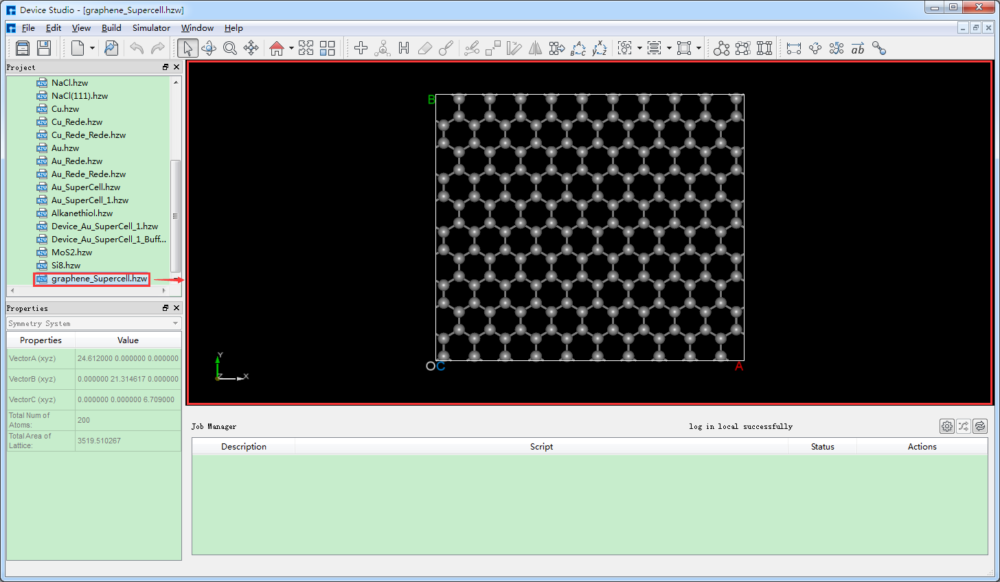
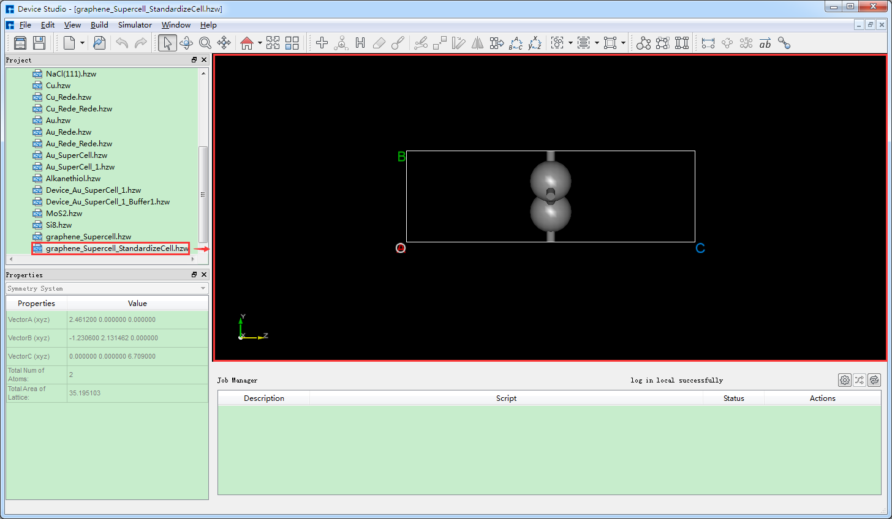
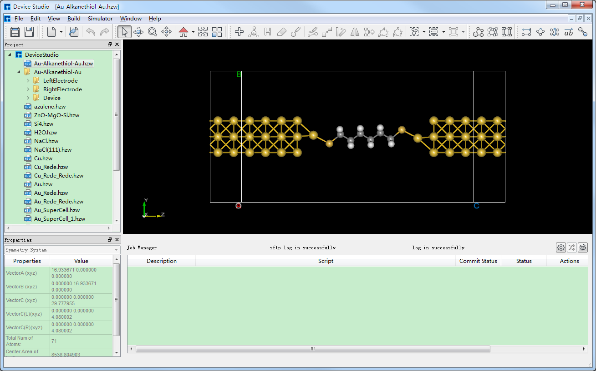
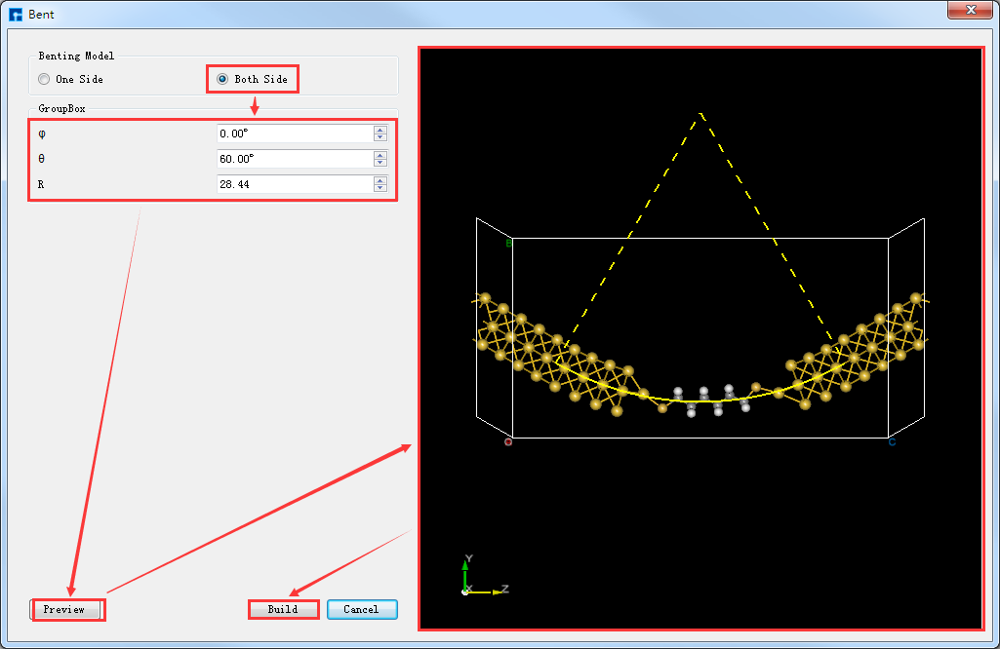
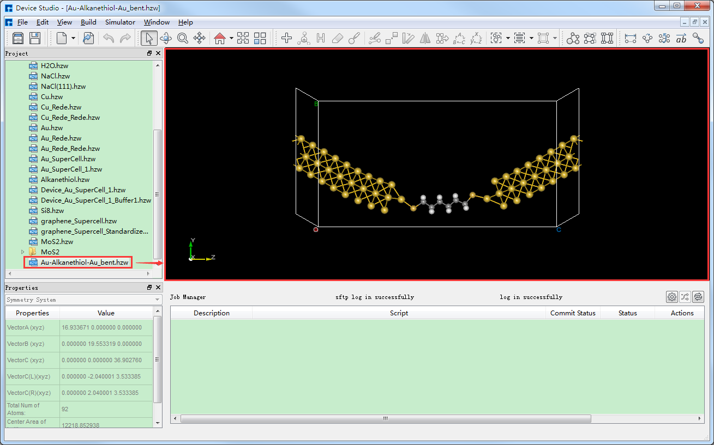
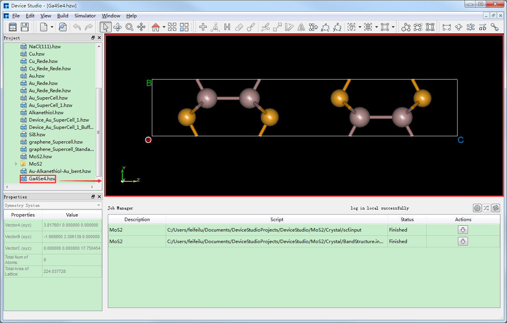
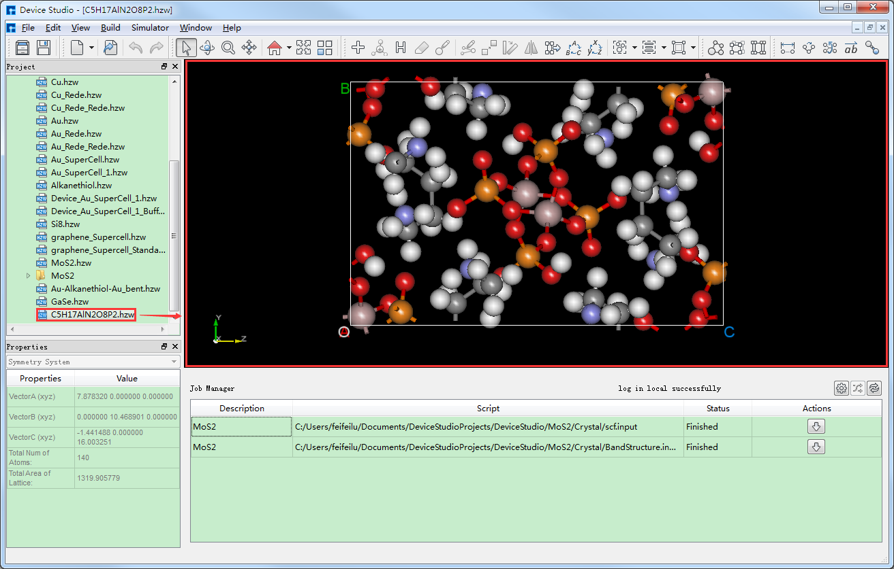
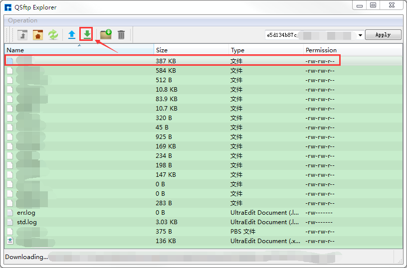
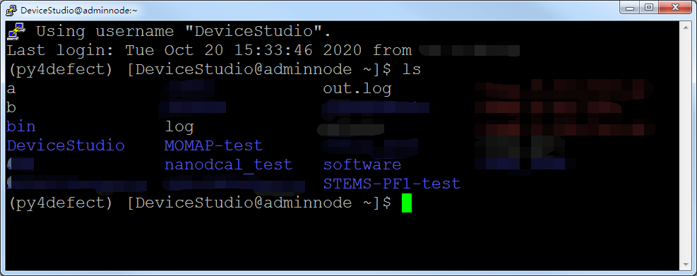
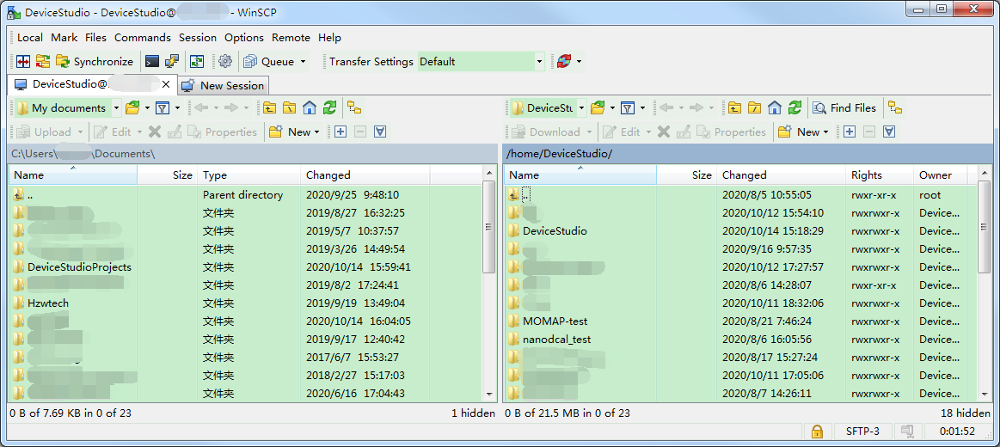

.. _key-features:

**************************************
Key Features
**************************************

.. _supercell-identification-of-primitive-cell:

================================
Supercell Identification of Primitive Cell
=======================================

Device Studio features a **supercell-to-primitive-cell recognition** function, which is very easy to operate.  For example, as shown in :numref:`HighLightFunction_1` (3D view of the graphene supercell structure in the XY plane), importing a graphene supercell structure in Device Studio, and clicking :guilabel:`Build` → :guilabel:`StandardizeCell` will recognize the graphene supercell structure as a primitive cell structure, as shown in :numref:`HighLightFunction_2`.

   Import the graphene supercell structure into the Device Studio interface

   Graphene unit cell structure

.. _flexible-device-structure-modeling:

================================
Flexible Device Structure Modeling
======================================

Device Studio allows for the construction of flexible device structures.  Taking the gold-alkanethiol-gold (Au-Alkanethiol-Au) flexible device structure as an example, first import the Au-Alkanethiol-Au molecular device structure into Device Studio as shown in :numref:`HighLightFunction_6`. In the :numref:`HighLightFunction_6` interface, click :guilabel:`Build` → :guilabel:`Bending of Device`. The Bent interface for constructing the flexible device structure will pop up. In the Bent interface, select :guilabel:`Both Side` and set the relevant parameters as shown in :numref:`HighLightFunction_7`. Click :guilabel:`Preview` to preview the constructed flexible device structure, and click :guilabel:`Build` to complete the construction of the Au-Alkanethiol-Au flexible device structure. The structure file ``Au-Alkanethiol-Au_bent.hzw`` will be mounted in the Device Studio Project Explorer area. The Device Studio interface after constructing the Au-Alkanethiol-Au flexible device structure is shown in :numref:`HighLightFunction_8`.

   Device Studio interface after importing the Gold-Alkanethiol-Gold (Au-Alkanethiol-Au) molecular device structure

   Constructing the Bent Interface of a **Flexible Device Structure**

   Device Studio interface for setting up a flexible **device structure** of Gold-Alkanethiol-Gold (Au-Alkanethiol-Au)

.. _identifying-the-space-group-information-of-crystal-structures:

================================
Identifying the Space Group Information of Crystal Structures
=========================================================

Device Studio can identify the space group and symmetry information of crystal structures. For example, in the Device Studio graphical user interface shown in :numref:`HighLightFunction_11`, for the GaSe crystal structure, clicking on
Clicking :guilabel:`Build` → :guilabel:`Symmetry` will open the Symmetry interface as shown in :numref:`HighLightFunction_12`.  The space group information for the GaSe crystal structure can be found in :numref:`HighLightFunction_12` (a), and clicking
Clicking the :guilabel:`Operators` button in the Symmetry interface displays the symmetry information of the GaSe crystal structure, as shown in :numref:`HighLightFunction_13`.

   Device Studio interface displaying the GaSe crystal structure

.. list-table:: 

   * - .. figure:: images/highLightFunction_12.png
          :name: HighLightFunction_12   

          Space group information of the GaSe crystal structure

     - .. figure:: images/highLightFunction_13.png
          :name: HighLightFunction_13

          Symmetry information of the GaSe crystal structure

.. _splitting-molecular-structures:

================================
Splitting Molecular Structures
=======================

Device Studio features a molecular structure decomposition function, which splits a crystal structure into individual molecular structures. For example, in the Device Studio graphical interface shown in :numref:`HighLightFunction_14`, for the C5H17AlN2O8P2 crystal structure,
Clicking :guilabel:`Build` → :guilabel:`Decomposition` in the interface will decompose the C5H17AlN2O8P2 crystal structure into 6 molecular structures, as shown in :numref:`HighLightFunction_15`, :numref:`HighLightFunction_16`, and :numref:`HighLightFunction_17`.
as shown in :numref:`HighLightFunction_18`, :numref:`HighLightFunction_19`, and :numref:`HighLightFunction_20`.

   Device Studio interface displaying the crystal structure of C5H17AlN2O8P2

.. list-table:: 

   * - .. figure:: images/highLightFunction_15.png
          :name: HighLightFunction_15

          C5H17AlN2O8P2_mole    			

     - .. figure:: images/highLightFunction_16.png
          :name: HighLightFunction_16

          C5H17AlN2O8P2_mole1

   * - .. figure:: images/highLightFunction_17.png
          :name: HighLightFunction_17

          C5H17AlN2O8P2_mole2    			

     - .. figure:: images/highLightFunction_18.png
          :name: HighLightFunction_18

          C5H17AlN2O8P2_mole3

   * - .. figure:: images/highLightFunction_19.png
          :name: HighLightFunction_19

          C5H17AlN2O8P2_mole4    			

     - .. figure:: images/highLightFunction_20.png
          :name: HighLightFunction_20

          C5H17AlN2O8P2_mole5

.. _task-monitoring-management:

================================
Task Monitoring and Management
=======================================

Device Studio's :ref:`JobManager`, as shown in :numref:`HighLightFunction_28`, integrates **PuTTY** and **WinSCP** modules, supporting the free configuration of server parameters, directories, and scripts.
Commands are supported, along with automatic task status refresh and disconnection alerts. For information on configuring server connections in the Job Manager's task monitoring and management area, please refer to the Server Connection section.

   Device Studio's :ref:`JobManager`

If the job calculation is complete, click the :guilabel:`Download` button under :guilabel:`Action` in the Job Manager to open the download interface for the calculation results, as shown in :numref:`HighLightFunction_29`, then click :guilabel:`Download` on the interface.
The results can then be downloaded and viewed in the Project Explorer area of the software.  Alternatively, users can connect to the server already connected to Device Studio by clicking the **Open PuTTY** and **Open WinSCP** icons in :numref:`HighLightFunction_28`, as shown in :numref:`HighLightFunction_30` and :numref:`HighLightFunction_31`, respectively.

   Device Studio's :ref:`JobManager` interface for downloading computation results

   ***PuTTY** Server Connection Interface

   ***WinSCP** Server Connection Interface

