.. _introduction-to-device-studio:

**************************************
Introduction to Device Studio
**************************************

Device_ Studio_ as a multi-scale materials design and simulation platform consists of four main modules: **Atomic-level Material Modeling (Million-scale)**, **High-performance Scientific Simulation Computing**, **Computation Task Monitoring and Management**, and **Data Visualization**. 

.. _Device: https://cloud.hzwtech.com/web/product-service?id=6
.. _Studio: https://cloud.hzwtech.com/web/product-service?id=6

.. _atomic-level-material-modeling:

========================================
Atomic-level Material Modeling
========================================

.. _import-and-export-of-various-material-structure-files:

Import and Export of Various Material Structure Files
=======================================================

Device Studio platform supports importing structure files in formats such as ``.hzw``, ``.xyz``, ``.cif``, ``.xsd``, ``scf.input``, ``.py``, ``POSCAR``, ``CONTCAR``, ``.mol``, and ``.pdb``. It also supports exporting structure files in formats such as ``.hzw``, ``.xyz``, ``.cif``, and ``.png``.

.. _visualization-of-molecules-crystals-devices-and-special-structures:

Visualization of Molecules, Crystals, Devices, and Special Structures
=====================================================================

Once a material structure file is imported into Device Studio, users can view the structure's 3D visualization in real-time in the main window. Users can zoom in/out, rotate, or pan the 3D view; view the structure from any plane (ZY, XY, XZ, YZ, YX, ZX); and choose between orthographic or perspective view modes for the 3D visualization.

.. figure:: images/Introduction_1.png
   :align: center
   :name: Introduction_2

.. figure:: images/Introduction_2.png
   :align: center
   :name: Introduction_3

.. _support-for-atomic-structure-refinement:

Support for Atomic Structure Refinement
=======================================

- The Device Studio platform supports adding, deleting, and modifying atomic structures.
- Users can choose between ball-and-stick or polyhedral display modes for atomic structures; users can adjust the transparency of polyhedra.
- Users can modify the color, radius, and lighting of atoms of the same element, multiple atoms, or individual atoms in the structure.
- Users can select and apply Device Studio initial templates, and can customize colors, radii, lighting, and background parameters based on research needs or personal preferences to create and apply user-specific templates.

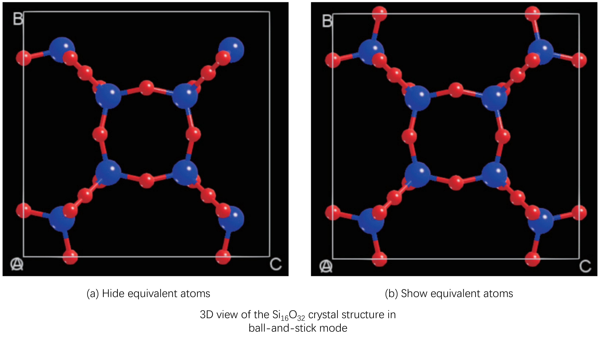

.. figure:: images/Introduction_4.png
   :align: center

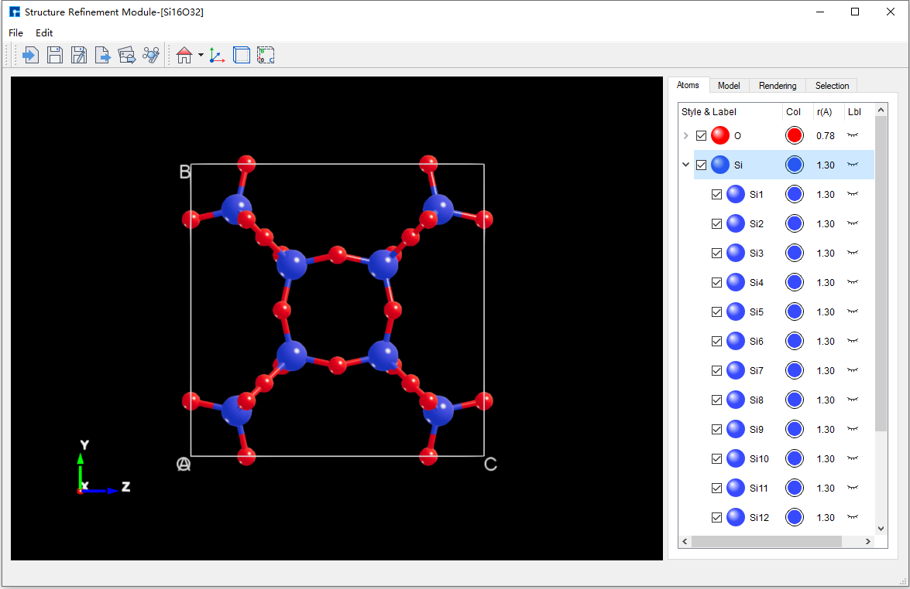

.. centered:: Device Studio Atomic Structure Refinement Interface

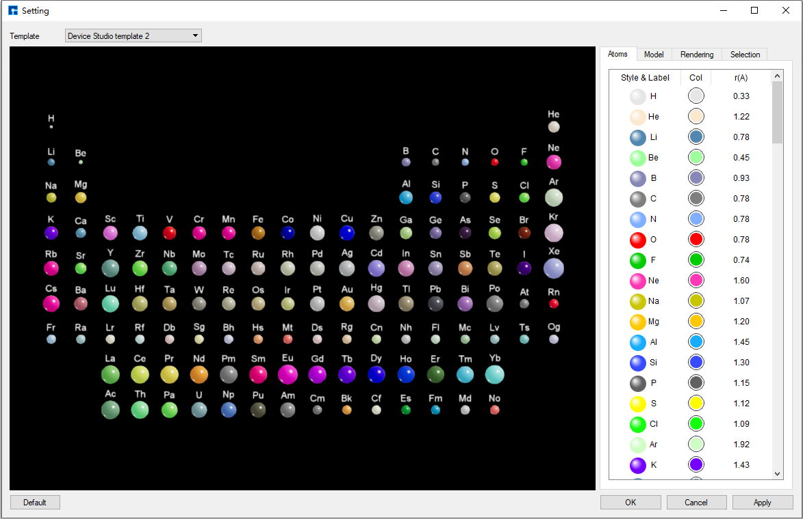

.. centered:: Device Studio Initial Template

.. _rich-material-database:

Rich Material Database
======================

- Local Database: Currently contains over 500 commonly used or popular materials, with continuous updates and expansion planned.
- The Device Studio platform supports the online Materials Project database. Users can connect to this database through the platform to search and import structures, and view information such as space group symmetry and atomic coordinates.

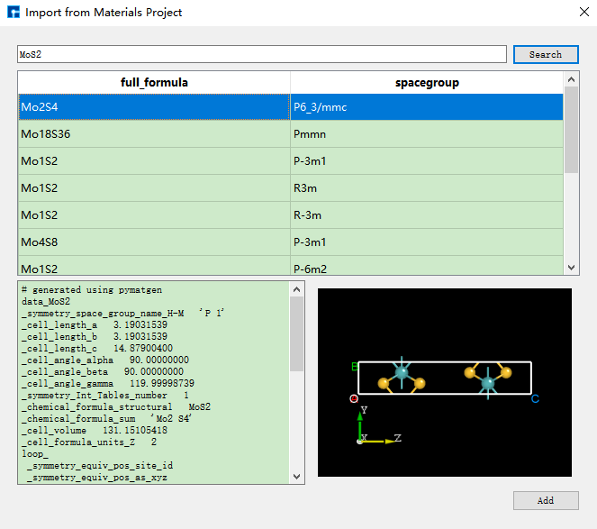

.. _creation-of-molecules-crystals-devices-and-special-structures:

Creation of Molecules, Crystals, Devices, and Special Structures
=================================================================

- The Device Studio platform has powerful modeling capabilities, supporting the creation of various molecules, crystals, devices, and special structures.
- It can automatically cleave crystal planes and match device structures based on matching precision; it can match and construct crystal and multilayer film structures.
- It can generate special structures such as Nanoribbons, Nanotubes, clusters, grain boundaries, and random doping.

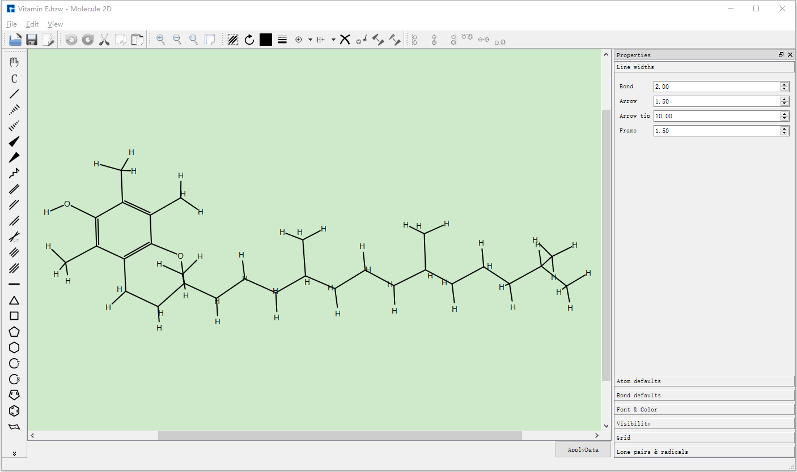

.. centered:: Device Studio Platform Building 2D Molecular Structure

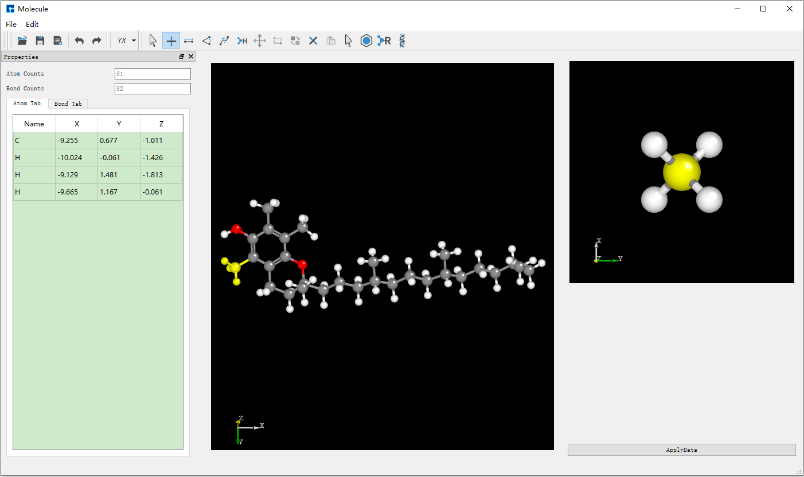

.. centered:: Device Studio Platform Building 3D Molecular Structure

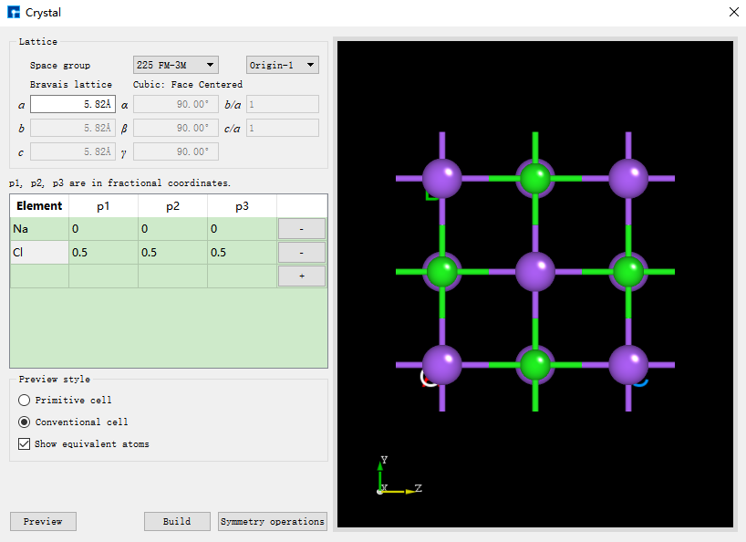

.. centered:: Device Studio Platform Building Crystal Structure

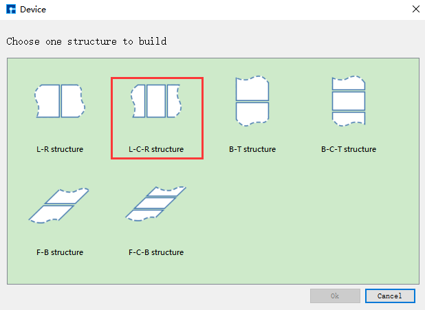

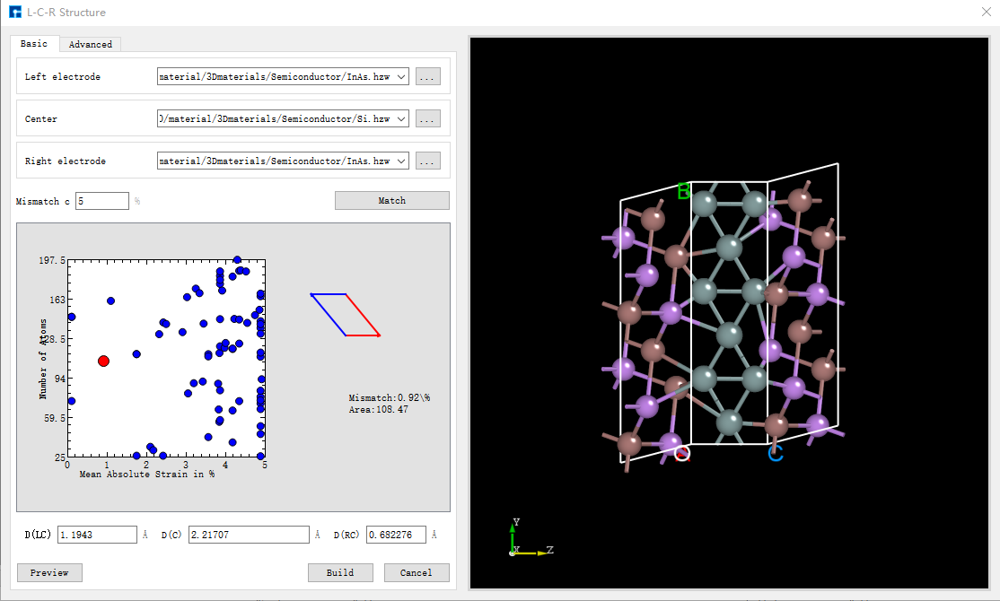

.. centered:: Device Studio Platform Building L-C-R Device Structure

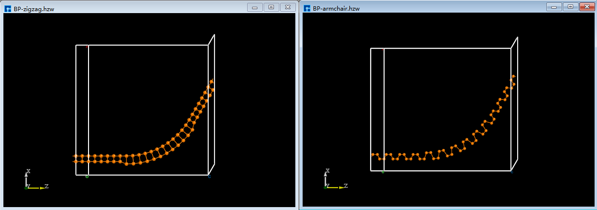

.. centered:: Device Studio Platform Building Flexible Device Structure

.. _interconversion-of-molecular-crystal-and-device-structures:

Interconversion of Molecular, Crystal, and Device Structures
=============================================================
The Device Studio platform supports interconversion between molecular, crystal, and device structures.

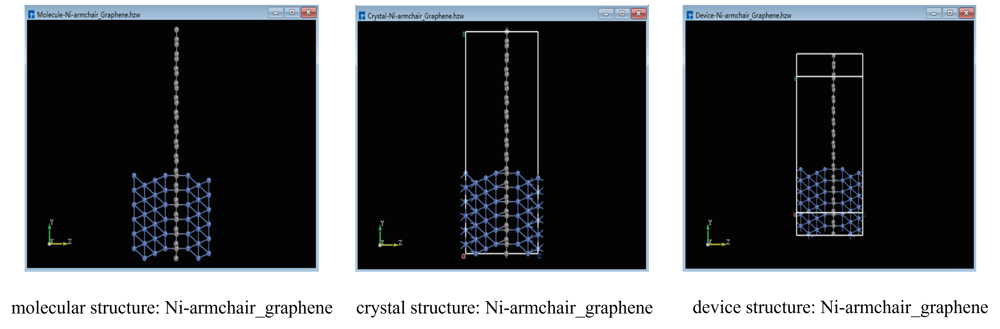

.. _high-performance-scientific-simulation-computing:

========================================
High-performance Scientific Simulation Computing
========================================

- **Multiple Computing Software Ready to Use**.

Device_ Studio_ integrates various scientific computing software that are ready to use, meeting users' simulation needs across different fields. It includes DS-PAW_ for first-principles plane-wave calculations, BDF_ for quantum chemistry calculations.

.. _computation-task-monitoring-and-management:

========================================
Computation Task Monitoring and Management
========================================

- **Connection to Supercomputing Servers and Local Computers**.

Using the Device Studio platform, users can automatically connect to supercomputing servers and local computers, switching between server and local computer usage with one click based on computational needs.

- **Computation Task Monitoring and Management**.

Through the Device Studio platform's graphical interface, users can submit various scientific simulation software computation tasks with mouse clicks, without needing to master Linux systems. Users can monitor computation task status in real-time (queued, computing, completed), and results are automatically retrieved locally upon completion, significantly reducing the learning curve and operational difficulty for beginners.

.. _data-visualization:

========================================
Data Visualization
========================================

- **Data Visualization of Computation Results**.

The Device Studio platform can automatically analyze scientific simulation computation results and generate data visualization graphics. Users can switch between 3D, 2D, or 1D data visualization graphics with one click, and can export visualizations in formats such as ``.png``, ``.jpg``, ``.bmp``, ``.pdf``, ``.tif``, and ``.eps``. For dynamic visualizations such as motion trajectories, users can export the visualization graphics as ``.gif`` animations.

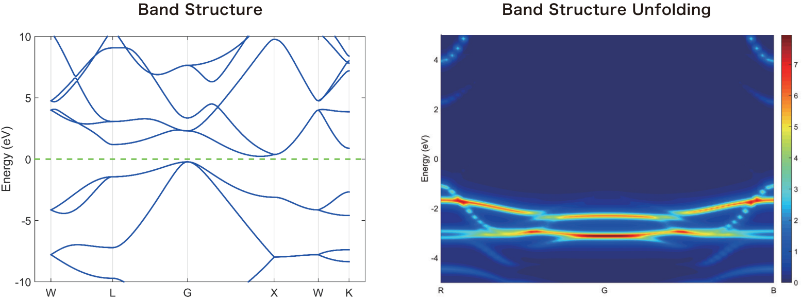

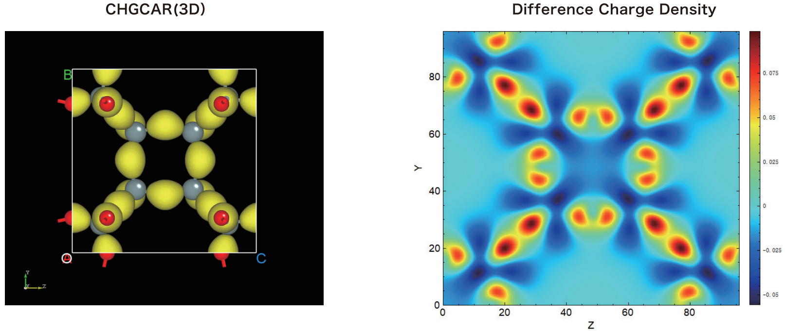

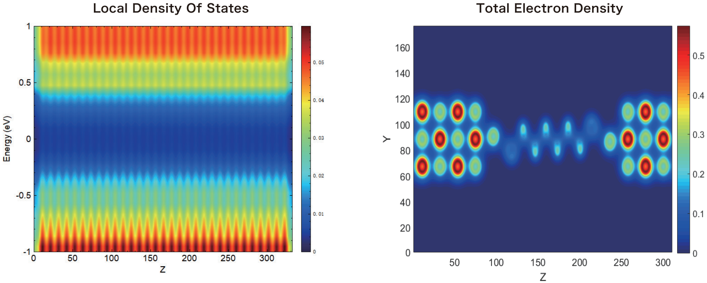

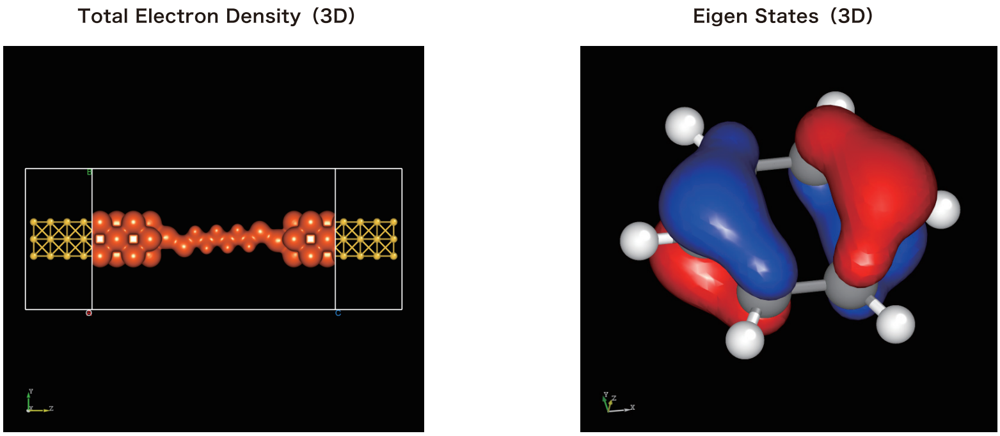

- **Visualization Graphics Editing**.

For visualization graphics, the Device Studio platform provides editing functions such as zoom in/out, rotation, Colorbar display options, Colormap selection, modification of axis ranges, and customization of title and axis font types, sizes, and bold settings.

.. _bdf: https://cloud.hzwtech.com/web/product-service?id=13

.. _device: https://cloud.hzwtech.com/web/product-service?id=6

.. _ds: https://cloud.hzwtech.com/web/product-service?id=10

.. _ds-paw: http://hzwtech.com/Device%20Studio/DS-PAW/index.html

.. _studio: https://cloud.hzwtech.com/web/product-service?id=6

