.. _quick-start-guide:

**************************
Quick Start Guide
**************************

This Quick Start Guide uses the **Self-consistent and Band Structure Calculation of Si Crystal Structure** in the first-principles quantum transport calculation software Nanodcal as an example. It is divided into several steps, including logging in and starting Device Studio, creating a Device Studio project, importing the Si crystal structure, generating self-consistent and band structure calculation input files, submitting self-consistent and band structure calculation tasks, data visualization of the Si crystal structure band structure, and exporting band structure visualization results.

.. _login-and-start-device-studio:
 
=============================
Login and Start Device Studio
=============================

Double-click the :guilabel:`DeviceStudio.exe` file in the **bin** directory of the extracted Device Studio installation package or the **Device Studio shortcut** on your desktop. The login and startup process is shown in :numref:`StartedGuide_1`.

.. _StartedGuide-figure_1:
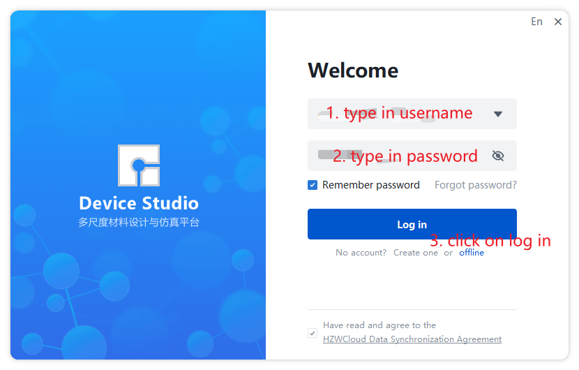

   Login and Start Device Studio

.. _create-a-device-studio-project:
 
=============================
Create a Device Studio Project
==============================

After logging in and starting Device Studio, you can create a Device Studio project. The project creation process is shown in :numref:`StartedGuide_2`, :numref:`StartedGuide_3`, and :numref:`StartedGuide_4`.

.. _StartedGuide-figure_2:
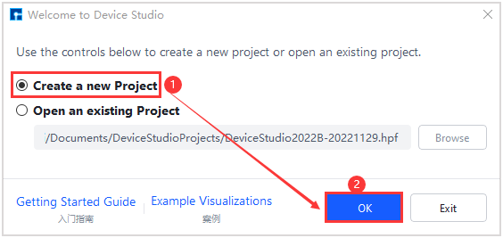

   Create Project

.. _StartedGuide-figure_3:
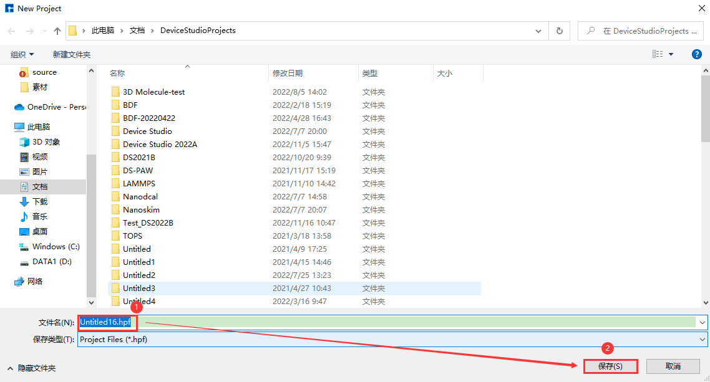

   Name the Project

.. _StartedGuide-figure_4:
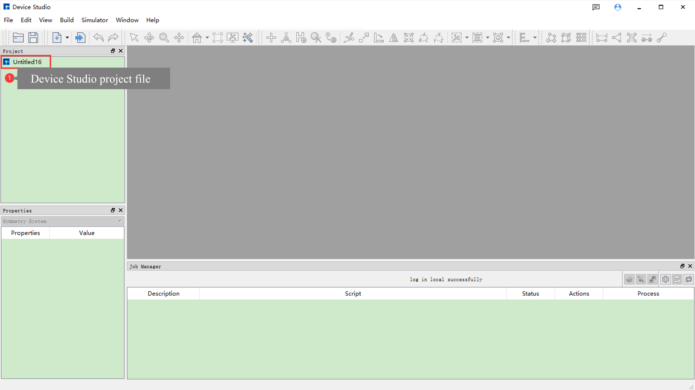

   Device Studio Interface After Project Creation

.. _import-si-crystal-structure:
 
=============================
Import Si Crystal Structure
===========================

The process of importing the Si crystal structure is shown in :numref:`StartedGuide_5`, :numref:`StartedGuide_6`, and :numref:`StartedGuide_7`.

.. _StartedGuide-figure_5:
.. figure:: images/BeginnerGuide_5.png
   :align: center
   :name: StartedGuide_5

   Open Import Structure Interface

.. _StartedGuide-figure_6:
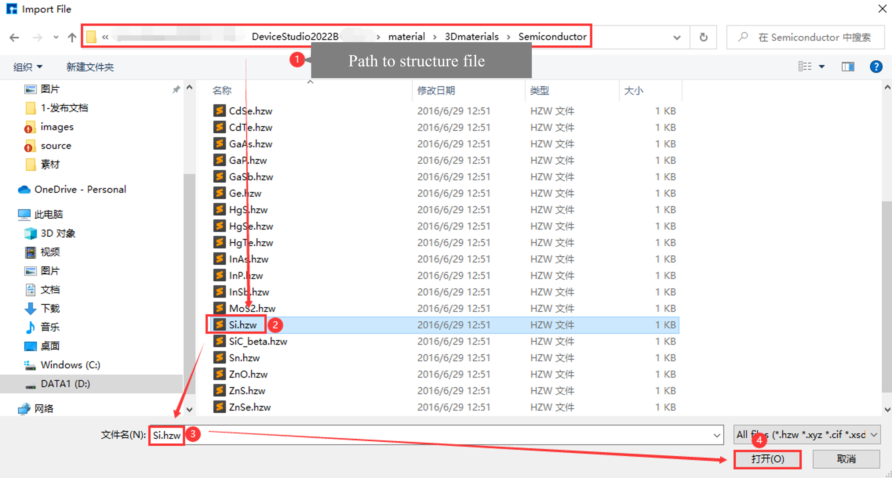

   Import Si Crystal Structure

.. _StartedGuide-figure_7:
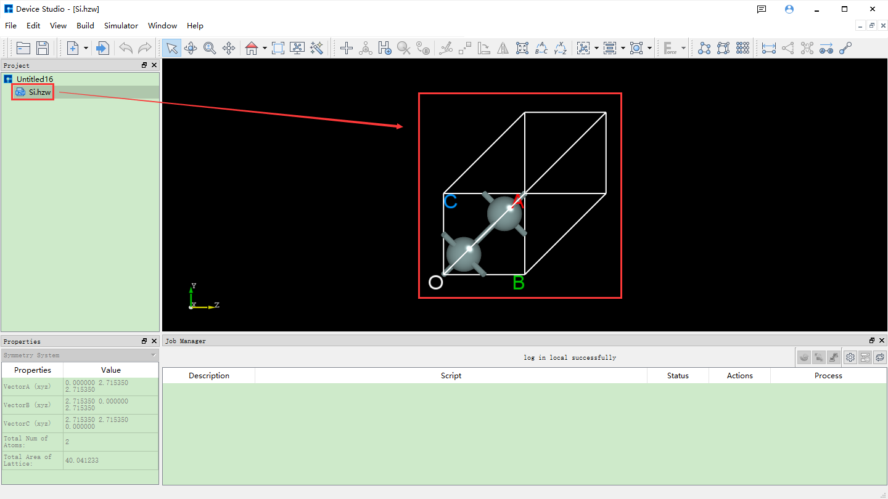

   Device Studio Interface After Importing Si Crystal Structure

.. _generate-self-consistent-and-band-structure-calculation-input-files:
 
=========================================================
Generate Self-consistent and Band Structure Calculation Input Files
===================================================================

The process of generating the Si crystal structure self-consistent calculation input file is shown in :numref:`StartedGuide_8`, :numref:`StartedGuide_9`, and :numref:`StartedGuide_10`.

The process of generating the Si crystal structure band structure calculation input file is shown in :numref:`StartedGuide_11`, :numref:`StartedGuide_12`, and :numref:`StartedGuide_13`.

.. _StartedGuide-figure_8:
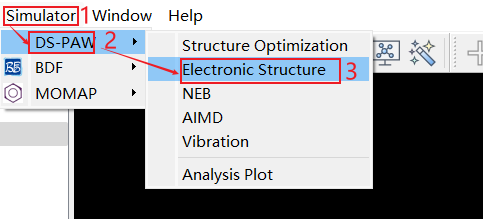

   Open Generate Self-consistent Calculation Input File Interface

.. _StartedGuide-figure_9:
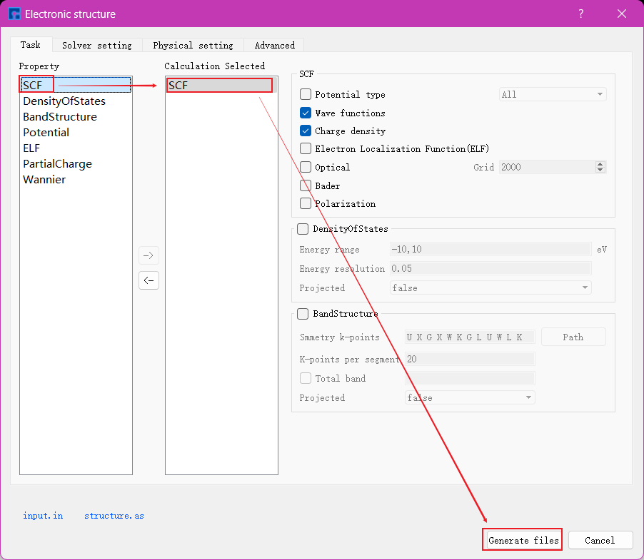

   Set Parameters and Generate Self-consistent Calculation Input File

.. _StartedGuide-figure_12:
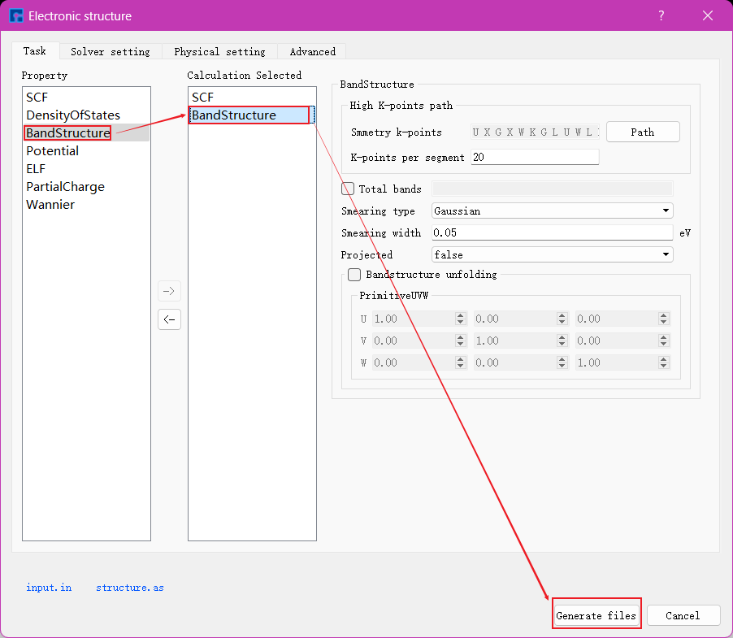

   Set Parameters and Generate Band Structure Calculation Input File

.. _StartedGuide-figure_13:
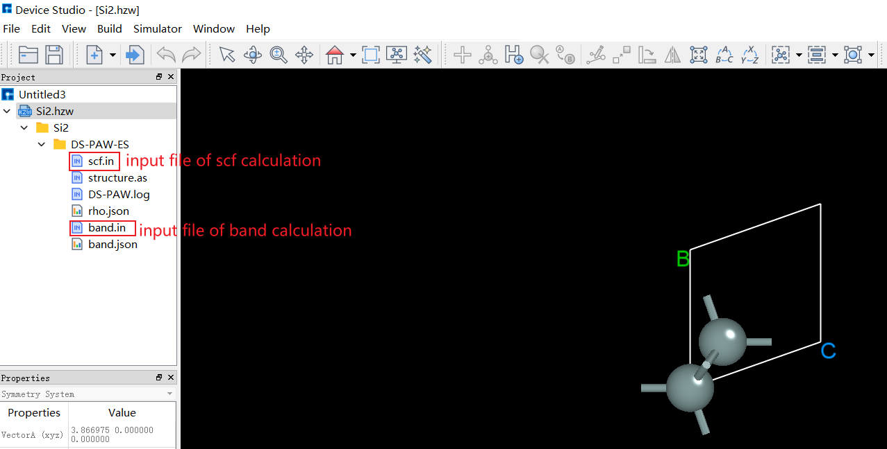

   Device Studio Interface After Generating Band Structure Calculation Input File

.. _submit-self-consistent-and-band-structure-calculation-tasks:
 
==========================================================
Submit Self-consistent and Band Structure Calculation Tasks
===========================================================

First, perform the self-consistent calculation for the Si crystal structure. The process of submitting the Si crystal structure self-consistent calculation task is shown in :numref:`StartedGuide_14` and :numref:`StartedGuide_15`.

.. _StartedGuide-figure_14:
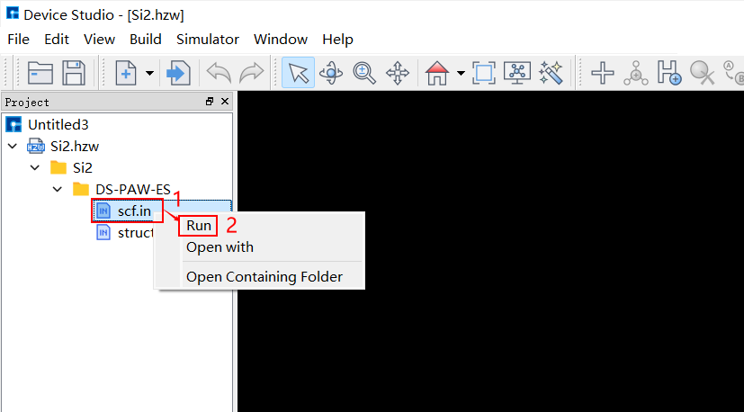

   Submit Self-consistent Calculation Task Step 1

.. _StartedGuide-figure_15:
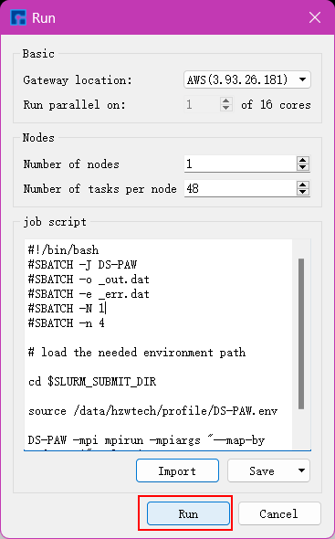

   Submit Self-consistent Calculation Task Step 2
   

.. _StartedGuide-figure_16:
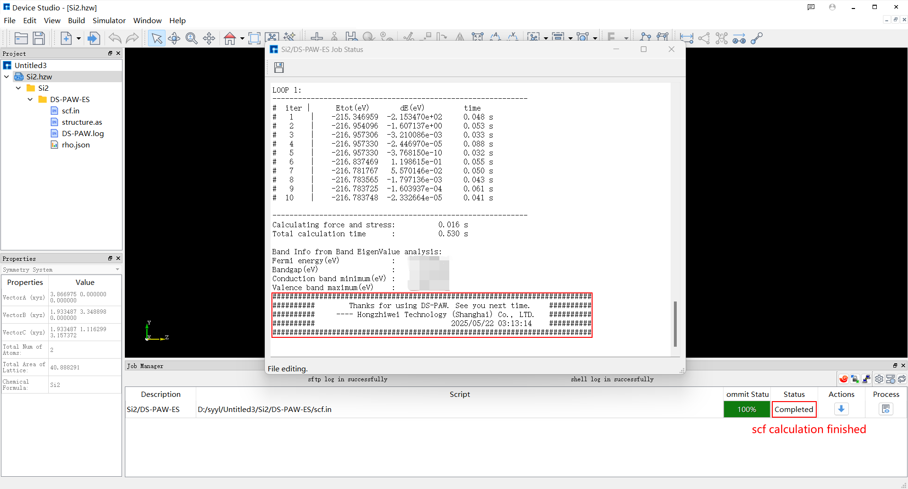
   
   Device Studio Interface After Si Crystal Structure Self-consistent Calculation Completion

**Only after the self-consistent calculation is completed can the band structure calculation of the Si crystal structure be performed**. You can determine whether the self-consistent calculation task is completed through the **Computation Task Monitoring Management Area**. When the calculation task is queued, running, or completed, the :guilabel:`Status` will be Queued, Running, or Completed respectively. The Device Studio interface after the Si crystal structure self-consistent calculation is completed is shown in :numref:`StartedGuide_16`. The process of submitting the Si crystal structure band structure calculation task is shown in :numref:`StartedGuide_17` and :numref:`StartedGuide_18`. The Device Studio interface after the Si crystal structure band structure calculation is completed is shown in :numref:`StartedGuide_19`.

.. _StartedGuide-figure_17:
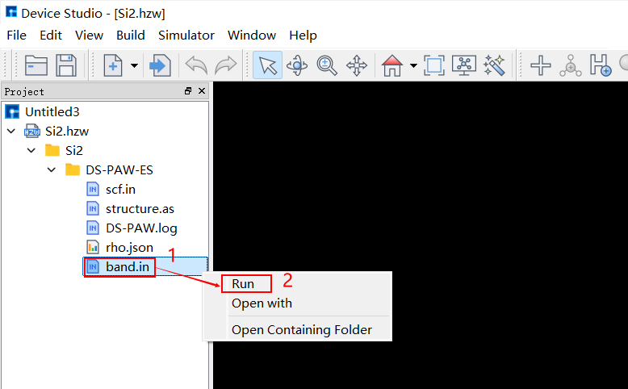

   Submit Band Structure Calculation Task Step 1

.. _StartedGuide-figure_18:
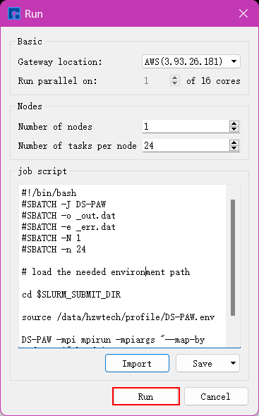

   Submit Band Structure Calculation Task Step 2

.. _StartedGuide-figure_19:
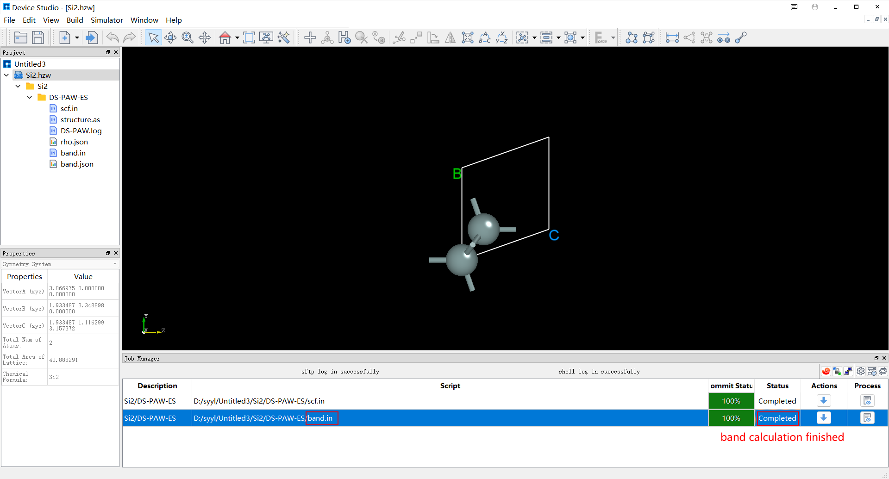
   
   Device Studio Interface After Si Crystal Structure Band Structure Calculation Completion

.. _data-visualization-of-si-crystal-structure-band-structure:
 
==========================================================
Data Visualization of Si Crystal Structure Band Structure
=========================================================

After the Si crystal structure band structure calculation is completed, you can perform visualization analysis on the band structure calculation results. The process is shown in :numref:`StartedGuide_20`.

.. _StartedGuide-figure_20:
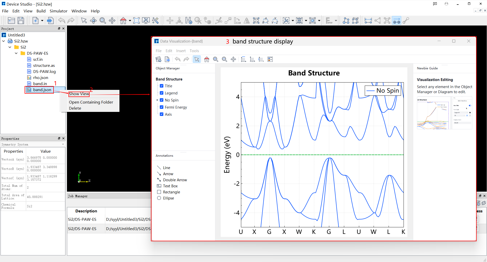
  
   Device Studio Steps for Data Visualization of Si Crystal Structure Band Structure Calculation Results

.. _export-band-structure-data-visualization-results:
 
==================================================
Export Band Structure Data Visualization Results
================================================

After visualizing the Si crystal structure band structure calculation results, users can export the data visualization results as needed. The export process is shown in :numref:`StartedGuide_21`.

.. _StartedGuide-figure_21:
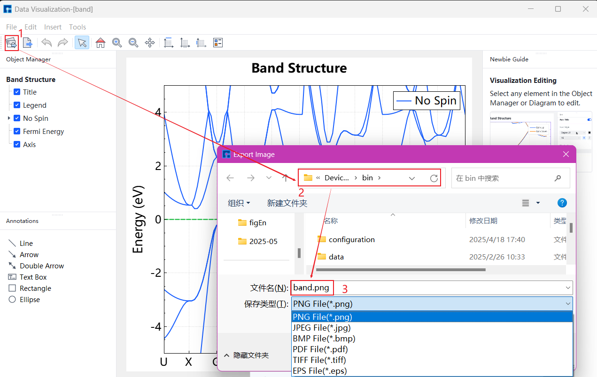

   Device Studio Steps for Exporting Si Crystal Structure Band Structure Data Visualization Results

