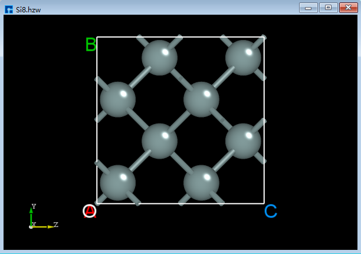

.. _structure-editing-and-information-measurement:

********************************
Structure Editing and Information Measurement
********************************

For structure manipulation, users should first carefully read the descriptions of each shortcut icon in :ref:`Toolbars`, then perform the corresponding operations as needed. The structure view after the operation can be viewed in the 3D display area.

.. _basic-operations-for-3d-structure-display:

================================
Basic Operations for 3D Structure Display
=========================================

Device Studio supports viewing the 3D structure from ZY, XY, XZ, YZ, YX, and ZX planes, as shown in the NaCl (111) crystal structure in the 3D display area (:download:`NaCl(111).hzw`). Users can reset the structure to the ZY plane by clicking the :guilabel:`3D Viewer zy View` shortcut icon in the toolbar.  Clicking the dropdown button of this shortcut icon allows selection of XY, XZ, YZ, YX, or ZX planes to view the 3D structure of the NaCl (111) crystal. The 3D views of the NaCl (111) crystal structure from the ZY, XY, XZ, YZ, YX, and ZX planes in the 3D display area are shown in :numref:`StructureOperation_1`, :numref:`StructureOperation_2`, :numref:`StructureOperation_3`, :numref:`StructureOperation_4`, :numref:`StructureOperation_5`, and :numref:`StructureOperation_6`, respectively.

.. list-table:: 

   * - .. figure:: images/NaCl_3D_1.png
          :name: StructureOperation_1

          3D View of NaCl (1 1 1) ZY Plane

     - .. figure:: images/NaCl_3D_2.png
          :name: StructureOperation_2

          3D View of NaCl (1 1 1) XY Plane

   * - .. figure:: images/NaCl_3D_3.png
          :name: StructureOperation_3

          3D view of NaCl (1 1 1) XZ plane

     - .. figure:: images/NaCl_3D_4.png
          :name: StructureOperation_4

          3D view of NaCl (111) YZ plane

   * - .. figure:: images/NaCl_3D_5.png
          :name: StructureOperation_5

          3D view of NaCl (1 1 1) YX plane

     - .. figure:: images/NaCl_3D_6.png
          :name: StructureOperation_6

          3D view of NaCl (1 1 1) ZX plane

In the 3D structure display area, users can zoom in or out of the 3D view of the structure by scrolling the middle mouse button; they can pan the 3D view of the structure in this area by first selecting the :guilabel:`3D Viewer Translation Mode` shortcut icon in the toolbar or holding down the middle mouse button and dragging the mouse; they can rotate the 3D view of the structure in this area by first selecting the :guilabel:`3D Viewer Rotation Mode` shortcut icon in the toolbar or holding down the right mouse button and dragging the mouse.

.. _structure-modification-operations:

================================
Structure Modification Operations
=================================

Taking crystalline MoS2 as an example to illustrate a series of structural modification operations, prepare the structure file (:download:`MoS2.hzw`). Drag and drop this file into the Project Explorer area of the software to import the structure. The 3D view of the structure in the zy plane is shown in :numref:`StructureOperation_7` (a).

.. _adding-atoms:

Adding Atoms
============

To add a Cr atom to crystalline MoS2, as shown in red in :numref:`StructureOperation_19`, click the :guilabel:`Add Atom` shortcut icon in the Toolbars.  The periodic table will pop up. Select Cr in the periodic table and click :guilabel:`OK`. Click the left mouse button at position ④ in the interface shown in :numref:`StructureOperation_19`. Then click the :guilabel:`Recalculate LinkerBond` shortcut icon to recalculate bond lengths. This completes the operation of adding a Cr atom to MoS2. The completed 3D view is shown in :numref:`StructureOperation_8` (b).

   Add atomic operation interface

.. _delete-atom:

Delete Atom
===========

To delete an S atom, as shown in the structure in :numref:`StructureOperation_8` (b), follow the steps illustrated in the red portion of :numref:`StructureOperation_20`. Select the S atom to be deleted, click the :guilabel:`Delete Atom` shortcut icon on the toolbar, or press the :guilabel:`Delete` key.  Then, click the :guilabel:`Recalculate LinkerBond` shortcut icon to recalculate bond lengths. The 3D view after deleting the S atom is shown in :numref:`StructureOperation_9` (c).

   Remove Atom Operation Interface

.. _replacement-atom:

Replacement Atom
================

To replace a Cr atom with a W atom in the structure shown in :numref:`StructureOperation_9` (c), follow the steps shown in red in :numref:`StructureOperation_21`. Select the Cr atom to be replaced, click the :guilabel:`Replace Atom` shortcut icon in the Toolbars, select W from the periodic table that appears, click :guilabel:`OK`, and then click the :guilabel:`Recalculate LinkerBond` shortcut icon to complete the replacement. The 3D view of the resulting structure is shown in :numref:`StructureOperation_10` (d).

   Replace Atomic Operation Interface

.. _modifying-atomic-coordinates:

Modifying Atomic Coordinates
============================

To modify the coordinates of the W atom from (0.79757905, 1.84840857, 7.24943971) in :numref:`StructureOperation_10` (d) to (1.0, 1.5, 12.0), follow the steps shown in red in :numref:`StructureOperation_22`. First, select the W atom with the mouse.  The coordinates of the selected W atom, (0.5951619, 1.47565329, 7.18570423), will be displayed in the Properties Explorer. Then, double-click the appropriate fields and enter 1.0, 1.5, and 12.0 respectively to modify the W atom's coordinates. Finally, click the :guilabel:`Recalculate LinkerBond` shortcut icon to recalculate bond lengths. The 3D view of the structure after modifying the atomic coordinates is shown in :numref:`StructureOperation_11` (e).

.. figure:: images/69_structure_4_1.png
   :align: center
   :name: StructureOperation_22

   Modify Atomic Coordinates Operation Interface

.. _move-the-selected-atom:

Move the selected atom
======================

For the structure shown in :numref:`StructureOperation_11` (e), move the two leftmost atoms as shown in the red portion of :numref:`StructureOperation_13`. First, select the two leftmost atoms with the mouse. Click the :guilabel:`Move Atom` shortcut icon to open the Move Atom dialog. Enter the distance to move in the dialog and click to move along the positive Z direction (+z). After moving, click the :guilabel:`Recalculate LinkerBond` shortcut icon to recalculate the bond lengths. The 3D view of the structure after moving is shown in :numref:`StructureOperation_12` (f).

   Move the selected atomic operation interface

.. admonition:: note

   This only describes a portion of the structural modification operations.  Users can refer to the descriptions of each shortcut icon in :ref:`Toolbars` for details and perform corresponding structural operations as needed.

.. list-table:: 

   * - .. figure:: images/66_structure_1.png
          :name: StructureOperation_7

          （a）               

     - .. figure:: images/67_structure_2.png
          :name: StructureOperation_8

          （b）

   * - .. figure:: images/68_structure_3.png
          :name: StructureOperation_9

          （c）               

     - .. figure:: images/69_structure_4.png
          :name: StructureOperation_10

          （d）

   * - .. figure:: images/70_structure_5.png
          :name: StructureOperation_11

          （e）               

     - .. figure:: images/72_structure_7.png
          :name: StructureOperation_12

          （f）

.. _information-measurement-of-structure:

================================
Information Measurement of Structure
====================================

A series of operations for measuring structural information is described using the Si8 crystal structure as an example. Prepare the structure file (:download:`Si8.hzw`), and drag and drop it into the Project Explorer of the software to import the structure. The 3D view of the structure's zy plane is shown in :numref:`StructureOperation_14`.

   Si8 Crystal Structure

.. admonition:: 注意事项

   To measure structural information, multiple atoms often need to be selected.  It is recommended that users first select the corresponding shortcut icon on the :ref:`Toolbars` and then hold down the :guilabel:`Ctrl` key while individually selecting atoms in the structure.  Without holding down the :guilabel:`Ctrl` key, multiple atom selection via mouse clicks is not possible, and therefore structural information measurement cannot be performed.

.. _measuring-the-distance-between-two-atoms:

Measuring the distance between two atoms
========================================

For the crystal structure shown in :numref:`StructureOperation_14`, click the :guilabel:`Distance` shortcut icon on the Toolbars, hold down the :guilabel:`Ctrl` key on the keyboard, and then select two atoms in the structure with the mouse to measure the distance between the selected two atoms, as shown in :numref:`StructureOperation_15` (a).  If you do not want to keep the measurement numbers, right-click and select "Clear Annotation".

.. _measuring-the-vector-between-two-atoms:

Measuring the vector between two atoms
======================================

For a crystal structure as shown in :numref:`StructureOperation_14`, click the :guilabel:`Vector between two atoms` shortcut icon on the Toolbars, hold down the :guilabel:`Ctrl` key on the keyboard, and then select two atoms in the structure with the mouse to measure the vector between the selected two atoms, as shown in :numref:`StructureOperation_16` (b).

.. _measuring-the-angle-between-three-atoms:

Measuring the Angle Between Three Atoms
=======================================

For a crystal structure as shown in :numref:`StructureOperation_14`, click the :guilabel:`Angle` shortcut icon on the Toolbars, hold down the :guilabel:`Ctrl` key on the keyboard, and then select three atoms in the structure with the mouse to measure the angle between the selected three atoms, as shown in :numref:`StructureOperation_17` (c).

.. _measuring-the-dihedral-angle-between-four-atoms:

Measuring the dihedral angle between four atoms
===============================================

For a crystal structure as shown in :numref:`StructureOperation_14`, click the :guilabel:`Dihedral angle` shortcut icon on the Toolbars, hold down the :guilabel:`Ctrl` key on the keyboard, and then select four atoms in the structure with the mouse to measure the dihedral angle between the selected four atoms, as shown in :numref:`StructureOperation_18` (d).

.. list-table:: 

   * - .. figure:: images/74_structure_9.png
          :name: StructureOperation_15

          （a）   			

     - .. figure:: images/75_structure_10.png
          :name: StructureOperation_16

          （b）

   * - .. figure:: images/76_structure_11.png
          :name: StructureOperation_17

          （c）    			

     - .. figure:: images/77_structure_12.png
          :name: StructureOperation_18

          （d）

