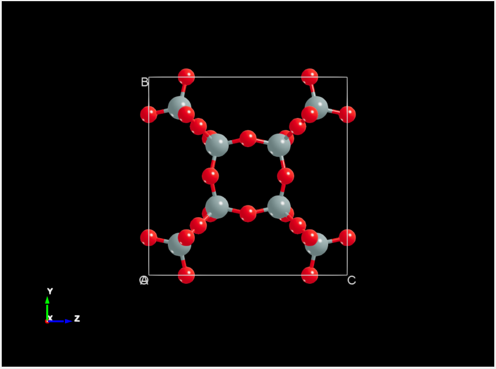
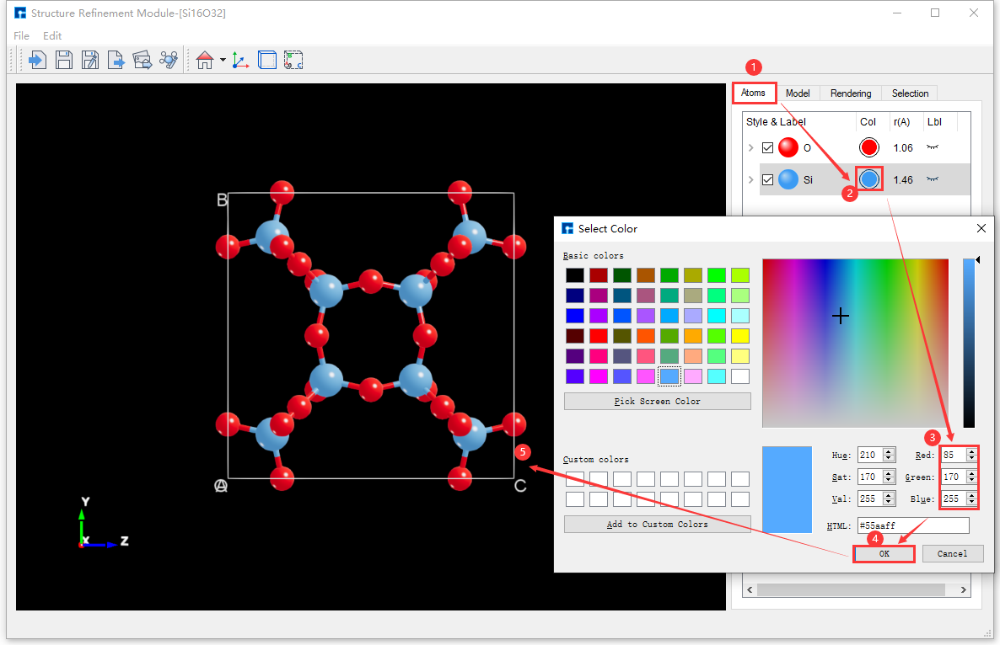
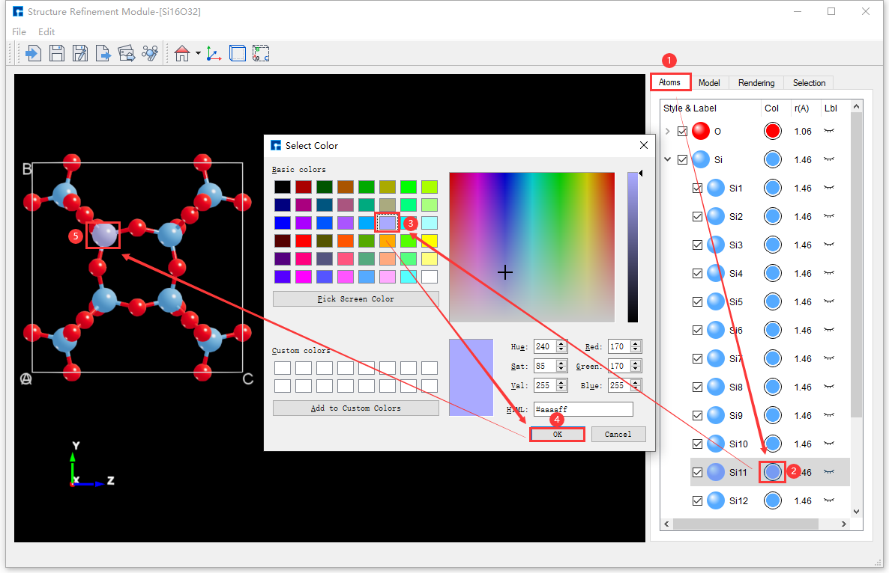
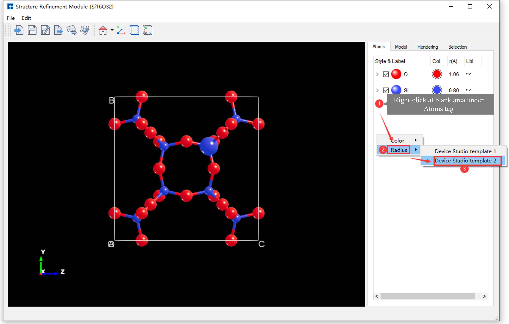

.. _atomic-structure-refinement-module:

********************************
Atomic Structure Refinement Module
********************************

The Device Studio's new Structure Refinement Module (SRM) significantly enhances the rendering and anti-aliasing of 3D atomic structure displays.  It displays atomic structures using equivalent atoms, supporting both ball-and-stick and polyhedral modes.  In polyhedral mode, polyhedron transparency can be adjusted.  Users can modify the color, radius, and lighting of individual atoms, multiple atoms of the same element, or groups of atoms.  The SRM includes Device Studio initial templates, allowing users to create custom templates with defined color, radius, and lighting parameters, which can then be applied to imported atomic structures.

This chapter will use the **Si16O32 crystal structure** (:download:`Si16O32.hzw`) as an example to detail the functions of the Structure Refinement Module.

***Key Features of the Atomic Structure Refinement Module** are as follows:

- - Added an atomic structure refinement module, comprehensively upgrading the rendering and anti-aliasing effects of the 3D atomic structure display;

  - - Smoother and more three-dimensional atomic structure display for improved visualization.

- - Added support for displaying atomic structures as **equivalent atoms**, with options for ball-and-stick or polyhedron modes;

  - - Users can select the display mode for atomic structures: ball-and-stick or polyhedron;

  - - In polyhedron mode, users can adjust the polyhedron's color and transparency.

- - Added support for 3D structure view editing;

  - - Supports modifying the color, radius, and lighting of a single atom, multiple atoms of the same element, or multiple atoms within an atomic structure.

- - Added Device Studio template functionality;

  - - Two Device Studio initial templates are currently available, allowing users to select and apply a template to the atomic structure;

  - - Templates are configured based on the periodic table of elements, including parameters such as color, radius, lighting, and background color.

- - Added support for creating user-specific templates;
  
  - - Users can set parameters such as template color, radius, lighting, and background color to generate and apply custom templates.

- - Added support for controlling the display or hiding of Axes, Cell, and OABC in the :ref:`SRM structure display area`;

- - Added support for setting the background color of the 3D structure view (:ref:`SRM structure display area`);

  - - Supports setting the background color of the :ref:`SRM structure display area`, including gradient effects.

- - Added structure import, save, and export functionalities.

  - - Supports importing and displaying `.dsxml`, `.hzw`, `.xyz`, `.cif`, `.pdb`, and `.mol` structure files;

  - - Supports exporting `.hzw`, `.xyz`, and `.cif` structure files;

  - - Supports exporting 3D views of atomic structures in `.png`, `.jpg`, `.bmp`, `.pdf`, `.tif`, and `.eps` image formats.

.. admonition:: note

    - - The `.dsxml` format is exclusive to the Device Studio atomic structure refinement module. To continue editing a structure file in a subsequent session, it is recommended to save it as a `.dsxml` file via the **Atomic Structure Refinement Module** interface, such as in :numref:`StructureRefinementModule_7`, by clicking :guilabel:`File` → :guilabel:`Save As`.

    - - Since the Structure Refinement module displays the structure file in a **3D view**, and ``.mol`` structure files are available in both 2D and 3D formats, users who need to import this type of structure file into the Structure Refinement module are advised to import the 3D ``.mol`` structure file.

.. _introduction-to-the-graphical-user-interface-of-the-atomic-structure-refinement-module:

================================
Introduction to the Graphical User Interface of the Atomic Structure Refinement Module
======================================================================================

The graphical user interface (GUI) of the Structure Refinement Module (SRM) is shown in :numref:`StructureRefinementModule_7`.

   Atomic Structure Refinement Module Graphical User Interface

.. _srm-menu-bar:
 
SRM Menu Bar
============

The Structure Refinement Module (SRM) menu bar is shown in :numref:`StructureRefinementModule_8`.

   Atomic Structure Refinement Module Menu Bar

.. _srm-menu-bar-file:

SRM Menu Bar - File
------------------------------

Clicking :guilabel:`File` on the Structure Refinement Module (SRM) menu bar displays the interface shown in :numref:`StructureRefinementModule_9`.

.. figure:: images/SRM_Function_9.png
   :align: center
   :name: StructureRefinementModule_9   

   SRM - Menu Bar - File

- - :guilabel:`Import` : Clicking this opens a dialog box (as shown in :numref:`StructureRefinementModule_6`) for importing structure files (``.dsxml``, ``.hzw``, ``.xyz``, ``.cif``, ``.pdb``, ``.mol``), allowing users to import atomic structures as needed.

- - :guilabel:`Save`: Initially grayed out and disabled.  It becomes highlighted and enabled after the user edits the atomic structure. Clicking it saves the user's edits to the atomic structure parameters.  This action subsequently invokes the :guilabel:`Save As` dialog (as shown in :numref:`StructureRefinementModule_12`) to save the structure file (``.dsxml``).

- - :guilabel:`Save As` : Clicking this button opens a dialog box for saving the structure file (``.dsxml``), allowing the user to name the file and choose a save location, as shown in :numref:`StructureRefinementModule_12`.

- - :guilabel:`Export Data` : Clicking this button opens a dialog for exporting structure files (``.hzw``, ``.xyz``, ``.cif``). Users can select the file format, name the file as needed, and choose a storage location, as shown in :numref:`StructureRefinementModule_13`.

- - :guilabel:`Export Image`: Clicking this button opens a dialog for exporting image files (``.png``, ``.jpg``, ``.bmp``, ``.pdf``, ``.tif``, ``.eps``). Users can name the image file as needed and select a storage location, as shown in :numref:`StructureRefinementModule_14`.

- - :guilabel:`Setting` : Clicking this opens the Setting interface, which contains Device Studio templates.  Parameters such as element radius, color, and lighting can be set within the templates.

- - :guilabel:`Exit` : Click to close the atomic structure refinement module interface.

   Save Structure File (``.dsxml``) Interface

   Export Structure Files (``.hzw``, ``.xyz``, ``.cif``) Interface

   Export Image Files (.png, .jpg, .bmp, .pdf, .tif, .eps) Interface

.. _SRMEdit:

SRM Menu Bar - Edit
------------------------------

Click :guilabel:`Edit` on the Structure Refinement Module (SRM) menu bar; the interface is shown in :numref:`StructureRefinementModule_10`.

   SRM - Menu Bar - Edit

- - :guilabel:`Home ZY View`: Clicking this restores the atomic structure to its initial state in the structure display area.  The dropdown allows selection of different 3D views of the structure.

.. admonition:: note

    The :guilabel:`Home ZY View` primarily targets atomic structures that have been rotated, translated, zoomed, or scaled.  Users can restore the initial state with a single click as needed.

.. _srm-toolbar:
 
SRM Toolbar
===========

The Structure Refinement Module (SRM) menu bar is shown in :numref:`StructureRefinementModule_11`.

   Structure Refinement Module Toolbar

The functions of each icon in the :ref:`SRM toolbar` are shown in the table below:

.. list-table:: 
    :widths: 5 5 10 40
    :header-rows: 1
    :stub-columns: 1

    * - Number
      - Icon
      - Icon Name
      - Function Description
    * - 1
      - .. image:: images/SRM_Toobars_1.png
          :align: center
      - Import
      - After clicking, a dialog box for importing structural files pops up, allowing users to import atomic structures as needed.
    * - 2
      - .. image:: images/SRM_Toobars_2.png
          :align: center
      - Save
      - After clicking, save the user's edited parameters for the atomic structure.
    * - 3
      - .. image:: images/SRM_Toobars_3.png
          :align: center
      - Save As
      - After clicking, a dialog box pops up for saving the structure file (``.dsxml``), allowing you to save the structure file.
    * - 4
      - .. image:: images/SRM_Toobars_4.png
          :align: center
      - Export Data
      - After clicking, a dialog box pops up for exporting structural files (``.hzw``, ``.xyz``, ``.cif``), allowing users to select the desired file format.
    * - 5
      - .. image:: images/SRM_Toobars_5.png
          :align: center
      - Export Image
      - After clicking, a dialog box will pop up allowing you to export the image file (``.png``, ``.jpg``, ``.bmp``, ``.pdf``, ``.tif``, ``.eps``).  Users can name the structure file and select a storage location as needed.
    * - 6
      - .. image:: images/SRM_Toobars_6.png
          :align: center
      - Setting
      - After clicking, the Setting interface pops up. This interface contains Device Studio templates, allowing you to set parameters such as the radius, color, and lighting of elements in the template.
    * - 7
      - .. image:: images/SRM_Toobars_7.png
          :align: center
      - Home ZY View
      - After clicking, restores the initial state of the atomic structure in the structure display area. Clicking the dropdown allows you to view the 3D structure from different perspectives.
    * - 8
      - .. image:: images/SRM_Toobars_8_Axes_On.png
          :align: center
      - Show Axes
      - Show Axes
    * - 9
      - .. image:: images/SRM_Toobars_8_Axes_Off.png
          :align: center
      - Hide Axes
      - Hide Axes
    * - 10
      - .. image:: images/SRM_Toobars_9_Cell_On.png
          :align: center
      - Show Cell
      - Show Cell when the structure is a crystal or a device.
    * - 11
      - .. image:: images/SRM_Toobars_9_Cell_Off.png
          :align: center
      - Hide Cell
      - Hide the Cell when the structure is a crystal or device.
    * - 12
      - .. image:: images/SRM_Toobars_10_Lable_On.png
          :align: center
      - Show OABC
      - Show OABC when the structure is a crystal or device.
    * - 13
      - .. image:: images/SRM_Toobars_10_Lable_Off.png
          :align: center
      - Hide OABC
      - Hide OABC when the structure is a crystal or device.

.. admonition:: note

    The first seven icons in the :ref:`SRM toolbar` correspond to those in the :ref:`SRM menu bar`; detailed functions can be found in the :ref:`SRM menu bar`. The :guilabel:`Show Cell`, :guilabel:`Hide Cell`, :guilabel:`Show OABC`, and :guilabel:`Hide OABC` functions are only activated when the imported structure is a crystal or device.

.. _srm-structure-display:
 
SRM - Structure Display Area
============================

The Structure Refinement Module (SRM) structure display area, as shown in :numref:`StructureRefinementModule_15`, has the following functions:

- - Displays a 3D view of the atomic structure;

- - Supports zooming the 3D view of the atomic structure in and out by scrolling the **mouse wheel**.

- - Supports rotating the 3D view of the atomic structure by holding down the **right mouse button** and dragging the mouse.

- - Supports panning the 3D view of the atomic structure by holding down the **middle mouse button** and dragging the mouse;

- - Real-time display of atomic structure edits is supported.

   Atomic Structure Refinement Module Structure Display Area

.. _srm-parameter-adjustment:
 
SRM Parameter Adjustment Area
=============================

The Structure Refinement Module (SRM) parameter area, as shown in :numref:`StructureRefinementModule_16`, is divided into four sections: Atoms, Model, Rendering, and Selection.  Each section will be explained below.

.. figure:: images/SRM_Function_16.png
   :align: center
   :width: 350
   :name: StructureRefinementModule_16   

   Atomic Structure Refinement Module Parameter Adjustment Area

.. admonition:: note

    The atomic structure refinement module parameter adjustment area is activated only after a structure has been imported; otherwise, it is grayed out and unusable.  Descriptions of this area's functionality are provided only when it is activated and usable.

.. _SRMAtoms:

SRM - Parameter Adjustment Area - Atoms Area
---------------------------------------------

The Atoms area in the parameter adjustment region of the Structure Refinement Module (SRM), as shown in :numref:`StructureRefinementModule_17`, provides the following functionality:

- - Supports collapsing atoms in the atomic structure by element pattern or expanding them by label pattern; the default is collapsing by element pattern.

- - Supports modifying the color and radius of atoms of the same element within the atomic structure;

- - Supports modifying the color and radius of a single atom in the atomic structure;

- - Supports showing or hiding all atoms of the same element in the atomic structure.

- - Show or hide individual atoms in the atomic structure;

- - Supports showing or hiding the labels of all atoms of the same element in the atomic structure;

- - Supports showing or hiding the label of a specific atom in the atomic structure.

   Atoms Area in the Structure Refinement Module Parameter Adjustment Region

The following describes the functions of each labeled item in the Atoms area of the Structure Refinement Module (SRM) parameter adjustment region, as shown in :numref:`StructureRefinementModule_17`:

- - Label (1) in :numref:`StructureRefinementModule_17`: Collapse atoms in the structure by element type or expand them by label.

  - - When the button arrow points down, clicking it will collapse all expanded ``O`` atoms according to the ``O`` element pattern;

  - - When the button arrow points right, clicking will expand all ``O`` atoms according to the label mode.

- - Number (2) in :numref:`StructureRefinementModule_17`: Show or hide all atoms of the same element in the structure in the :ref:`SRM structure display area`;

  - - Checked, all ``O`` atoms are shown in the :ref:`SRM structure display area`;

  - - Unchecked, all ``O`` atoms are hidden in the :ref:`SRM structure display area`.

- - Number (3) in :numref:`StructureRefinementModule_17`: Modify the color of the same element in the structure;

  - - Click (3) in :numref:`StructureRefinementModule_17` → The Select Color interface pops up as shown in :numref:`StructureRefinementModule_18` → Select a color or enter RGB values → Click the :guilabel:`OK` button to modify the color of the ``O`` element (i.e., the color of all ``O`` atoms).

.. admonition:: note

   When the atomic structure is displayed in polyhedral mode, modifying the color of atoms or elements in the structure will change the color of the polyhedra.  Users can use this method to modify the color of the polyhedra.

.. figure:: images/SRM_Function_18.png
   :align: center
   :width: 500
   :name: StructureRefinementModule_18 

   Select Color Interface

- - Label (4) in :numref:`StructureRefinementModule_17`: Modify the radius of the same element in the structure;

  - - Double-click label (4) in :numref:`StructureRefinementModule_17` → modify the radius value to change the radius of the ``O`` element (i.e., the radius of all ``O`` atoms).

.. admonition:: note

   This radius value is of Double type and is rounded to two decimal places.

- - Item (5) in :numref:`StructureRefinementModule_17`: Shows or hides the labels of all atoms of the same element in the :ref:`SRM structure display area`;

  - - When the eye button is closed, the labels of all ``O`` atoms are hidden in the :ref:`SRM structure display area`;

  - - When the eye button is open, the :ref:`SRM structure display area` shows the labels of all ``O`` atoms.

- - Item (6) in :numref:`StructureRefinementModule_17`: Shows or hides a specific atom in the :ref:`SRM structure display area`;

  - - Checking this box displays the ``Si1`` atom in the :ref:`SRM structure display area`;

  - - Unchecking this will hide the ``Si1`` atom in the :ref:`SRM structure display area`.

- - No. (7) in :numref:`StructureRefinementModule_17`: Modify the color of an atom in the structure;

  - - Click label (7) in :numref:`StructureRefinementModule_17` → The Select Color interface, as shown in :numref:`StructureRefinementModule_18`, will pop up → Select a color or enter RGB values → Click the :guilabel:`OK` button to modify the color of the ``Si1`` atom.

- - Label (8) in :numref:`StructureRefinementModule_17`: Modify the radius of an atom in the structure;

  - - Double-click label (8) in :numref:`StructureRefinementModule_17` → modify the radius value to change the radius of the ``Si1`` atom.

- - Number (9) in :numref:`StructureRefinementModule_17`: Show or hide the label of a specific atom in the :ref:`SRM structure display area`;

  - - When the eye button is closed, the label of the ``Si1`` atom is hidden in the :ref:`SRM structure display area`;

  - - When the eye button is open, the label of the ``Si1`` atom is displayed in the :ref:`SRM structure display area`.

- - :numref:`StructureRefinementModule_17`, label (10): Hovering the mouse over this location will display the atom label;

  - - If the atom label is too long to be fully displayed, place the mouse cursor over it to show the complete label. For example, placing the cursor over label (10) in :numref:`StructureRefinementModule_17` will display the complete label ``Si2``.

- - Number (11) in :numref:`StructureRefinementModule_17`: This can be any location in the Atoms area. You can modify the color or radius of all elements in the structure by right-clicking.

  - - Change the color of all elements in the structure: Right-click → Color → Device Studio template 1 or Device Studio template 2;

  - - Modify the radius of all elements in the structure: Right-click → Radius → Device Studio template 1 or Device Studio template 2.

.. admonition:: note

   Device Studio templates 1 and 2 are initial templates for Device Studio.  These templates are configured based on the periodic table and include parameters such as color, radius, lighting, and background color. Selecting a template applies all of its parameters to the structure.

.. _SRMModel:

SRM - Parameter Adjustment Area - Model Area
--------------------------------------------

The Model area in the parameter adjustment region of the Structure Refinement Module (SRM), as shown in :numref:`StructureRefinementModule_19`, provides the following functionalities:

- - Supports selecting the display mode of the atomic structure: ball-and-stick mode or polyhedral mode;

- - In polyhedron mode, the polyhedron transparency can be adjusted;

- - Supports controlling the visibility of Axes, Cell, and OABC within the :ref:`SRM structure display area`.

- - Supports setting the background color of the :ref:`SRM structure display area`, including gradient effects.

   Structure Refinement Module Parameter Adjustment Area - Model Area

The following describes the functions of each labeled item in the Model area of the Structure Refinement Module (SRM) parameter adjustment region, as shown in :numref:`StructureRefinementModule_19`:

- - In :numref:`StructureRefinementModule_19`, label (1): Clicking (1) selects the ball-and-stick model for displaying the atomic structure;

- - In :numref:`StructureRefinementModule_19`, label (2): Clicking (2) selects the polyhedral model for displaying the atomic structure;

- - In :numref:`StructureRefinementModule_19`, label (3): In polyhedral mode, clicking area (3) increases the transparency of the polyhedra, making them increasingly transparent;

- - In :numref:`StructureRefinementModule_19`, label (4): In polyhedral mode, dragging label (4) adjusts the transparency of the atomic structure polyhedra;

  - - Left-click and drag the button in area (4) to the left to increase the polyhedron's transparency, making it more transparent.

  - - Click and hold the button in area (4) with the left mouse button and drag to the right to decrease the polyhedron's transparency, making it increasingly opaque.

- - In :numref:`StructureRefinementModule_19`, clicking area (5) in polyhedron mode reduces the polyhedron's transparency, making it increasingly opaque;

.. admonition:: note

   Items (3), (4), and (5) in :numref:`StructureRefinementModule_19` (i.e., polyhedron transparency adjustment) are only active when item (2) (Polyhedral) is selected, meaning the atomic structure display mode is set to polyhedral. Otherwise, they are grayed out and unavailable.  Only one of the ball-and-stick and polyhedral modes can be selected at a time.

- - Number (6) in :numref:`StructureRefinementModule_19`: Shows or hides coordinate axes in the :ref:`SRM structure display area`;

  - - Checked, the coordinate axes of the atomic structure will be displayed in the :ref:`SRM structure display area`;

  - - Unchecked, the atomic structure coordinate axes are hidden in the :ref:`SRM structure display area`.

- - Item (7) in :numref:`StructureRefinementModule_19`: When the structure is a crystal or device, show or hide its cell in the :ref:`SRM structure display area`;

  - - When checked, the atomic structure's cell is displayed in the :ref:`SRM structure display area`;

  - - Unchecked, the atomic structure Cell is hidden in the :ref:`SRM structure display area`.

- - Item (8) in :numref:`StructureRefinementModule_19`: When the structure is a crystal or device, show or hide its OABC in the :ref:`SRM structure display area`;

  - - When checked, the OABC of the atomic structure is displayed in the :ref:`SRM structure display area`;

  - - Unchecked, hides the OABC atomic structure in the :ref:`SRM structure display area`.

.. admonition:: note

   Labels (7) and (8) in :numref:`StructureRefinementModule_19` are only activated when the imported structure is a crystal or device; if the imported structure is a molecule, both functions are grayed out and unavailable.

- - Number (9) in :numref:`StructureRefinementModule_19`: Modifies the background color of the :ref:`SRM structure display area`;

  - - Click label (9) in :numref:`StructureRefinementModule_19` → A Select Color dialog box will pop up as shown in :numref:`StructureRefinementModule_18` → Select a color or enter RGB values → Click the :guilabel:`OK` button to modify the background color of the :ref:`SRM structure display area`.

- - Number (10) in :numref:`StructureRefinementModule_19` sets the background color of the :ref:`SRM structure display area` to a gradient effect;

  - - Checked: Sets the background color to a gradient effect;

  - - Unchecking this option disables the background gradient effect.

- - In :numref:`StructureRefinementModule_19`, item (11): When item (10) (i.e., Use Gradient) in :numref:`StructureRefinementModule_19` is checked, click the dropdown button to select the gradient type for the background color.

.. admonition:: note

   In :numref:`StructureRefinementModule_19`, item (11) is activated only when item (10) (i.e., Use Gradient) is checked; otherwise, it is grayed out and unavailable.

.. _SRMRendering:

SRM - Parameter Adjustment Area - Rendering Area
-----------------------------------------------

The Rendering area in the Structure Refinement Module (SRM) parameter adjustment region, as shown in :numref:`StructureRefinementModule_22`, is divided into three parts: **Atom**, **Bonds**, and **Lighting**.  These allow for lighting adjustments to atoms, bonds, and the entire atomic structure, respectively.  Atom and bond lighting is controlled by three parameters: Multiplier, Diffuse, and Shininess. The **Lighting** section adjusts the lighting of the entire atomic structure.  This module provides the following functionality:

- - Supports individual lighting adjustments for atoms and bonds within the atomic structure;

- - Global illumination adjustment for the entire atomic structure is supported.

  - - Supports illuminating the atomic structure with multiple light beams, up to a maximum of four.

  - - Supports adjusting the position of the light beams on the atom.

  - - Supports adjusting the beam intensity;

  - - Supports adjusting the ambient light parameters.

   Structure Refinement Module Parameter Adjustment Area - Rendering Area

The following describes the functionality of each labeled feature in the Rendering area of the Structure Refinement Module (SRM) parameter adjustment region, i.e., :numref:`StructureRefinementModule_22`:

- - **Atom** section: Adjusts the lighting of atoms in the atomic structure;

  - - Labels (1), (2), (3) and (9), (10), (11) in :numref:`StructureRefinementModule_22`: Adjust the lighting of atoms in the structure by dragging the **slider** at positions (1), (2), (3) or setting the **numerical value** at positions (9), (10), (11). This is achieved by adjusting the Multiplier (highlight coefficient), Diffuse (diffuse reflection coefficient), and Shininess (shininess) parameters, and the effect can be seen in real time in the :ref:`SRM structure display area`.

- - **Bond** section: Adjusts the lighting of bonds in the atomic structure;

  - - The lighting parameters in this section are adjusted in the same way as in the **Atom** section and will not be described here.

- - **Lighting** section: Adjusts the overall lighting of the atomic structure. Spotlight 1 to Spotlight 4 represent four light sources, initially positioned at four fixed locations (two frontal, two rear).  A maximum of four spotlights can illuminate the atomic structure.

  - - Item (4) in :numref:`StructureRefinementModule_22`: Controls whether a light beam (e.g., Spotlight 1) illuminates the atom, with real-time effects visible in the :ref:`SRM structure display area`.

    - - Checked, the beam (e.g., Spotlight 1) illuminates the atoms;

    - - Unchecked, the beam (e.g., Spotlight 1) will not illuminate the atom.

  - - Item (5) in :numref:`StructureRefinementModule_22`: Adjusts the brightness of the beam (e.g., Spotlight 1), with real-time effects visible in the :ref:`SRM structure display area`.

    - - Click the button in area (5) with the left mouse button, hold and drag to the left to decrease the beam brightness, making it dimmer.

    - - Click and hold the button in area (5) with the left mouse button and drag to the right to increase the beam brightness.

  - - Number (6) in :numref:`StructureRefinementModule_22`: Adjusts the position of the beam illuminating the atom, with the adjustment effect visible in real time in the :ref:`SRM structure display area`;

    - - Clicking label (6) in :numref:`StructureRefinementModule_22` adjusts the beam's position on the atom, as shown in :numref:`StructureRefinementModule_23`.

  - - Click labels (7) and (8) in :numref:`StructureRefinementModule_22`, drag label (7) to **slide the button** or set the value at label (8) to adjust the atom structure lighting via the Ambient parameter.  The adjustment effect can be seen in real-time in the :ref:`SRM structure display area`.

   User interface for adjusting the beam's position on the atoms.

.. admonition:: note

   - - Multiplier (specular coefficient) ranges from [0, 1], with a default value of 0.7 for both **Atom** and **Bond** sections;

   - - Diffuse (Diffuse Reflection Coefficient) ranges from [0, 1], with a default value of 1 for both **Atom** and **Bond** sections;

   - - Shininess (glossiness) ranges from [0.001, 1], with a default value of 1 for both **Atom** and **Bond** sections;

   - - Ambient (ambient light) ranges from [0, 1], with a default value of 0.5.

.. _SRMSelection:

SRM Parameter Adjustment Area - Selection Area
------------------------------

The Selection area in the Structure Refinement Module (SRM) parameter adjustment region is initially grayed out and unavailable.  It is activated by selecting an atom in the :ref:`SRM structure display area`. For example, selecting atom ``O43`` in the Si16O32 crystal structure in the :ref:`SRM structure display area` will display the properties of atom ``O43`` in the Selection area, as shown in :numref:`StructureRefinementModule_24`.  The module's functions are as follows:

   Atom Structure Refinement Module Parameter Adjustment Area - Selection Area

- - :guilabel:`Element symbol` : Displays the element symbol of the selected atom (e.g., ``O43`` atom), not editable;

- - :guilabel:`Label` : Displays the label of the selected atom (e.g., atom ``O43``).  It is editable.

- - :guilabel:`Color` : Displays the color of the selected atom (e.g., ``O43`` atom). Clicking the color button after :guilabel:`Color` → opens the Select Color interface as shown in :numref:`StructureRefinementModule_18` → select a color or enter RGB values → click the :guilabel:`OK` button to modify the color of the ``O43`` atom;

- - :guilabel:`Radius` : Displays the radius of the selected atom (e.g., ``O43`` atom), and allows editing.

- - :guilabel:`XYZ values` : Displays the coordinates of the selected atom (e.g., atom ``O43``), which are not editable;

- - :guilabel:`Show label` : When checked, shows the label of the selected atom (e.g., ``O43`` atom) in the :ref:`SRM structure display area`; otherwise, hides it.

.. _srm-setting-interface:
 
SRM Setting Interface
=====================

Click the :guilabel:`Setting` icon  in the Structure Refinement Module (SRM) graphical user interface :ref:`SRM toolbar` as shown in :numref:`StructureRefinementModule_27`, to open the SRM Setting interface as shown in :numref:`StructureRefinementModule_25`.  This module provides the following functionalities:

- - Supports user selection of Device Studio initial templates and their application to the structure;

  - - Initial templates Device Studio template 1 and Device Studio template 2 are shown in :numref:`StructureRefinementModule_25` and :numref:`StructureRefinementModule_26` respectively.

- - Users can customize parameters such as color, radius, lighting, and background color to generate and apply a personalized template.

   Steps to Open the Setting Interface

   Settings Interface (Device Studio template 1)

   Settings Interface (Device Studio template 2)

Functional description of parameters in the Setting interface of the atomic structure refinement module :numref:`StructureRefinementModule_25`:

- - Template Selection Area:
  
  - - The Structure Refinement module currently includes two Device Studio initial templates, Device Studio template 1 and Device Studio template 2, as shown in :numref:`StructureRefinementModule_25` and :numref:`StructureRefinementModule_26` respectively.  A dropdown button allows selection; Device Studio template 1 is used by default. The templates contain:

    - - The template is arranged according to the periodic table, and by default displays all atoms in the periodic table structure;

    - - Labels for all atoms in the default periodic table structure;

    - - Default element color parameter;

    - - Default element radius parameter;

    - - Default lighting parameters;

    - - The default background color for displaying the periodic table structure is black.

- - Template Display Area:

  - - Displays the template element periodic table structure file, and also displays real-time adjustments to template parameters in this area;

- - Template Parameter Adjustment Area:

  - - This area has the same functionality as the :ref:`SRM parameter adjustment area` in the atomic structure refinement module, except that the **polyhedral mode** for selecting the periodic table structure of template elements is unavailable.  Further details are omitted here.

- - :guilabel:`Default` : Clicking this button restores the Device Studio initial template;

- - :guilabel:`OK` : Clicking this button closes the Setting interface, saves the template parameters, and applies the parameters to the structure in the atomic structure refinement template interface;

- - :guilabel:`Cancel` : Clicking this button closes the Setting window without saving the template parameters;

- - :guilabel:`Apply` : Click this button to save the template parameters without closing the Setting interface, and apply the parameters to the structure in the atomic structure refinement template interface.

.. admonition:: note

   To generate a user-specific template, you can modify the initial Device Studio templates, Device Studio template 1 and Device Studio template 2, based on :numref:`StructureRefinementModule_25` and :numref:`StructureRefinementModule_26` respectively.  Adjust parameters such as color, radius, lighting, and background color, then click :guilabel:`OK` or :guilabel:`Apply` in the Setting interface.  Refer to :ref:`srm-parameter-adjustment` for detailed parameter adjustment instructions.

.. _import-structure-srm:

================================
Importing Structures into the Atomic Structure Refinement Module
================================================================

Before using the Structure Refinement Module (SRM), you need to :ref:`log in and start` and :ref:`create` a project.  To import the Si16O32 crystal structure, drag and drop the Si16O32 structure file into the Device Studio :ref:`Project` area (:ref:`import structure`). There are two ways to import the structure into the SRM via the Device Studio main interface.

1. Method 1: If the structure (e.g., Si16O32 crystal structure) is already displayed on the Device Studio main interface, as shown in :numref:`StructureRefinementModule_1`, the Si16O32 crystal structure can be imported into the Structure Refinement Module as shown in :numref:`StructureRefinementModule_2`;

   Device Studio main interface showing the Si16O32 crystal structure (**without equivalent atoms shown**).

   Import the atomic structure refinement module interface for the Si16O32 crystal structure (**show equivalent atoms**).

The Si16O32 crystal structure is displayed in the Device Studio main interface and the atomic structure refinement module interface with **equivalent atoms not shown** and **equivalent atoms shown**, respectively, as shown in :numref:`StructureRefinementModule_20` and :numref:`StructureRefinementModule_21`.

.. list-table:: 

   * - .. figure:: images/SRM_Function_20.png
          :align: center
          :name: StructureRefinementModule_20

          The Si16O32 crystal structure does not show equivalent atoms

     - .. figure:: images/SRM_Function_21.png
          :align: center
          :name: StructureRefinementModule_21

          The Si16O32 crystal structure shows equivalent atoms

2. Method 2: If the structure is not displayed in the Device Studio main interface, as shown in :numref:`StructureRefinementModule_3`, you can enter the atomic structure refinement module as shown in :numref:`StructureRefinementModule_4`. As shown in :numref:`StructureRefinementModule_5` and :numref:`StructureRefinementModule_6`, you can import the Si16O32 crystal structure into the atomic structure refinement module. The atomic structure refinement module interface after importing the Si16O32 crystal structure is shown in :numref:`StructureRefinementModule_2`.

   Device Studio main interface without structure displayed

   The atomic structure refinement module interface is not displayed.

   The Atomic Structure Refinement Module pops up; import structure operation interface.

   Select the Si16O32 crystal structure file to import into the atomic structure refinement module interface.

.. _modify-srm-background-color:

================================
Modify the background color of the atomic structure refinement module
=====================================================================

Modifying the background color of the Atomic Structure Refinement module requires a loaded structure.  For example, if you have already loaded the **Si16O32 crystal structure** as shown in :numref:`StructureRefinementModule_2`, refer to :ref:`Importing a structure into the Atomic Structure Refinement module` for instructions on importing a structure.  Detailed instructions for importing are omitted here.

To illustrate, this section details how to modify the background color of the Si16O32 crystal structure display within the Atomic Structure Refinement module, specifically changing the background color of the :ref:`SRM structure display area`, using the **Si16O32 crystal structure** as an example.

|B_1| |B_2| |B_3|

.. |B_2| image:: images/SRM_Function_36.png
   :width: 32%
   :align: middle

1. As shown in :numref:`StructureRefinementModule_33`, the interface for modifying the **background color** of the displayed Si16O32 crystal structure from **pure black** to **pure white** is shown.

   The operation interface for changing the background color of the displayed Si16O32 crystal structure from **pure black** to **pure white**.

2. As shown in :numref:`StructureRefinementModule_34`, this is the interface for changing the background color of the displayed Si16O32 crystal structure from **pure white** to a **gradient effect**.

   The interface displays the modification of the **background color** of the Si16O32 crystal structure from **pure white** to a **gradient effect**.

3. Based on :numref:`StructureRefinementModule_34`, click the dropdown button in area (4) of :numref:`StructureRefinementModule_34` to select the gradient type for the background color.

.. admonition:: note

   The background color of the atomic structure refinement module is primarily modified through :ref:`SRMModel`.  Users can read this section for details.

.. _modify-atom-colors:

================================
Modifying the color of atoms in the structure
=============================================

To modify the color of atoms in the structure, you need to import the structure first.  For example, if you have already imported the **Si16O32 crystal structure** into the Atomic Structure Refinement module as shown in :numref:`StructureRefinementModule_2`, you can refer to the section :ref:`Importing structures into the Atomic Structure Refinement module` for details on importing structures.  The specific steps will not be detailed here.

Taking the **Si16O32 crystal structure** as an example, this section details how to modify the color of atoms within the **Si16O32 crystal structure** in the Atomic Structure Refinement module.

|C_1| |C_2| |C_3| |C_4|

.. _modify-element-colors:
 
Modifying the Color of the Same Element within a Structure
==========================================================

As shown in :numref:`StructureRefinementModule_28`, this interface allows modification of the color of the Si element (i.e., all Si atoms) in the Si16O32 crystal structure to **blue** (RGB value: ``[85 170 255]``).

   The interface for modifying the color of the ``Si`` element in the Si16O32 crystal structure to **blue** (RGB value ``[85 170 255]``)

.. _modify-single-atom-color:
 
Change the color of an atom in the structure
============================================

There are two ways to change the color of atom ``Si11`` in the Si16O32 crystal structure to RGB value ``[170 170 255]``, based on :numref:`StructureRefinementModule_28`.

1. Method 1: Without selecting the ``Si11`` atom, as shown in :numref:`StructureRefinementModule_29`, the interface for modifying the color of the ``Si11`` atom in the Si16O32 crystal structure to RGB value ``[170 170 255]`` is displayed;

   Unselected atoms: Modify the color of the ``Si11`` atom in the ``Si16O32`` crystal structure to RGB value ``[170 170 255]`` in the operation interface.

2. Method 2:  Click on the ``Si11`` atom with the mouse, as shown in :numref:`StructureRefinementModule_30`, to modify the color of the ``Si11`` atom in the Si16O32 crystal structure to RGB value ``[170 170 255]``.

   Select Atom: Modify the color of atom ``Si11`` in the ``Si16O32`` crystal structure to RGB value ``[170 170 255]`` in the operation interface.

.. _modify-all-elements-colors:
 
Change the color of all elements in the structure
=================================================

The initial Device Studio templates, Device Studio template 1 and Device Studio template 2, are shown in :numref:`StructureRefinementModule_25` and :numref:`StructureRefinementModule_26`, respectively.

The Si16O32 crystal structure contains two elements, Si and O.  Figure :numref:`StructureRefinementModule_31` shows the interface for modifying the color of all elements in the Si16O32 crystal structure (essentially switching to the colors of Device Studio template 2) based on :numref:`StructureRefinementModule_30`. The modified interface is shown in :numref:`StructureRefinementModule_32`.

   User interface for modifying the color of all elements in the Si16O32 crystal structure.

   The interface after modifying the color of all elements in the Si16O32 crystal structure.

.. admonition:: note

   Modify the color of all elements in the structure by right-clicking in the blank area of :ref:`SRMAtoms` → Color → Device Studio template 1 or Device Studio template 2.  This only applies the color parameters from the template to the structure; radius parameters are not applied.

.. _modify-atom-radius:

================================
Modify the radius of atoms in the structure
===========================================

Modify the atomic radii in the structure.  This modification requires that the structure be imported.  Based on :numref:`StructureRefinementModule_32`, this section details how to modify the atomic radii in the Si16O32 crystal structure as an example within the atomic structure refinement module.

|R_1| |R_2| |R_3| |R_4|

.. |R_2| image:: images/SRM_Function_42.png
   :width: 24%
   :align: middle

.. _modify-element-radius:
 
Modify the radius of the same element in the structure
======================================================

As shown in :numref:`StructureRefinementModule_41`, this is the interface for modifying the radius of the Si element (i.e., all Si atoms) in the Si16O32 crystal structure from 1.46 to 0.80.

   The interface for modifying the radius of the ``Si`` element in the Si16O32 crystal structure from ``1.46`` to ``0.80``

.. _modify-single-atom-radius:
 
Modify the radius of an atom in the structure
=============================================

Based on :numref:`StructureRefinementModule_41`, there are two ways to modify the radius of the ``Si16`` atom in the Si16O32 crystal structure from ``0.80`` to ``1.60``.

1. Method 1: Without selecting the ``Si16`` atom, as shown in :numref:`StructureRefinementModule_44`, the interface for modifying the radius of the ``Si16`` atom in the Si16O32 crystal structure from ``0.80`` to ``1.60`` is displayed;

   Unselected Atoms: Interface for modifying the radius of the ``Si16`` atom in the ``Si16O32`` crystal structure from ``0.80`` to ``1.60``.

2. Method 2: Click on the ``Si16`` atom with the mouse, as shown in :numref:`StructureRefinementModule_45`, to modify the radius of the ``Si16`` atom in the Si16O32 crystal structure from ``0.80`` to ``1.60``.

   Select Atoms: Interface for modifying the radius of the Si16 atom in the Si16O32 crystal structure from 0.80 to 1.60.

.. _modify-all-elements-radius:
 
Modify the radius of all elements in the structure
==================================================

The initial Device Studio templates, Device Studio template 1 and Device Studio template 2, are shown in :numref:`StructureRefinementModule_25` and :numref:`StructureRefinementModule_26`, respectively.

The Si16O32 crystal structure contains two elements, Si and O.  The interface for modifying the radii of all elements in the Si16O32 crystal structure based on :numref:`StructureRefinementModule_45` (effectively switching to the radii of Device Studio template 2) is shown in :numref:`StructureRefinementModule_46`. The interface after modification is shown in :numref:`StructureRefinementModule_47`.

   User interface for modifying the radii of all elements in the Si16O32 crystal structure.

   Interface after modifying the atomic radii of all elements in the Si16O32 crystal structure

.. admonition:: note

   Modify the radius of all elements in the structure by right-clicking in the blank area of :ref:`SRMAtoms` → Radius → Device Studio template 1 or Device Studio template 2.  This only applies the radius parameter from the template to the structure; color parameters are not applied.

.. _structure-ball-stick-polyhedra:

================================
Ball-and-stick/polyhedral model of the structure
================================================

The structure imported by default from the atomic structure refinement module is displayed in **ball-and-stick mode**, as shown in :numref:`StructureRefinementModule_49` for the Si16O32 crystal structure displayed in **ball-and-stick mode**.

   Si16O32 crystal structure shown in **ball-and-stick model**

.. admonition:: note

   To hide bonds in the atomic structure, for example, in the Si16O32 crystal structure, select the Si16O32 crystal structure with your mouse and press the :guilabel:`Delete` key.

As shown in :numref:`StructureRefinementModule_50`, this is the interface for switching the Si16O32 crystal structure from **ball-and-stick model** to **polyhedral model**.

   Si16O32 crystal structure displayed in **polyhedral mode**

To adjust the polyhedron transparency, please refer to the :ref:`SRMModel` section, which details how to do so.

.. _adjust-lighting-parameters:

================================
Adjusting Lighting Parameters of Structures
===========================================

The atomic structure refinement module supports adjusting lighting parameters for the structure; detailed instructions are omitted here, and users may refer to section :ref:`SRMRendering`.

- - Supports individual lighting adjustment for atoms and bonds within the atomic structure;

- - Supports global illumination adjustment for the entire atomic structure.

  - - Supports illuminating the atomic structure with multiple light beams, up to four.

  - - Supports adjusting the position of the light beams on the atom.

  - - Supports adjusting the beam intensity;

  - - Supports adjusting the ambient light parameters.

